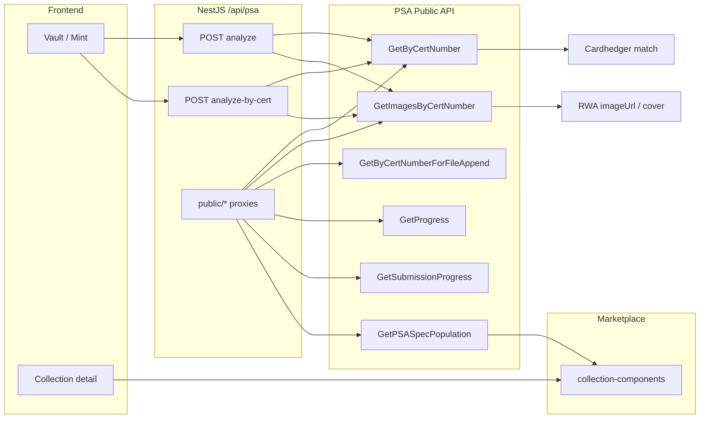

# PSA API

**Controller:** `backend/src/psa/psa.controller.ts`  
**Upstream spec:** `backend/src/psa/psa-swagger.json` (PSA Public API, base `/publicapi`)  
**Base path:** `/api/psa`  
**Swagger tag:** `psa`

Tokenable wraps PSA’s **six** Public API methods behind server-side proxies (token never exposed to the browser). High-level mint flows combine PSA with Cardhedger OCR and catalog resolution.

---

## Architecture



### PSA Public API — six upstream methods

| # | PSA upstream | Purpose |
|---|--------------|---------|
| 1 | `GET /cert/GetByCertNumber/{cert}` | Official grade metadata (`PSACert`, `DNACert`), SpecID, population summary |
| 2 | `GET /cert/GetByCertNumberForFileAppend/{cert}` | Compact cert + population for labels / print / batch files |
| 3 | `GET /cert/GetImagesByCertNumber/{cert}` | Slab front/back image URLs (`ImageURL`, `IsFrontImage`) |
| 4 | `GET /order/GetProgress/{orderNumber}` | Order status (grades ready, shipped, tracking) — **no per-cert list** |
| 5 | `GET /order/GetSubmissionProgress/{submissionNumber}` | Submission status — same `OrderProgress` shape |
| 6 | `GET /pop/GetPSASpecPopulation/{specID}` | Per-grade population (Grade1–10, Q) for a PSA spec |

### Platform integration (what we use today)

| PSA API | Tokenable connection | Priority |
|---------|----------------------|----------|
| **GetByCertNumber** | `POST /psa/analyze`, `analyze-by-cert`, Cardhedger cert lookup, collection mirror | **Required** — mint + identity |
| **GetImagesByCertNumber** | Mint `imageUrl`, RWA metadata, collection cover candidates | **Required** — visual assets |
| **GetPSASpecPopulation** | `collection-components.service` → `psaSpecPopulation`, rarity on collection detail | **Required** — market context |
| **GetByCertNumberForFileAppend** | Not wired to UI yet | Future — vault outbound labels / PDF |
| **GetProgress / GetSubmissionProgress** | Swagger proxy only | Future — profile “PSA submission status” (order-level, not cert-level) |

---

## High-level routes (mint pipeline)

### `POST /api/psa/analyze`

**Content-Type:** `multipart/form-data`

Runs the full pipeline:

1. Cardhedger **details-by-cert-ocr** on slab image(s) → cert candidates  
2. PSA Public API **GetByCertNumber** + **GetImagesByCertNumber** (first successful cert)  
3. Cardhedger mint enrichment  

| Field | Type | Required | Description |
|-------|------|----------|-------------|
| `slabFront` | file | Yes | Slab front image (JPEG/PNG/WebP, max 15 MB) |
| `slabBack` | file | No | Slab back image |
| `certNumber` | string | No | Manual cert hint when OCR finds no cert |

**Response:** `PsaAnalyzeResult` (see Swagger).

---

### `POST /api/psa/analyze-by-cert`

**Content-Type:** `application/json`

Cert-only lookup — no slab upload.

```json
{ "certNumber": "83179580" }
```

Accepts digits or `https://www.psacard.com/cert/83179580`.

- Uses **only** the requested cert (no OCR).  
- Rejects when `PSACert.CertNumber` ≠ request (**400**).  
- **Mint gate:** Vault preview allows any PSA grade; `POST /api/rwa/upload` requires **PSA 10**.

---

## Public API proxies (raw JSON / Swagger QA)

These map 1:1 to PSA upstream. POST variants exist for Swagger **Try it out**.

| Method | Tokenable path | PSA upstream |
|--------|----------------|--------------|
| GET | `/api/psa/public/cert/:certNumber` | GetByCertNumber |
| POST | `/api/psa/public/cert` | GetByCertNumber |
| GET | `/api/psa/public/cert/:certNumber/file-append` | GetByCertNumberForFileAppend |
| POST | `/api/psa/public/cert/file-append` | GetByCertNumberForFileAppend |
| GET | `/api/psa/public/cert/:certNumber/images` | GetImagesByCertNumber |
| POST | `/api/psa/public/cert/images` | GetImagesByCertNumber |
| GET | `/api/psa/public/pop/:specId` | GetPSASpecPopulation |
| POST | `/api/psa/public/pop` | GetPSASpecPopulation |
| GET | `/api/psa/order/progress/:orderNumber` | GetProgress |
| POST | `/api/psa/order/progress` | GetProgress |
| GET | `/api/psa/order/submission-progress/:submissionNumber` | GetSubmissionProgress |
| POST | `/api/psa/order/submission-progress` | GetSubmissionProgress |

Successful proxy responses include `psaPath` (upstream path) and `raw` (PSA JSON body). Spec population success also includes parsed `pop` summary (`grade10`, `total`, `byGrade`).

---

## Environment variables

| Variable | Purpose |
|----------|---------|
| `PSA_PUBLIC_API_TOKENS` | Preferred — comma-separated Bearer tokens (round-robin pool). From [psacard.com/publicapi](https://www.psacard.com/publicapi) |
| `PSA_PUBLIC_API_TOKEN` | Single-token fallback (merged into the same pool) |
| `PSA_PUBLIC_API_UPSTREAM_ENABLED` | Master switch for live PSA HTTP (`true`/`false`; default on when a token is set) |
| `PSA_PUBLIC_API_CACHE_TTL_MS` | In-memory cache TTL for successful PSA responses (default on) |
| `PSA_PUBLIC_API_MAX_RETRIES` | Retry count on HTTP 429 |
| `PSA_PUBLIC_API_MAX_CERT_ATTEMPTS` | Max distinct certs tried per OCR analyze |
| `PSA_PUBLIC_API_REFRESH_ON_SNAPSHOT` | When `always`, Cardhedger snapshot refresh may call PSA for cert mirror fields |
| `CARDHEDGER_API_KEY` | Cardhedger OCR + catalog enrichment in analyze pipeline |

---

## Rate limits

PSA applies per-account / per-IP quotas (HTTP **429**). The backend (`psa-public-api.service.ts`):

- Rotates across `PSA_PUBLIC_API_TOKENS` (and `PSA_PUBLIC_API_TOKEN`)  
- Blocks a token until **UTC midnight** (or PSA `Retry-After`) after 429  
- Caches successful cert / image / spec-pop responses  
- Coalesces in-flight duplicate cert requests  

**Vault / mint impact:** When **all** pool tokens are blocked, `POST /api/psa/analyze-by-cert` fails quickly (often logged as **500** with `PSA token pool: all N token(s) rate-limited`). Wait for reset or add another token and restart the backend.

See logs with `perf: psa` and `[PsaPublicApiService]`.

---

## Troubleshooting

- **500 on `/psa/analyze`:** Check logs for `PSA analyze failed:` — `sharp`, OOM, outbound HTTPS, upload > 15 MB.  
- **500 / fail on `/psa/analyze-by-cert` in a few ms:** Usually **token pool rate-limited** — see WARN `PSA token pool: all … rate-limited`. Not a vault UI bug.  
- **Wrong card / empty grade:** Prefer `analyze-by-cert` for a known cert; slab OCR can pick the wrong cert first.  
- **429:** Wait for daily UTC reset, add tokens to `PSA_PUBLIC_API_TOKENS`, or request higher quota from PSA.  
- **Token missing / upstream off:** Proxies / analyze return disabled or **503** — set tokens and `PSA_PUBLIC_API_UPSTREAM_ENABLED=true`.

See also: [guides/troubleshooting.md](../guides/troubleshooting.md) · [guides/cardhedger-psa-variety.md](../guides/cardhedger-psa-variety.md)

---

## Collection covers

**Code:** `backend/src/marketplace/collections/collection-cover.service.ts`

Cover images are set once from Cardhedger catalog URLs (and Pokémon TCG art when applicable) on first collection creation — not refreshed on every GET.

**Manual override:** `POST /api/marketplace/collections/:key/admin/cover` or `admin/cover/from-token`.
