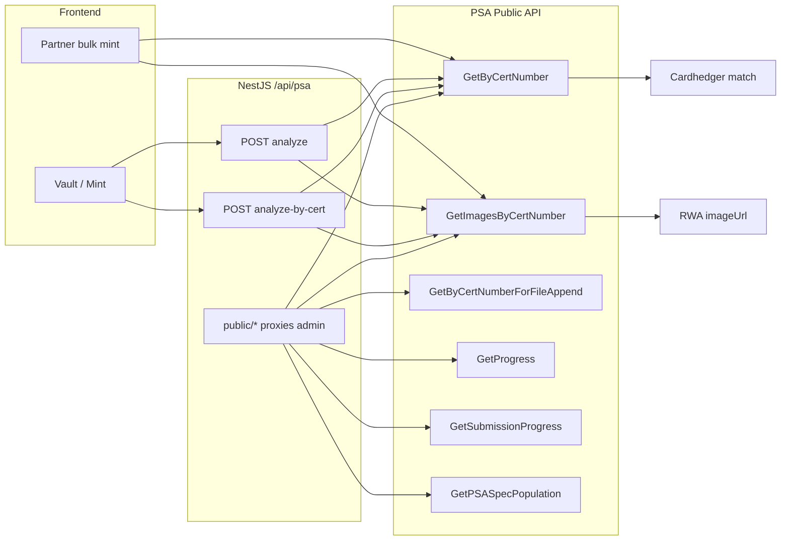

# PSA API

**Controller:** `backend/src/psa/psa.controller.ts`  
**Upstream spec:** `backend/src/psa/psa-swagger.json` (PSA Public API, base `/publicapi`)  
**Base path:** `/api/psa`  
**Swagger tag:** `psa`

Tokenable wraps PSA’s **six** Public API methods behind server-side proxies (token never exposed to the browser). High-level mint flows combine PSA with Cardhedger OCR and catalog resolution.

---

## Architecture



### PSA Public API — six upstream methods

| # | PSA upstream | Purpose |
|---|--------------|---------|
| 1 | `GET /cert/GetByCertNumber/{cert}` | Official grade metadata (`PSACert`, `DNACert`), SpecID, population summary |
| 2 | `GET /cert/GetByCertNumberForFileAppend/{cert}` | Compact cert + population for labels / print / batch files |
| 3 | `GET /cert/GetImagesByCertNumber/{cert}` | Slab front/back image URLs (`ImageURL`, `IsFrontImage`) |
| 4 | `GET /order/GetProgress/{orderNumber}` | Order status (grades ready, shipped, tracking) — **no per-cert list** |
| 5 | `GET /order/GetSubmissionProgress/{submissionNumber}` | Submission status — same `OrderProgress` shape |
| 6 | `GET /pop/GetPSASpecPopulation/{specID}` | Per-grade population (Grade1–10, Q) for a PSA spec |

### Platform integration (mint + collection-create PSA budget)

**Live PSA Public API is reserved for mint identity and first-time Spec population at collection create** (rate-limit budget). Marketplace collection **reads**, listings, portfolio mint-previews, and Cardhedger snapshot refresh **never** call PSA upstream.

| PSA API | Tokenable connection | Priority |
|---------|----------------------|----------|
| **GetByCertNumber** | `POST /psa/analyze`, `analyze-by-cert`, partner **bulk-mint** prepare | **Required** — mint identity (includes SpecID) |
| **GetImagesByCertNumber** | Mint / bulk-mint slab `imageUrl` | **Required** — mint visual assets |
| **GetPSASpecPopulation** | Collection create (`ensureCollectionForListing` → `ensurePsaSpecPopulationFromApi`): **once per SpecID** when Grade1–10 not already on any collection `components`; written to `marketplace_collections.components` (`psaPopulationByGrade` / `psaSpecTotalPopulation` / `psaGrade10Population`). Mint metadata keeps SpecID only — not Grade1–10. Collection detail reads never call PSA. | Collection-create, SpecID-deduped |
| **GetByCertNumberForFileAppend** | **Disabled** (403 `PSA_MINT_ONLY`) | — |
| **GetProgress / GetSubmissionProgress** | **Disabled** (403 `PSA_MINT_ONLY`) | — |

Deprecated / ignored for marketplace: `PSA_PUBLIC_API_REFRESH_ON_SNAPSHOT`, `PSA_PUBLIC_API_BACKGROUND_UPSTREAM`.

---

## High-level routes (mint pipeline)

### `POST /api/psa/analyze`

**Content-Type:** `multipart/form-data`

Runs the full pipeline:

1. Cardhedger **details-by-cert-ocr** on slab image(s) → cert candidates  
2. PSA Public API **GetByCertNumber** + **GetImagesByCertNumber** (first successful cert)  
3. Cardhedger mint enrichment  

| Field | Type | Required | Description |
|-------|------|----------|-------------|
| `slabFront` | file | Yes | Slab front image (JPEG/PNG/WebP, max 15 MB) |
| `slabBack` | file | No | Slab back image |
| `certNumber` | string | No | Manual cert hint when OCR finds no cert |

**Response:** `PsaAnalyzeResult` (see Swagger).

---

### `POST /api/psa/analyze-by-cert`

**Content-Type:** `application/json`

Cert-only lookup — no slab upload.

```json
{ "certNumber": "83179580" }
```

Accepts digits or `https://www.psacard.com/cert/83179580`.

- Uses **only** the requested cert (no OCR).  
- Rejects when `PSACert.CertNumber` ≠ request (**400**).  
- **Mint gate:** Vault preview allows any PSA grade; `POST /api/rwa/upload` requires **PSA 10**.

---

## Public API proxies (disabled — mint-only policy)

All `/api/psa/public/*` and `/api/psa/order/*` routes return **403 `PSA_MINT_ONLY`**.  
They must not consume the daily PSA quota (~500 calls). Use mint endpoints instead:

- `POST /api/psa/analyze`
- `POST /api/psa/analyze-by-cert`
- Partner bulk-mint prepare (server-side)

`POST /api/marketplace/cert-market-trace` was removed (it always returned 403 and had no callers).

---

## Environment variables

| Variable | Purpose |
|----------|---------|
| `PSA_PUBLIC_API_TOKENS` | Preferred — comma-separated Bearer tokens (round-robin pool). From [psacard.com/publicapi](https://www.psacard.com/publicapi) |
| `PSA_PUBLIC_API_TOKEN` | Single-token fallback (merged into the same pool) |
| `PSA_PUBLIC_API_UPSTREAM_ENABLED` | Master switch for live PSA HTTP (`true`/`false`; default on when a token is set) |
| `PSA_PUBLIC_API_CACHE_TTL_MS` | In-memory cache TTL for successful PSA responses (default on) |
| `PSA_PUBLIC_API_MAX_RETRIES` | Retry count on HTTP 429 |
| `PSA_PUBLIC_API_MAX_CERT_ATTEMPTS` | Max distinct certs tried per OCR analyze |
| `PSA_PUBLIC_API_REFRESH_ON_SNAPSHOT` | **Ignored** (mint-only policy — snapshot never calls PSA) |
| `PSA_PUBLIC_API_BACKGROUND_UPSTREAM` | **Ignored** (mint-only policy) |
| `CARDHEDGER_API_KEY` | Cardhedger OCR + catalog enrichment in analyze pipeline |

---

## Rate limits

PSA applies per-account / per-IP quotas (HTTP **429**). The backend (`psa-public-api.service.ts`):

- Rotates across `PSA_PUBLIC_API_TOKENS` (and `PSA_PUBLIC_API_TOKEN`) round-robin  
- Does **not** locally block tokens after 429 — each call goes to PSA; a 429 is PSA’s real response  
- Caches successful cert / image / spec-pop responses  
- Coalesces in-flight duplicate cert requests  

**Vault / mint impact:** When PSA returns 429, `POST /api/psa/analyze-by-cert` and public cert proxies surface `PSA_RATE_LIMIT_EXCEEDED`. Wait for PSA’s reset / `Retry-After`, add more tokens, or request higher quota from PSA.

See logs with `perf: psa` and `[PsaPublicApiService]`.

---

## Troubleshooting

- **500 on `/psa/analyze`:** Check logs for `PSA analyze failed:` — `sharp`, OOM, outbound HTTPS, upload > 15 MB.  
- **429 on `/psa/analyze-by-cert` or `/psa/public/cert/...`:** PSA upstream rate limit — check WARN `PSA upstream 429`. Not a Tokenable local block.  
- **Wrong card / empty grade:** Prefer `analyze-by-cert` for a known cert; slab OCR can pick the wrong cert first.  
- **429:** Wait for PSA daily reset / Retry-After, add tokens to `PSA_PUBLIC_API_TOKENS`, or request higher quota from PSA.  
- **Token missing / upstream off:** Proxies / analyze return disabled or **503** — set tokens and `PSA_PUBLIC_API_UPSTREAM_ENABLED=true`.

See also: [guides/troubleshooting.md](../guides/troubleshooting.md) · [guides/cardhedger-psa-variety.md](../guides/cardhedger-psa-variety.md)

---

## Collection covers

**Code:** `backend/src/marketplace/collections/collection-cover.service.ts`  
**Ranking:** `backend/src/marketplace/utils/collection-image.util.ts` (`scoreCollectionCoverUrl`)

Cover images come from catalog HTTPS URLs (never PSA cert slabs). Resolution gathers **all** candidates (embedded Cardhedger `imageUrl`, card-details/search, Pokémon TCG `images.large` when the card looks like Pokémon) and picks the **highest score**. Bubble CDN paths ending in `/resize` are demoted when present — they are **not** assumed to always exist.

- **Create:** best candidate is stored on first collection insert (catalog S3 when configured).
- **Upgrade:** on later listings for the same bucket, cover is replaced only if the newly resolved URL scores higher (e.g. Bubble thumb → Pokémon TCG large).
- **Not** refreshed on every public GET.

**Manual override:** `POST /api/marketplace/collections/:key/admin/cover`, `admin/cover/upload` (S3), or `admin/cover/from-token` (`save` = force; `upgradeIfBetter` = score-based upgrade). See [catalog-cover-s3.md](../guides/catalog-cover-s3.md).
