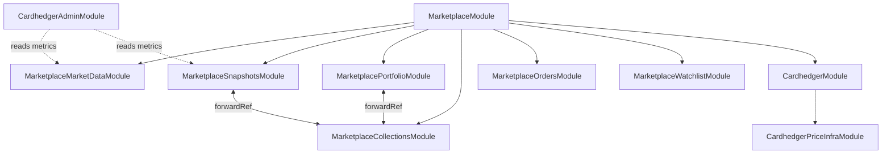

# Backend Structure

**Source:** `backend/src/`  
**Framework:** NestJS 11 + TypeORM + Ethers.js 6

## Marketplace layout

The marketplace domain is organized into **six submodules**:

| Submodule | Role |
|-----------|------|
| `marketplace/orders/` | Seaport order book CRUD |
| `marketplace/collections/` | Bucket metadata, listing enrichment, merkle set, **identity cache**, RWA token admin |
| `marketplace/market-data/` | Cardhedger resolve / pricing / mint previews / AI insight |
| `marketplace/snapshots/` | Materialized `collection_market_snapshots` (write, read, cron) |
| `marketplace/portfolio/` | Daily wallet snapshots + hidden-holdings preference |
| `marketplace/watchlist/` | Per-user saved collections |
| `marketplace/admin/` | Marketplace admin auth (username/password, separate from `users`) |

Cross-cutting additions:

- **`CollectionIdentityService`** — canonical writer for `components.cardhedgerCardId` with L1 in-process + L2 Redis cache, row-lock precedence, write-through invalidation.
- **`CardhedgerResolveService`** — Cardhedger card-search resolution (resolve / pricing / mint are separate services under `market-data/`).
- **`CardhedgerAdminModule`** — ops health + Prometheus scrape (`/api/admin/cardhedger/*`).
- **`CardhedgerPriceInfraModule`** — price webhook receiver, subscription sync, nightly delta import (`/api/admin/cardhedger/price-subscriptions/*`).
- **`common/cache/`** — global in-memory TTL cache (`TTL_CACHE_PROVIDER`) for resolve paths.
- **`common/metrics/`** — Cardhedger operational counters (identity + resolve + scheduler).

`CollectionsController` and `CollectionMarketSnapshotController` both mount under `/api/marketplace`. Snapshot read routes (`…/cardhedger`, `…/cardhedger/price-history`) are handled by the snapshot controller to avoid a module import cycle.

---

## Module map

```
backend/src/
├── main.ts                  # Bootstrap: global prefix /api, CORS, ValidationPipe, Swagger
├── app.module.ts            # Root — TypeORM (17 entities), ScheduleModule, EventEmitter, CacheModule
│
├── config/
│   ├── app.config.ts
│   ├── marketplace.config.ts   # Admin wallets, order scan limits, merkle tuning
│   └── cardladder.config.ts
│
├── common/
│   ├── cache/               # Global MemoryTtlCacheProvider (TTL_CACHE_PROVIDER)
│   └── metrics/             # CardhedgerMetricsModule — identity/resolve/scheduler counters
│
├── auth/                    # Google OAuth, email/password, JWT cookies, wallet link
├── user/                    # users + user_wallets
├── mail/                    # SMTP (verification + password reset emails)
├── health/                  # GET /api/health
├── site-access/             # Optional staging gate middleware + POST verify
│
├── rwa/                     # IPFS upload (Pinata) — PSA 10 gate on mint metadata
├── blockchain/              # Sepolia read-only RWA + IPFS gateway resolver
├── psa/                     # Slab OCR, analyze-by-cert, Public API progress proxy
│
├── cardhedger/              # Upstream HTTP client + public controllers
│   ├── cardhedger.service.ts       # forwardJson to Cardhedger upstream
│   ├── controllers/
│   │   ├── cardhedger-proxy.controller.ts    # /api/cardhedger/v1/* full proxy
│   │   ├── card-top100.controller.ts         # /api/cardhedger/top100/*
│   │   ├── card-top-movers.controller.ts     # /api/cardhedger/top-movers
│   │   ├── cardhedger-catalog.controller.ts  # GET /api/cardhedger/routes
│   │   └── cardhedger-price-webhook.controller.ts  # POST /api/webhooks/cardhedger/*
│   ├── admin/               # CardhedgerAdminModule — health, circuit, metrics
│   └── cardhedger-price-infra.module.ts  # subscriptions + delta import admin
│
├── cardladder/              # Card Ladder indexes scrape (Playwright)
│   └── controllers/cardladder-indexes.controller.ts  # GET /api/cardladder/indexes
│
└── marketplace/             # MarketplaceModule (facade — re-exports submodules)
    ├── marketplace.module.ts
    ├── admin/               # MarketplaceAdminService + marketplace-admin-auth
    ├── entities/            # TypeORM entities for marketplace + portfolio + watchlist
    ├── utils/               # bucket-key, card-match, market-stats, PSA variety helpers, …
    │
    ├── orders/
    │   ├── orders.controller.ts
    │   └── orders.service.ts          # ensureCollectionForListing, replace-listing, fulfill
    │
    ├── collections/
    │   ├── collections.controller.ts  # List, detail, stats, market-series, portfolio batch, admin
    │   ├── cert-market-trace.controller.ts
    │   ├── rwa-token-admin.controller.ts   # /api/marketplace/admin/rwa-tokens
    │   ├── collection.service.ts
    │   ├── collection-market.service.ts
    │   ├── collection-identity.service.ts
    │   ├── collection-enrichment.service.ts
    │   ├── collection-components.service.ts
    │   ├── collection-cover.service.ts
    │   ├── collection-merkle-set.service.ts
    │   ├── collection-boot.service.ts
    │   ├── rwa-token-registry.service.ts
    │   ├── identity-cache-*.ts        # Decision engine, execution, reconciliation, warmup, SLO
    │   ├── layered-identity-cache.provider.ts
    │   └── redis-identity-cache.provider.ts
    │
    ├── market-data/
    │   ├── cardhedger-resolve.service.ts
    │   ├── cardhedger-pricing.service.ts
    │   ├── cardhedger-mint.service.ts
    │   ├── cardhedger-market-data.service.ts
    │   └── cardhedger-ai-insight.service.ts
    │
    ├── snapshots/
    │   ├── collection-market-snapshot.controller.ts
    │   ├── collection-market-snapshot.service.ts
    │   ├── collection-market-snapshot-read.service.ts
    │   └── collection-market-snapshot-scheduler.service.ts
    │
    ├── portfolio/
    │   ├── portfolio.controller.ts
    │   ├── portfolio-daily-snapshot.service.ts
    │   ├── portfolio-daily-snapshot-scheduler.service.ts
    │   └── portfolio-hidden-holding.service.ts
    │
    └── watchlist/
        ├── watchlist.controller.ts
        └── watchlist.service.ts
```

**Entities (17):** `User`, `UserWallet`, `VerificationToken`, `Order`, `MarketplaceCollection`, `CollectionMarketSnapshot`, `PsaCertSnapshot`, `RwaToken`, `PortfolioDailySnapshot`, `PortfolioHiddenHolding`, `UserWatchlist`, `MarketplaceAdmin`, `CardTop100DailySnapshot`, `CardhedgerPriceSubscription`, `CardhedgerPriceDeltaCheckpoint`, `CardhedgerDailyPriceExportRun`, `CardhedgerPriceDeltaImportRun` — see [database.md](./database.md).

There is **no** relational `BidsController` / `TradeController`, or PokéTrace proxy in the current tree. **VaultModule** is not implemented yet (planned).

---

## Marketplace data paths

### Listing → bucket → snapshot

```
Ask POST → OrdersService.ensureCollectionForListing
         → marketplace_collections + rwa_tokens
         → CollectionIdentityService (optional cardhedgerCardId from mint metadata)
         → snapshot scheduler enqueue → collection_market_snapshots upsert (async)
```

### Hot read path (charts / markets list)

```
GET …/collections, POST …/market-snapshots, GET …/cardhedger*, GET …/market-series
         → CollectionMarketSnapshotReadService (PostgreSQL only)
         → stale row → enqueue SWR refresh (non-blocking)
```

### Cardhedger resolution (worker / cold start / cert trace)

```
CollectionIdentityService.readOrResolve  → L2 Redis → L1 → DB (no upstream on cache hit)
CardhedgerResolveService.resolveCardForCollection → card-search upstream (cached 5 min)
CardhedgerPricingService → preview / comps / tier history (snapshot worker)
```

### Portfolio

```
09:00 KST cron → PortfolioDailySnapshotSchedulerService
         → ownerOf scan + batch Cardhedger pricing → portfolio_daily_snapshots upsert

GET …/portfolio/daily/:wallet
         → list snapshots; fallback capture only if today's row missing (no overwrite)

GET/POST/DELETE …/portfolio/hidden*
         → portfolio_hidden_holdings (off-chain UI preference; NFT stays on-chain)
```

### Watchlist

```
GET/POST/DELETE …/marketplace/watchlist
         → user_watchlist (JWT user_id + collection_key)
```

---

## Identity cache (collections)

| Layer | Implementation | When |
|-------|----------------|------|
| L1 | In-process `Map` + hot-key LRU | Always |
| L2 | Redis (`REDIS_URL`) | When configured |
| DB | `marketplace_collections.components.cardhedgerCardId` | Source of truth |

**Write precedence:** stored valid ID (audit pass) > mint metadata > PSA cert lookup > Cardhedger search.

All writes use `SELECT … FOR UPDATE` on the collection row — multi-pod safe without distributed locks.

Env: `REDIS_URL`, optional `IDENTITY_SERVICE_ENABLED`. See [local-setup.md](../guides/local-setup.md).

---

## Module dependencies



`CardhedgerAdminModule` is imported at app root and reads marketplace metrics services.

---

## Global bootstrap (`main.ts`)

| Setting | Value |
|---------|-------|
| Global prefix | `/api` |
| Swagger UI | `GET /api/docs` |
| ValidationPipe | `whitelist: true`, `forbidNonWhitelisted: true`, `transform: true` |
| CORS | `CORS_ORIGIN` (comma-separated); `credentials: true` |
| Cookie parser | `cookie-parser` |
| Default port | `4000` (`PORT` env; local dev often `4100`) |

## Production TypeORM

```typescript
synchronize: NODE_ENV !== 'production'
```

Use bootstrap SQL for prod; do not rely on `synchronize` in production.  
`card_top100_daily_snapshots` is entity-backed — ensure table exists via sync (dev) or add DDL before prod use.
