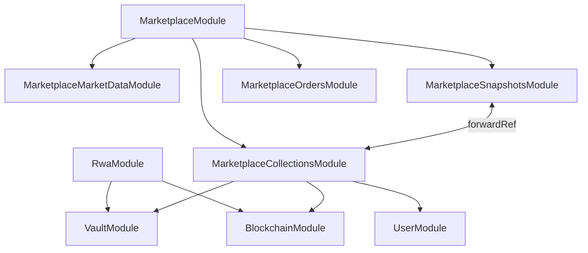

# Backend Structure

**Source:** `backend/src/`  
**Framework:** NestJS 11 + TypeORM + Ethers.js 6

## Marketplace layout

The marketplace domain is organized into **six submodules**:

| Submodule | Role |
|-----------|------|
| `marketplace/orders/` | Seaport order book CRUD |
| `marketplace/collections/` | Bucket metadata, listing enrichment, merkle set, **identity cache**, RWA token admin |
| `marketplace/market-data/` | Cardhedger resolve / pricing / mint previews / AI insight |
| `marketplace/snapshots/` | Materialized `collection_market_snapshots` (write, read, cron) |
| `marketplace/portfolio/` | Daily wallet snapshots + hidden-holdings preference |
| `marketplace/watchlist/` | Per-user saved collections |
| `marketplace/admin/` | Marketplace admin auth (username/password, separate from `users`) |

Cross-cutting:

- **`CollectionIdentityService`** — canonical writer for `components.cardhedgerCardId` with L1 in-process + L2 Redis cache, row-lock precedence, write-through invalidation.
- **`CardhedgerResolveService`** — Cardhedger card-search resolution.
- **`CardhedgerAdminModule`** — ops health + Prometheus scrape (`/api/admin/cardhedger/*`).
- **`CardhedgerPriceInfraModule`** — price webhook receiver, subscription sync, nightly delta import.
- **`common/cache/`** — global in-memory TTL cache (`TTL_CACHE_PROVIDER`).
- **`common/metrics/`** — Cardhedger operational counters.
- **`common/perf/`** — lightweight JSON stdout performance logging.

---

## Module map

```
backend/src/
├── main.ts                  # Bootstrap: global prefix /api, helmet, compression, CORS, ValidationPipe, Swagger, perf logger
├── app.module.ts            # Root — TypeORM (22 entities), ScheduleModule, EventEmitter, CacheModule
│
├── config/
│   ├── app.config.ts
│   ├── marketplace.config.ts
│   └── cardladder.config.ts
│
├── common/
│   ├── cache/               # Global MemoryTtlCacheProvider (TTL_CACHE_PROVIDER)
│   ├── metrics/             # CardhedgerMetricsModule
│   └── perf/                # perfNow, perfLog, elapsedMs
│
├── auth/                    # Privy JWT session; JWT cookies; legacy Email/Password services (admin only)
│   └── privy/               # PrivyService — JWKS verify, user fetch, profile parse
├── privy/                   # Privy catalog endpoint + API proxy (users, funding)
├── kyc/                     # Sumsub WebSDK tokens + webhook → users.kyc_status
├── user/                    # users, user_wallets, user_auth_providers, user_kyc_events
├── mail/                    # SMTP (legacy verification + password reset — admin tooling only)
├── health/                  # GET /api/health
├── site-access/             # Optional staging gate middleware + POST verify
│
├── rwa/                     # IPFS upload (Pinata), platform-signed mint, redeem-request
│   ├── rwa.controller.ts    # POST /upload, /mint, /redeem-request
│   ├── rwa.service.ts       # IPFS upload logic + PSA 10 gate
│   ├── rwa-mint.service.ts  # Orchestrates vault cycle + chain writer mint to custody
│   └── rwa-redeem.service.ts
│
├── vault/                   # Physical card vault lifecycle — DB orchestration only
│   ├── vault.service.ts     # VaultAsset, VaultCycle, VaultRedemption state machine
│   └── entities/
│       ├── vault-asset.entity.ts
│       ├── vault-cycle.entity.ts
│       └── vault-redemption.entity.ts
│
├── blockchain/              # Multi-chain reads + IPFS + write operations
│   ├── blockchain.service.ts         # ownerOf, tokenURI, getRwaTokensByOwner
│   ├── rwa-chain-writer.service.ts   # mintTo, adminBurn, safeTransferFromCustody
│   ├── chain-config.service.ts       # ChainConfigService — per-chain RPC + contract config
│   ├── rwa-asset-resolve.service.ts
│   └── ipfs-gateway-resolver.service.ts
│
├── psa/                     # Slab OCR, analyze-by-cert, PSA Public API 6-method proxy
│   ├── psa.service.ts
│   ├── psa.controller.ts
│   └── psa-public-api.service.ts    # Multi-token pool (PSA_PUBLIC_API_TOKENS)
│
├── cardhedger/              # Upstream HTTP client + public controllers
│   ├── cardhedger.service.ts
│   ├── controllers/
│   │   ├── cardhedger-proxy.controller.ts
│   │   ├── card-top100.controller.ts
│   │   ├── card-top-movers.controller.ts
│   │   ├── cardhedger-catalog.controller.ts
│   │   └── cardhedger-price-webhook.controller.ts
│   ├── admin/               # CardhedgerAdminModule
│   └── cardhedger-price-infra.module.ts
│
├── cardladder/              # Card Ladder indexes (Playwright scrape)
│
└── marketplace/             # MarketplaceModule facade
    ├── admin/               # Marketplace admin auth + user admin
    ├── entities/
    ├── utils/
    ├── orders/
    ├── collections/
    │   ├── rwa-token-admin.controller.ts  # /api/marketplace/admin/rwa-tokens/*
    │   ├── rwa-token-admin.service.ts     # listCustodyHeldNfts, deliverCustodyNftToUser, burnTokenOnChain
    │   └── ...
    ├── market-data/
    ├── snapshots/
    ├── portfolio/
    └── watchlist/
```

**Entities (21):** `User`, `UserWallet`, `UserAuthProvider`, `UserKycEvent`, `VerificationToken`, `Order`, `MarketplaceCollection`, `CollectionMarketSnapshot`, `RwaToken`, `PortfolioDailySnapshot`, `PortfolioHolding`, `UserWatchlist`, `MarketplaceAdmin`, `CardTop100DailySnapshot`, `CardhedgerPriceSubscription`, `CardhedgerPriceDeltaCheckpoint`, `CardhedgerDailyPriceExportRun`, `CardhedgerPriceDeltaImportRun`, `VaultAsset`, `VaultCycle`, `VaultRedemption` — see [database.md](./database.md).

---

## Authentication

**Active:** Privy-only. `auth.controller.ts` exposes:

| Route | Purpose |
|-------|---------|
| `POST /api/auth/privy/session` | Exchange Privy access token → Tokenable JWT cookie |
| `GET /api/auth/session` | Current session (never 401; returns `{ user: null }` if anonymous) |
| `POST /api/auth/logout` | Clear cookie |
| `POST /api/auth/delete-account` | Delete account (JWT) |

**Removed from controller** (code retained for admin tooling): `register`, `login`, `google`, `verify-email`, `forgot/reset/change-password`, wallet challenge/link.

**Admin auth:** Separate username/password (`marketplace_admins` table) → `marketplace_admin` HMAC cookie.

**Guard:** Single `JwtAuthGuard` for user routes. Admin routes use `MarketplaceAdminService.assertAdminSession()`.

---

## Vault NFT Flow

```
POST /api/rwa/upload
  → Pinata IPFS upload → tokenURI

POST /api/rwa/mint  (JWT required)
  → VaultService.reserveCycleForDeposit()
  → RwaChainWriterService.mintTo(custodyWallet, tokenURI, vaultRef)
  → VaultService.recordMintResult()
  → returns { tokenId, txHash, custodyWallet, intendedRecipient }

POST /api/marketplace/admin/rwa-tokens/:id/deliver
  → RwaChainWriterService.safeTransferFromCustody(tokenId, userPrimaryWallet)

POST /api/rwa/redeem-request  (JWT required)
  → VaultService.requestRedemption()

POST /api/marketplace/admin/rwa-tokens/:id/burn
  → RwaChainWriterService.adminBurn()
  → VaultService.completeRedemptionBurn()
```

Detail: [vault-lifecycle.md](./vault-lifecycle.md).

---

## Marketplace data paths

### Listing → bucket → snapshot

```
Ask POST → OrdersService.ensureCollectionForListing
         → marketplace_collections + rwa_tokens
         → CollectionIdentityService (optional cardhedgerCardId from mint metadata)
         → snapshot scheduler enqueue → collection_market_snapshots upsert (async)
```

### Hot read path (charts / markets list)

```
GET …/collections, POST …/market-snapshots
         → CollectionMarketSnapshotReadService (PostgreSQL only)
         → stale row → enqueue SWR refresh (non-blocking)
```

### Portfolio

```
09:00 KST cron → PortfolioDailySnapshotSchedulerService
         → ownerOf scan + batch Cardhedger pricing → portfolio_daily_snapshots upsert

GET …/portfolio/daily/:wallet
         → list snapshots; fallback capture only if today's row missing
```

---

## Identity cache (collections)

| Layer | Implementation | When |
|-------|----------------|------|
| L1 | In-process `Map` + hot-key LRU | Always |
| L2 | Redis (`REDIS_URL`) | When configured |
| DB | `marketplace_collections.components.cardhedgerCardId` | Source of truth |

**Write precedence:** stored valid ID > mint metadata > PSA cert lookup > Cardhedger search.

All writes use `SELECT … FOR UPDATE` on the collection row — multi-pod safe.

---

## Global bootstrap (`main.ts`)

| Setting | Value |
|---------|-------|
| Global prefix | `/api` |
| Swagger UI | `GET /api/docs` |
| ValidationPipe | `whitelist: true`, `forbidNonWhitelisted: true`, `transform: true` |
| Security headers | `helmet` (`contentSecurityPolicy: false`, `crossOriginEmbedderPolicy: false`) |
| Compression | `compression()` — gzip responses |
| CORS | `CORS_ORIGIN` (comma-separated); `credentials: true` |
| Default port | `4000` (`PORT` env; local dev defaults to `4100`) |
| Perf logger | HTTP request duration logged when `PERF_LOG=true` |

## Multi-chain support

`ChainConfigService` resolves per-chain RPC, RWA contract, and USDC addresses.

| Chain ID | Network | Notes |
|----------|---------|-------|
| `11155111` | Ethereum Sepolia | Default dev chain |
| `1` | Ethereum mainnet | Production chain |

Chain ID is read from `x-tokenable-chain-id` header; falls back to `DEFAULT_CHAIN_ID`.

## Production TypeORM

```typescript
synchronize: NODE_ENV !== 'production'
```

Use bootstrap SQL for prod; do not rely on `synchronize` in production.

## Module dependencies (key relationships)


