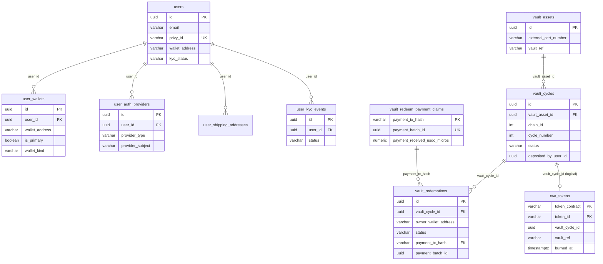
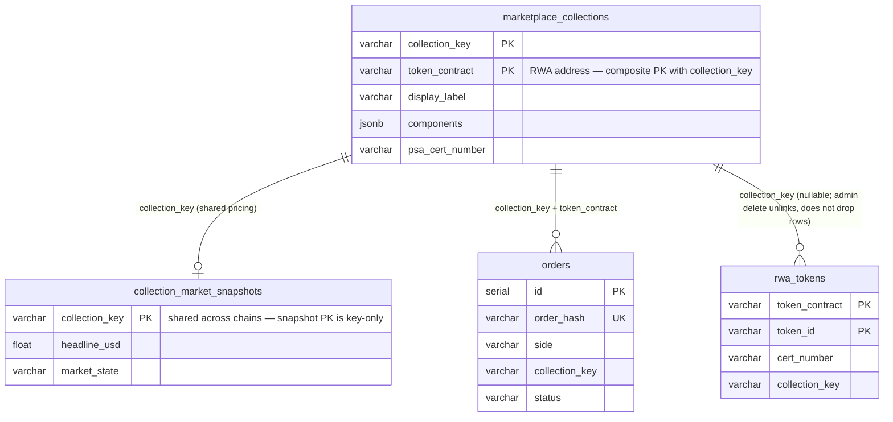

# Database

**Engine:** PostgreSQL 16  
**ORM:** TypeORM (NestJS) — **34 entities** registered in `app.module.ts` 
**DDL:** `backend/sql/schema/` — applied via [bootstrap script](../../backend/sql/README.md)  
**Source of truth:** `backend/src/**/entities/*.ts`

---

## Principles

| Rule | Detail |
|------|--------|
| **Domain tables** | Auth/users, vault lifecycle, marketplace core, portfolio, Cardhedger price infra, admin |
| **No FK constraints (marketplace core)** | Core bucket/order relationships are **logical** (enforced in app code) |
| **FK on user-scoped tables** | `user_wallets`, `user_shipping_addresses`, `user_watchlist`, `user_kyc_events` reference `users(id)` with CASCADE |
| **FK on vault tables** | `vault_cycles` → `vault_assets`, `vault_redemptions` → `vault_cycles` with RESTRICT |
| **Bucket vs pricing split** | `marketplace_collections` = metadata · `collection_market_snapshots` = Cardhedger pricing |
| **PSA cert facet** | `marketplace_collections.psa_cert_number` + `components` PSA mirror fields (live API / mint metadata) |
| **Hot read path** | Collection charts/list rows read PostgreSQL only — Cardhedger upstream runs in snapshot workers |

---

## Tables by domain

### Auth & users

| Table | Purpose | Entity |
|-------|---------|--------|
| `users` | Platform account (email may be shared across wallet accounts; profile, Privy DID, KYC snapshot, Settings prefs) | `user/entities/user.entity.ts` |
| `user_auth_providers` | Linked login methods (email, Google, Apple, wallet, passkey) — synced from Privy | `user/entities/user-auth-provider.entity.ts` |
| `user_wallets` | Multiple linked wallets per user with embedded/external metadata | `user/entities/user-wallet.entity.ts` |
| `user_shipping_addresses` | Saved ship-to address book (Settings → Addresses; redeem) | `user/entities/user-shipping-address.entity.ts` |
| `user_kyc_events` | Append-only KYC status audit trail | `user/entities/user-kyc-event.entity.ts` |

### Vault lifecycle (new — migrations 080–084)

| Table | Purpose | Entity |
|-------|---------|--------|
| `vault_assets` | Permanent physical card identity (PSA cert → vaultRef = keccak256) | `vault/entities/vault-asset.entity.ts` |
| `vault_cycles` | One deposit-to-redemption window per asset **per chain** (`chain_id`); statuses include `minting` + `mint_attempt` JSON for crash recovery; at most one open cycle per (asset, chain) — mirrors the per-contract `activeTokenIdByVaultRef` invariant | `vault/entities/vault-cycle.entity.ts` |
| `vault_redemptions` | Per-card redeem state machine + denormalized fee/payment/custody/refund/tracking fields (`carrier_delivered_at`, `receipt_confirmed_via` for FedEx Track auto-receipt) | `vault/entities/vault-redemption.entity.ts` |
| `vault_redeem_payment_claims` | Ledger: unique `payment_tx_hash` → one `payment_batch_id` (batch total micros). Referenced by paid `vault_redemptions.payment_tx_hash` | `vault/entities/vault-redeem-payment-claim.entity.ts` |
| `vault_submissions` | Sell-flow shipping package for one RWA (`token_contract`; unstamped leftovers are hidden) | `vault/entities/vault-submission.entity.ts` |
| `vault_submission_items` | Per-cert rows; optional FK to `vault_cycles` after mint | `vault/entities/vault-submission-item.entity.ts` |
| `vault_psa_arrival_reviews` | PSA “Items Received” mail (Gmail poll / admin) | `vault/entities/vault-psa-arrival-review.entity.ts` |
| `vault_psa_vaulted_reviews` | PSA “Items Vaulted” mail → mint/deliver review | `vault/entities/vault-psa-vaulted-review.entity.ts` |

### Marketplace core

| Table | Purpose | Entity |
|-------|---------|--------|
| `marketplace_collections` | Graded-metadata bucket catalog. **Composite PK: `(collection_key, token_contract)`** — one review/cover lifecycle per RWA chain address. Snapshot PK stays `collection_key`-only (shared pricing across chains). | `marketplace/entities/marketplace-collection.entity.ts` |
| `rwa_tokens` | On-chain mint registry (contract + tokenId → cert, vault cycle, IPFS, `settlement_policy`, `vault_partner_id`, `owner_wallet`) | `marketplace/entities/rwa-token.entity.ts` |
| `rwa_owner_index_cursors` | Transfer-log backfill cursor per RWA contract | `blockchain/entities/rwa-owner-index-cursor.entity.ts` |
| `collection_market_snapshots` | Materialized Cardhedger market state per bucket | `marketplace/entities/collection-market-snapshot.entity.ts` |
| `orders` | Seaport signed asks/bids + fulfilled trade tape | `marketplace/entities/order.entity.ts` |
| `self_vault_settlements` | Self-vault hold ledger (confirm → company→seller payout) | `marketplace/entities/self-vault-settlement.entity.ts` |
| `marketplace_notifications` | In-app inbox (`bid`/`trade`/`vault`/`price`; **per `chain_id`**) | `marketplace/entities/marketplace-notification.entity.ts` |

### Portfolio & engagement

| Table | Purpose | Entity |
|-------|---------|--------|
| `portfolio_daily_snapshots` | Daily 09:00 KST wallet mark-to-market **per RWA** (`token_contract` + `chain_id` in unique key) | `marketplace/entities/portfolio-daily-snapshot.entity.ts` |
| `portfolio_holdings` | Per-wallet hide + cost basis (off-chain, chain-scoped) | `marketplace/entities/portfolio-holding.entity.ts` |
| `kbw_mystery_card_burns` | Web2 KBW Mystery Card burn ledger — one row per email; all wallets sharing that email hide the card after burn | `marketplace/entities/kbw-mystery-card-burn.entity.ts` |
| `user_watchlist` | Saved marketplace collections per authenticated user | `marketplace/entities/user-watchlist.entity.ts` |
| `user_buyer_listing_alert` | One-time BUYER_LISTING_ALERT when a collection gets its first active ask **on this RWA** — unique `(user_id, collection_key, token_contract)` | `marketplace/entities/user-buyer-listing-alert.entity.ts` |

### Admin & Cardhedger infra

| Table | Purpose | Entity |
|-------|---------|--------|
| `marketplace_admins` | Marketplace admin console credentials | `marketplace/entities/marketplace-admin.entity.ts` |
| `marketplace_partners` | Company wallets for Self vault (+ optional encrypted PK for bulk mint) | `marketplace/entities/marketplace-partner.entity.ts` |
| `marketplace_partner_addresses` | Partner Self-vault Origin address (FedEx Rate ship-from; 1:1) | `marketplace/entities/marketplace-partner-address.entity.ts` |
| `bulk_mint_jobs` | Partner mint+list job runs | `rwa/entities/bulk-mint-job.entity.ts` |
| `bulk_mint_job_items` | Per-cert price + order status rows | `rwa/entities/bulk-mint-job-item.entity.ts` |
| `cardhedger_price_subscriptions` | Price push registrations | `cardhedger/entities/cardhedger-price-subscription.entity.ts` |
| `cardhedger_price_delta_checkpoints` | Singleton checkpoint for delta polling | `cardhedger/entities/cardhedger-price-delta-checkpoint.entity.ts` |
| `cardhedger_daily_price_export_runs` | Nightly CSV export audit | `cardhedger/entities/cardhedger-daily-price-export-run.entity.ts` |
| `cardhedger_price_delta_import_runs` | Per-run delta import audit | `cardhedger/entities/cardhedger-price-delta-import-run.entity.ts` |

---

## Entity relationships

### User → wallets / vault



### Marketplace core (logical links — no FK)



---

## Vault cycle status machine

```
pending_deposit
  → deposit_verified    (PSA cert lookup passed — automated)
  → minted              (after on-chain mint to custody wallet)
  → redemption_requested
  → redeemed            (after adminBurn)

(terminal) cancelled    (on-chain mint failed; compensating action)
```

---

## `rwa_tokens` — key columns

| Column | Notes |
|--------|-------|
| `(token_contract, token_id)` | Composite PK |
| `cert_number` | PSA cert |
| `vault_cycle_id` | Links to vault lifecycle |
| `vault_ref` | `keccak256(certNumber.toUpperCase())` — permanent, survives burn |
| `burned_at` | Set on adminBurn |
| `settlement_policy` | `NULL` until mint registry (`recordMintResult`); then `standard` (PSA) or `self_vault_hold` (partner/self). Transfer-index stubs stay `NULL` — never invent PSA custody |
| `vault_partner_id` | FK to `marketplace_partners` (admin / partner vault name; buyers see `Tokenable Vault`) |
| `display_image_url` | Platform S3 slab front (mint or admin) |
| `display_image_back_url` | Platform S3 slab back (mint or admin) |
| **Unique constraint** | `(token_contract, cert_number) WHERE burned_at IS NULL` — allows re-mint of same cert after burn |

---

## `portfolio_daily_snapshots` — key columns

| Column / constraint | Notes |
|---------------------|-------|
| `(wallet_address, snapshot_date_kst, chain_id, token_contract)` | Unique — one mark-to-market row per wallet per KST day **per RWA address** |
| `chain_id` | EIP-155 id of the RWA contract marked in the row (`CHECK > 0`) |
| `token_contract` | RWA address marked in the row. Reads ignore a different address and unstamped leftovers from a previous contract |
| `snapshot_at` | Usually 09:00 Asia/Seoul for that `snapshot_date_kst` |
| `total_value_usd` / `card_count` | Wallet totals on that chain (hidden holdings excluded). Cron writes 09:00 KST; mint/fill/deliver/hide/burn overwrite today's slot |

Inventory isolation for holdings/orders uses `token_contract` (= per-chain RWA address). Snapshots store both `chain_id` and `token_contract` so a new RWA on the same chain does not reuse the previous contract's chart or 24h P/L.

**Shared across chain switch (intentional):** `users` / KYC / partners / watchlist keys are global — inventory is per RWA, but the user profile must stay shared when the network picker changes.

**Existing DBs:** run `backend/sql/maintenance/add_portfolio_daily_snapshot_chain_id.sql` — do not rely on TypeORM synchronize to drop the old `(wallet, date)` unique.

---

## Schema files (applied by `bootstrap-empty-prod-db.sql`)

Domain-grouped DDL for **fresh bootstrap only** — no incremental migration chain.

| # | File | Contents |
|---|------|----------|
| 010 | `010_users_and_auth.sql` | `users`, `user_wallets`, `user_auth_providers`, `user_shipping_addresses`, `user_kyc_events` |
| 020 | `020_vault.sql` | `vault_assets`, `vault_cycles`, `vault_redemptions`, `vault_redeem_payment_claims`, `vault_submissions`, `vault_submission_items` |
| 030 | `030_rwa_tokens.sql` | `rwa_tokens` (vault FK, burn-aware cert unique) |
| 040 | `040_marketplace.sql` | `marketplace_collections`, `collection_market_snapshots`, `orders`, `marketplace_notifications` + perf indexes |
| 045 | `045_p2p.sql` | LEGACY — not in bootstrap; historical DBs only |
| 046 | `046_self_vault_settlements.sql` | Self-vault hold settlement ledger |
| 050 | `050_portfolio.sql` | `portfolio_daily_snapshots`, `portfolio_holdings`, `kbw_mystery_card_burns`, `user_watchlist`, `user_buyer_listing_alert` |
| 060 | `060_admin.sql` | `marketplace_admins` |
| 064 | `064_marketplace_partners.sql` | Consignment partners (encrypted wallet keys) |
| 066 | `066_marketplace_partner_addresses.sql` | Partner company / Self-vault Origin address (1:1) |
| 065 | `065_bulk_mint.sql` | `bulk_mint_jobs`, `bulk_mint_job_items` (partner mint+list) |
| 070 | `070_cardhedger.sql` | Cardhedger pricing infra |
| 900 | `900_triggers.sql` | `updated_at` auto-triggers |

**Maintenance (not in bootstrap):**

| File | Purpose |
|------|---------|
| `maintenance/reset_marketplace_data.sql` | Full wipe of marketplace + vault data (keeps users/admins). Admin UI reset is per RWA address, not this script |
| `maintenance/add_marketplace_partners.sql` | Existing DBs: create `marketplace_partners` |
| `maintenance/add_marketplace_partner_addresses.sql` | Existing DBs: partner company Origin addresses |
| `maintenance/add_bulk_mint_tables.sql` | Existing DBs: create partner bulk mint+list tables |
| `maintenance/migrate_bulk_mint_to_partner_list.sql` | Upgrade old custody bulk mint schema → partner mint+list |
| `maintenance/add_bulk_mint_slab_display_image_url.sql` | Add `bulk_mint_job_items.slab_display_image_url` (S3 cache from prepare) |
| `maintenance/add_rwa_tokens_display_image_back_url.sql` | Existing DBs: `rwa_tokens.display_image_back_url` |
| `maintenance/add_bulk_mint_slab_display_image_back_url.sql` | Existing DBs: `bulk_mint_job_items.slab_display_image_back_url` |
| `maintenance/add_collection_review_status.sql` | Existing DBs: collection review_status column |
| `maintenance/add_marketplace_collections_token_contract.sql` | Existing DBs: `marketplace_collections.token_contract` + backfill from orders/tokens |
| `maintenance/marketplace_collections_per_chain_pk.sql` | Existing DBs: drop single-col PK, stamp remaining NULL rows from activity, clone catalog rows per RWA, enforce `NOT NULL`, add composite PK `(collection_key, token_contract)` |
| `maintenance/add_portfolio_daily_snapshot_chain_id.sql` | Existing DBs: `portfolio_daily_snapshots.chain_id` + unique `(wallet, date, chain)` |
| `maintenance/add_portfolio_daily_snapshots_token_contract.sql` | Existing DBs: `portfolio_daily_snapshots.token_contract`; unique includes the RWA address. Unstamped rows are not read |
| `maintenance/add_vault_submissions_token_contract.sql` | Existing DBs: `vault_submissions.token_contract` + backfill from linked mints. Unstamped packages stay hidden |
| `maintenance/ensure_marketplace_chain_indexes.sql` | Existing DBs: order indexes for chain-scoped reads |
| `maintenance/drop_card_top100_daily_snapshots.sql` | Existing DBs: drop legacy Top 100 snapshot table |
| `maintenance/add_rwa_tokens_settlement_policy.sql` | Existing DBs: `rwa_tokens.settlement_policy` |
| `maintenance/nullable_rwa_tokens_settlement_policy.sql` | Existing DBs: allow `NULL` settlement until mint registry; clear stub defaults |
| `maintenance/add_vault_cycles_mint_attempt.sql` | Existing DBs: `minting` status + `mint_attempt` JSON for redeploy-safe mint |
| `maintenance/alter_marketplace_partners_optional_pk.sql` | Existing DBs: nullable partner private key |
| `maintenance/add_rwa_tokens_vault_partner_id.sql` | Existing DBs: `rwa_tokens.vault_partner_id` |
| `maintenance/add_self_vault_settlements.sql` | Existing DBs: `self_vault_settlements` table |
| `maintenance/add_vault_submission_item_display_fields.sql` | Existing DBs: SSOT card number/year/set on `vault_submission_items` |
| `maintenance/cancel_legacy_vault_submission_drafts.sql` | Cancel orphan `status=draft` packages (add-cards is local-only) |
| `maintenance/add_user_settings_prefs_and_addresses.sql` | Existing DBs: users prefs columns + `user_shipping_addresses` |
| `maintenance/add_user_buyer_listing_alert.sql` | Existing DBs: `user_buyer_listing_alert` (BUYER_LISTING_ALERT) |
| `maintenance/user_buyer_listing_alert_token_contract.sql` | Existing DBs: add `token_contract`, unique `(user_id, collection_key, token_contract)` |
| `maintenance/drop_legacy_unused_tables.sql` | Drop unused leftovers: `psa_cert_snapshots`, `portfolio_hidden_holdings`, `verification_tokens` |
| `maintenance/audit_stale_public_tables.sql` | Read-only: empty / quiet public tables (no DROP) |

**Seeds (dev only):**

| File | Purpose |
|------|---------|
| `seed/marketplace-admin.sql` | Default admin credentials |
| `seed/dev-platform-chart-fills.sql` | Synthetic fulfilled orders for chart data |

---

## Environment

| Variable | Purpose |
|----------|---------|
| `RWA_TOKEN_REGISTRY_SYNC_ON_BOOT` | Scan minted token ids **1..totalMinted** → `rwa_tokens` (TokenableRWA is 1-based) |
| `MARKETPLACE_BUCKET_KEY_MIGRATE_ON_BOOT` | Recompute active ask `collection_key` (v2). Listing `ensureCollectionForListing` also rewrites that token’s live ask when the key changes (e.g. Variety-as-set-name now hashes as `base`). |
| `PSA_PUBLIC_API_REFRESH_ON_SNAPSHOT` | Ignored. Snapshot refresh never calls PSA |
| `MARKET_SNAPSHOT_*` | Snapshot worker tuning |
| `PORTFOLIO_SNAPSHOT_*` | Portfolio cron tuning |
| `REDIS_URL` | Identity cache L2 |
| `PARTNER_WALLET_ENCRYPTION_KEY` | 32-byte hex — AES-GCM for `marketplace_partners.encrypted_private_key` |

---

## Bootstrap approach per environment

| Environment | Approach |
|-------------|----------|
| **Local dev** | `NODE_ENV !== production` → TypeORM `synchronize: true` on backend boot |
| **Production / empty DB** | Run `backend/sql/scripts/bootstrap-db.sh` once |
| **Existing DB (upgrade)** | Apply missing numbered migrations manually |

Details: [backend/sql/README.md](../../backend/sql/README.md) · [guides/deployment.md](../guides/deployment.md)
