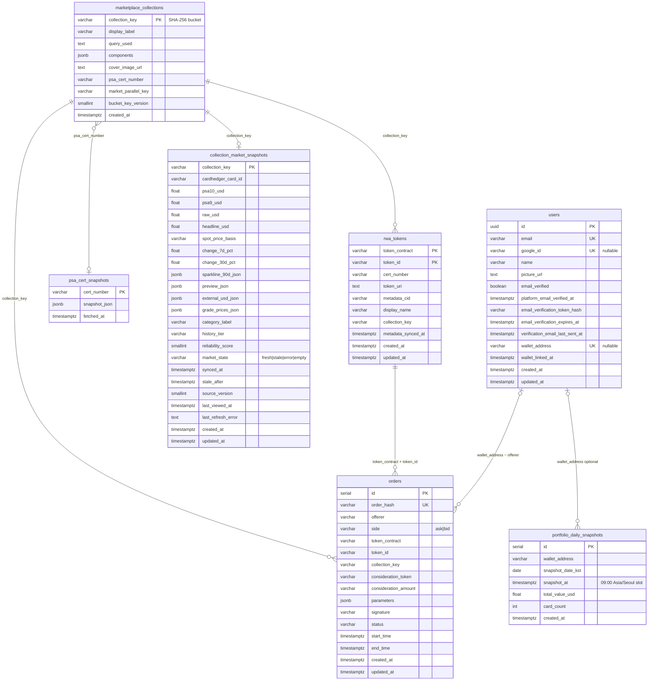

# Database

**Engine:** PostgreSQL 16  
**ORM:** TypeORM (NestJS) — entities are the source of truth; DDL mirrors live under `backend/sql/schema/`.

## Schema overview

**Seven** application tables. Legacy relational trading tables (`bids`, `asks`, `match_intents`, …) and `hidden_assets` are **not** in the current codebase.

PostgreSQL **does not declare FK constraints** between these tables — relationships below are **logical** (denormalized keys, app-enforced).



```
users
psa_cert_snapshots              ← PSA Public API cache (by cert digits)
marketplace_collections          ← bucket metadata (created on first ask)
rwa_tokens                       ← on-chain mint registry (contract + tokenId)
collection_market_snapshots      ← materialized Cardhedger pricing (worker upsert)
orders                           ← Seaport signed asks/bids + fulfilled tape
portfolio_daily_snapshots        ← daily 09:00 KST wallet mark-to-market (cron)
```

### How data flows

| Event | Tables touched |
|-------|----------------|
| Google login | `users` |
| **Mint** (on-chain) | `rwa_tokens` (optional sync on listing / `RWA_TOKEN_REGISTRY_SYNC_ON_BOOT`) |
| First **ask** listing for a token | `orders` + `marketplace_collections` + `rwa_tokens` |
| PSA cert lookup (TTL) | `psa_cert_snapshots` |
| Snapshot worker / on-demand refresh | upsert `collection_market_snapshots` |
| List / cancel / fulfill | `orders` only |
| Markets UI read | `marketplace_collections` + `collection_market_snapshots` + `orders` |
| Portfolio chart (09:00 KST cron) | upsert `portfolio_daily_snapshots` (on-chain holders + tracked zero-card wallets) |
| Portfolio API read | `portfolio_daily_snapshots` (+ fallback capture if today’s row missing) |

Cardhedger is **not** called on the hot read path for collection charts — see [materialized-market-snapshots.md](./materialized-market-snapshots.md).

---

## Design notes (refactor)

| Concern | Where it lives |
|---------|----------------|
| **Bucket identity** | `marketplace_collections.collection_key` + indexed `market_parallel_key`, `bucket_key_version` |
| **PSA cert (canonical)** | `marketplace_collections.psa_cert_number` — not duplicated in `components` on new writes |
| **PSA API cache** | `psa_cert_snapshots` — shared by cert, not per collection row |
| **Cardhedger pricing** | `collection_market_snapshots` only (`headline_usd`, `spot_price_basis`, `preview_json`, …) |
| **Mint inventory** | `rwa_tokens` — all minted tokenIds + cert from IPFS |

Removed from `marketplace_collections` (were redundant): `cardhedger_*` audit columns, `psa_public_snapshot_*`.

---

## Bootstrap & sync

| Environment | Approach |
|-------------|----------|
| **Local dev** | `NODE_ENV !== production` → TypeORM `synchronize: true` on backend boot |
| **Production / empty DB** | Run `backend/sql/scripts/bootstrap-db.sh` once, then `TYPEORM_SYNC=false` |
| **Existing DB** | `schema/050_refactor_legacy_columns.sql` migrates PSA cache + drops legacy columns |

Details: [backend/sql/README.md](../../backend/sql/README.md) · [guides/deployment.md](../guides/deployment.md)

---

## Tables

### `users`

Google OAuth accounts + optional linked wallet. Entity: `user.entity.ts`.

| Column | Type | Notes |
|--------|------|-------|
| `id` | uuid PK | |
| `email` | varchar | unique |
| `name` | varchar | nullable |
| `picture_url` | varchar | nullable |
| `wallet_address` | varchar | nullable, EIP-55 checksum |
| `wallet_linked_at` | timestamptz | nullable |
| `platform_email_verified_at` | timestamptz | nullable |
| `created_at` | timestamptz | |

---

### `psa_cert_snapshots`

PSA Public API `PSACert` body cache. Entity: `psa-cert-snapshot.entity.ts`.

| Column | Type | Notes |
|--------|------|-------|
| `cert_number` | varchar(32) PK | |
| `snapshot_json` | jsonb | Compact cert fields |
| `fetched_at` | timestamptz | TTL via `PSA_PUBLIC_SNAPSHOT_DB_TTL_SEC` |

---

### `marketplace_collections`

Logical **bucket** from graded RWA metadata (`computeMarketBucketKey`, **v2**: grader + name + set + grade + card # + parallel). Created on first **ask**, not at mint. Entity: `marketplace-collection.entity.ts`.

| Column | Type | Notes |
|--------|------|-------|
| `collection_key` | varchar(64) PK | SHA-256 hex bucket key |
| `display_label` | varchar | Human-readable title |
| `query_used` | text | Cardhedger search text (nullable) |
| `components` | jsonb | Bucket fields + enrichments — see `CollectionComponents` type |
| `cover_image_url` | text | Catalog / PSA / gateway URL |
| `psa_cert_number` | varchar(32) | Canonical cert from active listings |
| `market_parallel_key` | varchar(96) | `base` or PSA Variety slug (indexed) |
| `bucket_key_version` | smallint | `BUCKET_KEY_VERSION` at create/migrate |
| `created_at` | timestamptz | |

**Pricing** lives in `collection_market_snapshots`, not here.

---

### `rwa_tokens`

On-chain mint registry. Entity: `rwa-token.entity.ts`.

| Column | Type | Notes |
|--------|------|-------|
| `token_contract` | varchar(42) PK | `RWA_CONTRACT_ADDRESS` |
| `token_id` | varchar(64) PK | |
| `cert_number` | varchar(32) | From IPFS `graded.psa.certNumber` |
| `token_uri` | text | On-chain `tokenURI` |
| `metadata_cid` | varchar(128) | Parsed from `ipfs://` |
| `display_name` | varchar(512) | IPFS `name` |
| `collection_key` | varchar(64) | Last listing bucket (nullable) |
| `metadata_synced_at` | timestamptz | |
| `created_at`, `updated_at` | timestamptz | |

Populated on ask listing; optional full scan with `RWA_TOKEN_REGISTRY_SYNC_ON_BOOT=true`.

---

### `collection_market_snapshots`

Materialized Cardhedger market state per `collection_key`. Entity: `collection-market-snapshot.entity.ts`.

| Column | Type | Notes |
|--------|------|-------|
| `collection_key` | varchar(64) PK | |
| `cardhedger_card_id` | varchar(64) | Resolved catalog id |
| `psa10_usd`, `psa9_usd`, `raw_usd`, `headline_usd` | double precision | Grade strip / headline |
| `spot_price_basis` | varchar(32) | comps, latest_sale, catalog, … |
| `change_7d_pct`, `change_30d_pct` | double precision | |
| `sparkline_90d_json` | jsonb | |
| `preview_json` | jsonb | Full Cardhedger preview for API |
| `external_usd_json` | jsonb | ~365d series |
| `grade_prices_json` | jsonb | |
| `category_label` | varchar(512) | |
| `history_tier` | varchar(32) | |
| `reliability_score` | smallint | 0–100 |
| `market_state` | varchar(16) | fresh \| stale \| error \| empty |
| `synced_at`, `stale_after` | timestamptz | SWR freshness |
| `source_version` | smallint | Normalization version |
| `last_viewed_at` | timestamptz | Scheduler prioritization |
| `last_refresh_error` | text | |
| `created_at`, `updated_at` | timestamptz | |

---

### `orders`

Seaport off-chain order book. Entity: `order.entity.ts`.

| Column | Type | Notes |
|--------|------|-------|
| `id` | serial PK | |
| `order_hash` | varchar | unique — Seaport order hash |
| `offerer` | varchar | ask: seller / bid: buyer |
| `side` | varchar(16) | ask \| bid |
| `token_contract` | varchar | RWA ERC-721 |
| `token_id` | varchar | |
| `collection_key` | varchar(64) | Denormalized bucket at insert |
| `consideration_token` | varchar | USDC |
| `consideration_amount` | varchar | wei string |
| `parameters` | jsonb | Full Seaport order |
| `signature` | varchar | EIP-712 |
| `status` | varchar(32) | active \| fulfilled \| cancelled \| expired |
| `start_time`, `end_time` | timestamptz | |
| `created_at`, `updated_at` | timestamptz | |

---

### `portfolio_daily_snapshots`

Daily wallet mark-to-market for portfolio charts. Entity: `portfolio-daily-snapshot.entity.ts`. Captured by **09:00 KST cron** (`PortfolioDailySnapshotSchedulerService`).

| Column | Type | Notes |
|--------|------|-------|
| `id` | serial PK | |
| `wallet_address` | varchar(42) | Lowercase `0x…`; not FK to `users` |
| `snapshot_date_kst` | date | KST calendar day for the slot |
| `snapshot_at` | timestamptz | Always the slot’s **09:00 Asia/Seoul** instant |
| `total_value_usd` | double precision | Sum of Cardhedger marks for on-chain holdings |
| `card_count` | int | NFT count at capture |
| `created_at` | timestamptz | Row insert time |

**Unique:** `(wallet_address, snapshot_date_kst)`.

**Cron targets:** all on-chain RWA holders + linked users with zero holdings + wallets with prior snapshot history (sold out).

---

## Env (registry / migration)

| Variable | Purpose |
|----------|---------|
| `RWA_TOKEN_REGISTRY_SYNC_ON_BOOT` | Scan all minted tokenIds → `rwa_tokens` |
| `MARKETPLACE_BUCKET_KEY_MIGRATE_ON_BOOT` | Recompute active ask `collection_key` (v2) |
| `PSA_PUBLIC_SNAPSHOT_DB_TTL_SEC` | `psa_cert_snapshots` TTL |

See [backend/sql/README.md](../../backend/sql/README.md) for snapshot worker and portfolio cron env vars (`PORTFOLIO_SNAPSHOT_*`).
