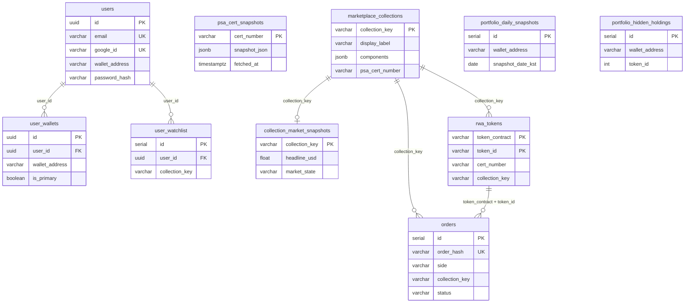
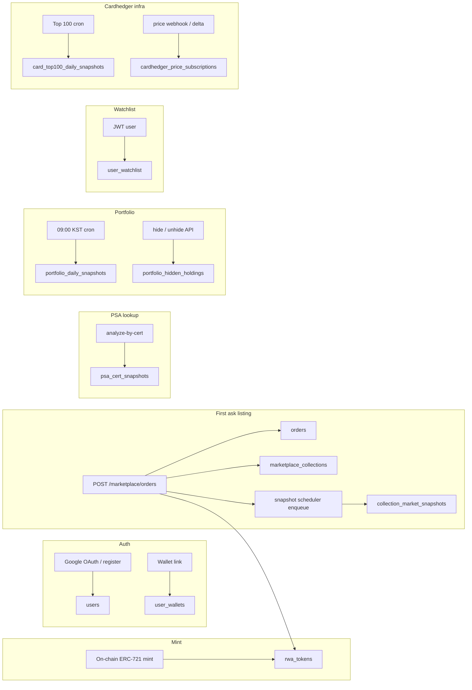

# Database

**Engine:** PostgreSQL 16  
**ORM:** TypeORM (NestJS) — **17 entities**  
**DDL:** `backend/sql/schema/` — applied via [bootstrap script](../../backend/sql/README.md)  
**Source of truth:** `backend/src/**/entities/*.ts`

---

## Principles

| Rule | Detail |
|------|--------|
| **Domain tables** | Auth/users, marketplace core, portfolio, Cardhedger price infra, admin — see table list below |
| **No FK constraints (marketplace core)** | Core bucket/order relationships are **logical** (denormalized keys, enforced in app code) |
| **FK on user-scoped tables** | `user_wallets`, `user_watchlist`, `verification_tokens` reference `users(id)` with CASCADE |
| **Bucket vs pricing split** | `marketplace_collections` = metadata · `collection_market_snapshots` = Cardhedger pricing |
| **PSA cache split** | `psa_cert_snapshots` = API cache by cert · `marketplace_collections.psa_cert_number` = bucket facet |
| **Hot read path** | Collection charts/list rows read PostgreSQL only — Cardhedger upstream runs in snapshot workers |

---

## Tables by domain

### Auth & users

| Table | Purpose | Entity |
|-------|---------|--------|
| `users` | Google OAuth + email/password accounts | `user/entities/user.entity.ts` |
| `user_wallets` | Multiple linked wallets per user (shared address allowed across users) | `user/entities/user-wallet.entity.ts` |
| `verification_tokens` | Hashed single-use tokens (email verify, password reset) | `auth/entities/verification-token.entity.ts` |

### Marketplace core

| Table | Purpose | Entity |
|-------|---------|--------|
| `psa_cert_snapshots` | PSA Public API response cache (by cert number) | `marketplace/entities/psa-cert-snapshot.entity.ts` |
| `marketplace_collections` | Graded-metadata bucket catalog (created on first ask) | `marketplace/entities/marketplace-collection.entity.ts` |
| `rwa_tokens` | On-chain mint registry (contract + tokenId → cert, IPFS) | `marketplace/entities/rwa-token.entity.ts` |
| `collection_market_snapshots` | Materialized Cardhedger market state per bucket | `marketplace/entities/collection-market-snapshot.entity.ts` |
| `orders` | Seaport signed asks/bids + fulfilled trade tape | `marketplace/entities/order.entity.ts` |

### Portfolio & engagement

| Table | Purpose | Entity |
|-------|---------|--------|
| `portfolio_daily_snapshots` | Daily 09:00 KST wallet mark-to-market | `marketplace/entities/portfolio-daily-snapshot.entity.ts` |
| `portfolio_hidden_holdings` | Per-wallet UI hide list (off-chain preference) | `marketplace/entities/portfolio-hidden-holding.entity.ts` |
| `user_watchlist` | Saved marketplace collections per authenticated user | `marketplace/entities/user-watchlist.entity.ts` |

### Admin & Cardhedger infra

| Table | Purpose | Entity |
|-------|---------|--------|
| `marketplace_admins` | Marketplace admin console credentials | `marketplace/entities/marketplace-admin.entity.ts` |
| `card_top100_daily_snapshots` | Daily Top 100 rank snapshots (KST date × category × grade) | `cardhedger/entities/card-top100-snapshot.entity.ts` |
| `cardhedger_price_subscriptions` | Cardhedger `subscribe-price-updates` registrations | `cardhedger/entities/cardhedger-price-subscription.entity.ts` |
| `cardhedger_price_delta_checkpoints` | Singleton checkpoint for delta polling | `cardhedger/entities/cardhedger-price-delta-checkpoint.entity.ts` |
| `cardhedger_daily_price_export_runs` | Nightly CSV export import audit | `cardhedger/entities/cardhedger-daily-price-export-run.entity.ts` |
| `cardhedger_price_delta_import_runs` | Per-run delta import audit | `cardhedger/entities/cardhedger-price-delta-import-run.entity.ts` |

> **Note:** `card_top100_daily_snapshots` is not yet in `bootstrap-empty-prod-db.sql`. Created via TypeORM sync in dev; add DDL before relying on it in a bootstrap-only prod DB.

---

## Entity relationships (core marketplace)

PostgreSQL does not declare foreign keys on marketplace core tables. Arrows show **logical** links only.

---

## Write paths

Cardhedger upstream calls happen inside **snapshot workers**, **cold-start refresh**, **cert trace**, **portfolio capture**, and **Cardhedger proxy/controllers** — not on every chart/list GET. See [materialized-market-snapshots.md](./materialized-market-snapshots.md).

---

## Concern mapping

| Concern | Storage |
|---------|---------|
| Bucket identity | `marketplace_collections.collection_key` + `market_parallel_key` + `bucket_key_version` |
| Cardhedger catalog id | `marketplace_collections.components.cardhedgerCardId` (via `CollectionIdentityService`) |
| Cardhedger pricing | `collection_market_snapshots` |
| PSA cert (canonical per bucket) | `marketplace_collections.psa_cert_number` |
| PSA API payload cache | `psa_cert_snapshots.snapshot_json` |
| Mint inventory | `rwa_tokens` |
| Order book + trade tape | `orders` |
| Portfolio history | `portfolio_daily_snapshots` |
| Portfolio hide preference | `portfolio_hidden_holdings` |
| Saved collections | `user_watchlist` |
| Top 100 daily rank | `card_top100_daily_snapshots` |
| Live price push / delta | `cardhedger_price_subscriptions` + import run tables |

---

## Schema files

Applied in order by `backend/sql/bootstrap-empty-prod-db.sql`:

| File | Table(s) / change |
|------|-------------------|
| `schema/010_users.sql` | `users` |
| `schema/015_psa_cert_snapshots.sql` | `psa_cert_snapshots` |
| `schema/020_marketplace_collections.sql` | `marketplace_collections` |
| `schema/025_rwa_tokens.sql` | `rwa_tokens` |
| `schema/026_rwa_tokens_display_image.sql` | `rwa_tokens.display_image_url` |
| `schema/030_collection_market_snapshots.sql` | `collection_market_snapshots` |
| `schema/040_orders.sql` | `orders` |
| `schema/050_refactor_legacy_columns.sql` | Legacy column migration (safe on fresh bootstrap) |
| `schema/060_portfolio_daily_snapshots.sql` | `portfolio_daily_snapshots` |
| `schema/061_portfolio_hidden_holdings.sql` | `portfolio_hidden_holdings` |
| `schema/062_user_watchlist.sql` | `user_watchlist` |
| `schema/063_users_password_hash.sql` | `users.password_hash` |
| `schema/064_verification_tokens.sql` | `verification_tokens` |
| `schema/065_user_wallets.sql` | `user_wallets` |
| `schema/066_user_wallets_allow_shared.sql` | Shared wallet constraint change |
| `schema/067_password_reset_tokens.sql` | `verification_token_type` + `password_reset` |
| `schema/068_marketplace_admins.sql` | `marketplace_admins` |
| `schema/070_cardhedger_price_infra.sql` | subscriptions, checkpoints, export runs |
| `schema/900_triggers.sql` | `updated_at` triggers |

**Manual migrations (not in bootstrap orchestrator):**

| File | Purpose |
|------|---------|
| `schema/071_cardhedger_price_delta_import_runs.sql` | Delta import audit table |
| `schema/072_cardhedger_delta_catalog_fallback.sql` | Extra columns on import runs |

Apply `071`/`072` on existing DBs that bootstrapped before those files existed.

| Environment | Approach |
|-------------|----------|
| **Local dev** | `NODE_ENV !== production` → TypeORM `synchronize: true` on backend boot |
| **Production / empty DB** | Run `backend/sql/scripts/bootstrap-db.sh` once, then apply `071`/`072` if needed |
| **Older DBs** | Bootstrap includes `050_refactor_legacy_columns.sql` for legacy column cleanup |

Details: [backend/sql/README.md](../../backend/sql/README.md) · [guides/deployment.md](../guides/deployment.md)

---

## Table reference (key columns)

### `users`

| Column | Notes |
|--------|-------|
| `id` | uuid PK |
| `email` | UNIQUE |
| `google_id` | UNIQUE, nullable |
| `password_hash` | nullable — Google-only users have NULL |
| `email_verified` | boolean — required for email/password login |
| `wallet_address` | Denormalized primary wallet (nullable; not globally unique) |
| `name`, `picture_url` | Profile |

Legacy per-user verification columns were moved to `verification_tokens`.

### `user_wallets`

| Column | Notes |
|--------|-------|
| `user_id` | FK → `users` |
| `wallet_address` | Same address may appear on **multiple users** (shared custody) |
| `is_primary` | One primary per user |
| **Unique** | `(user_id, wallet_address)` |

### `verification_tokens`

| Column | Notes |
|--------|-------|
| `token_hash` | SHA-256 of raw token (email only) |
| `type` | `email_verify` \| `password_reset` |
| `expires_at` | Single-use until consumed |

### `marketplace_collections`

Logical bucket from graded RWA metadata (`computeMarketBucketKey`, **v2**). Created on **first ask**, not at mint.

Key columns: `collection_key`, `display_label`, `components` (jsonb — includes `cardhedgerCardId`, `psaVariety`), `cover_image_url`, `psa_cert_number`, `market_parallel_key`, `bucket_key_version`.

### `rwa_tokens`

On-chain mint registry. Key columns: `(token_contract, token_id)` PK, `cert_number`, `token_uri`, `metadata_cid`, `display_name`, `display_image_url`, `collection_key`.

### `collection_market_snapshots`

Materialized Cardhedger state — API read path is DB-first. Key columns: `headline_usd`, `preview_json`, `external_usd_json`, `sparkline_90d_json`, `market_state`, `synced_at`, `stale_after`.

### `orders`

Seaport off-chain order book. `side`: `ask` \| `bid`. `status`: `active` \| `fulfilled` \| `cancelled` \| `expired`.

### `portfolio_daily_snapshots`

Daily wallet totals at **09:00 Asia/Seoul**. Unique `(wallet_address, snapshot_date_kst)`.

### `portfolio_hidden_holdings`

Off-chain UI preference — NFT stays in wallet. Unique `(wallet_address, token_id)`.

### `user_watchlist`

Unique `(user_id, collection_key)`.

### `marketplace_admins`

Separate admin console auth (`username`, `password_hash`) — not linked to `users`.

### `card_top100_daily_snapshots`

Unique `(snapshot_date_kst, category, grade)`. Stores ranked card JSON array for that day's snapshot.

### Cardhedger price infra tables

See `schema/070_cardhedger_price_infra.sql` and entity files under `backend/src/cardhedger/entities/`.

---

## Environment

| Variable | Purpose |
|----------|---------|
| `RWA_TOKEN_REGISTRY_SYNC_ON_BOOT` | Scan all minted tokenIds → `rwa_tokens` |
| `MARKETPLACE_BUCKET_KEY_MIGRATE_ON_BOOT` | Recompute active ask `collection_key` (v2) |
| `PSA_PUBLIC_SNAPSHOT_DB_TTL_SEC` | `psa_cert_snapshots` TTL |
| `MARKET_SNAPSHOT_*` | Snapshot worker tuning — [sql/README.md](../../backend/sql/README.md) |
| `PORTFOLIO_SNAPSHOT_*` | Portfolio cron tuning — [sql/README.md](../../backend/sql/README.md) |
| `REDIS_URL` | Identity cache L2 for `components.cardhedgerCardId` |
