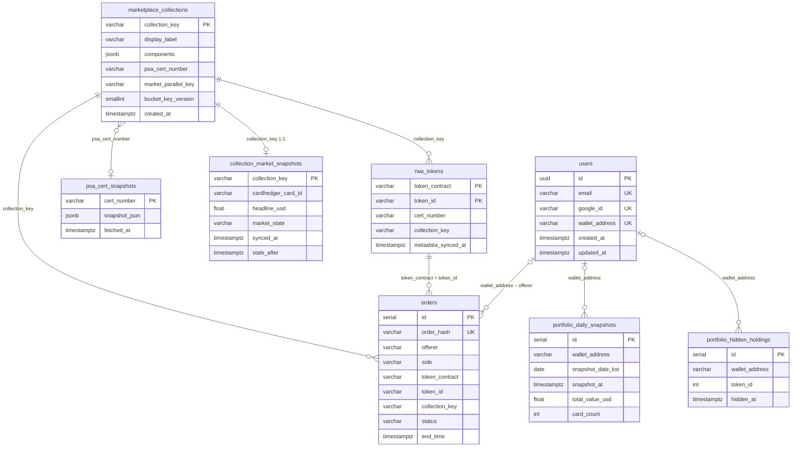
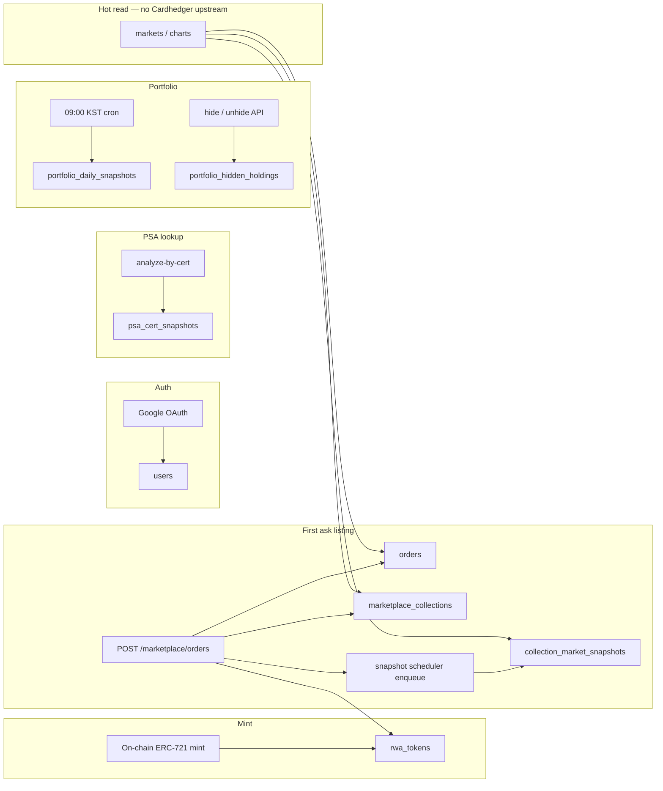

# Database

**Engine:** PostgreSQL 16  
**ORM:** TypeORM (NestJS)  
**DDL:** `backend/sql/schema/` — applied via [bootstrap script](../../backend/sql/README.md)  
**Source of truth:** `backend/src/**/entities/*.ts`

---

## Principles

| Rule | Detail |
|------|--------|
| **Eight tables** | All application state lives in the tables listed below — no relational `bids`/`asks` matching layer |
| **No FK constraints** | Relationships are **logical** (denormalized keys, enforced in application code) |
| **Bucket vs pricing split** | `marketplace_collections` = metadata · `collection_market_snapshots` = Cardhedger pricing |
| **PSA cache split** | `psa_cert_snapshots` = API cache by cert · `marketplace_collections.psa_cert_number` = bucket facet |
| **Hot read path** | Collection charts/list rows read PostgreSQL only — Cardhedger upstream runs in snapshot workers |

---

## Tables

| Table | Purpose | Entity |
|-------|---------|--------|
| `users` | Google OAuth accounts + optional linked wallet | `user/entities/user.entity.ts` |
| `psa_cert_snapshots` | PSA Public API response cache (by cert number) | `marketplace/entities/psa-cert-snapshot.entity.ts` |
| `marketplace_collections` | Graded-metadata bucket catalog (created on first ask) | `marketplace/entities/marketplace-collection.entity.ts` |
| `rwa_tokens` | On-chain mint registry (contract + tokenId → cert, IPFS) | `marketplace/entities/rwa-token.entity.ts` |
| `collection_market_snapshots` | Materialized Cardhedger market state per bucket | `marketplace/entities/collection-market-snapshot.entity.ts` |
| `orders` | Seaport signed asks/bids + fulfilled trade tape | `marketplace/entities/order.entity.ts` |
| `portfolio_daily_snapshots` | Daily 09:00 KST wallet mark-to-market | `marketplace/entities/portfolio-daily-snapshot.entity.ts` |
| `portfolio_hidden_holdings` | Per-wallet UI hide list (off-chain preference) | `marketplace/entities/portfolio-hidden-holding.entity.ts` |

---

## Entity relationships

PostgreSQL does not declare foreign keys. Arrows show **logical** links only.

---

## Write paths

Cardhedger upstream calls happen only inside **snapshot workers**, **cold-start refresh**, **cert trace**, and **portfolio capture** — not on every chart/list GET. See [materialized-market-snapshots.md](./materialized-market-snapshots.md).

---

## Concern mapping

| Concern | Storage |
|---------|---------|
| Bucket identity | `marketplace_collections.collection_key` + `market_parallel_key` + `bucket_key_version` |
| Cardhedger catalog id | `marketplace_collections.components.cardhedgerCardId` (via `CollectionIdentityService`) |
| Cardhedger pricing | `collection_market_snapshots` (`headline_usd`, `preview_json`, `external_usd_json`, …) |
| PSA cert (canonical per bucket) | `marketplace_collections.psa_cert_number` |
| PSA API payload cache | `psa_cert_snapshots.snapshot_json` |
| Mint inventory | `rwa_tokens` (optional boot sync: `RWA_TOKEN_REGISTRY_SYNC_ON_BOOT`) |
| Order book + trade tape | `orders` |
| Portfolio history | `portfolio_daily_snapshots` |
| Portfolio hide preference | `portfolio_hidden_holdings` |

`marketplace_collections` does **not** store Cardhedger pricing columns or per-row PSA JSON blobs — those live in the tables above.

---

## Schema files

Applied in order by `backend/sql/bootstrap-empty-prod-db.sql`:

| File | Table(s) |
|------|----------|
| `schema/010_users.sql` | `users` |
| `schema/015_psa_cert_snapshots.sql` | `psa_cert_snapshots` |
| `schema/020_marketplace_collections.sql` | `marketplace_collections` |
| `schema/025_rwa_tokens.sql` | `rwa_tokens` |
| `schema/030_collection_market_snapshots.sql` | `collection_market_snapshots` |
| `schema/040_orders.sql` | `orders` |
| `schema/050_refactor_legacy_columns.sql` | Legacy column migration (safe on fresh bootstrap) |
| `schema/060_portfolio_daily_snapshots.sql` | `portfolio_daily_snapshots` |
| `schema/061_portfolio_hidden_holdings.sql` | `portfolio_hidden_holdings` |
| `schema/900_triggers.sql` | `updated_at` triggers |

| Environment | Approach |
|-------------|----------|
| **Local dev** | `NODE_ENV !== production` → TypeORM `synchronize: true` on backend boot |
| **Production / empty DB** | Run `backend/sql/scripts/bootstrap-db.sh` once |
| **Older DBs** | Bootstrap includes `050_refactor_legacy_columns.sql` for legacy column cleanup |

Details: [backend/sql/README.md](../../backend/sql/README.md) · [guides/deployment.md](../guides/deployment.md)

---

## Table reference

### `users`

Google OAuth accounts with optional linked wallet.

| Column | Type | Notes |
|--------|------|-------|
| `id` | uuid PK | `gen_random_uuid()` |
| `email` | varchar(320) | UNIQUE |
| `google_id` | varchar(64) | UNIQUE, nullable |
| `name` | varchar(200) | nullable |
| `picture_url` | text | nullable |
| `email_verified` | boolean | default `false` |
| `platform_email_verified_at` | timestamptz | nullable |
| `email_verification_token_hash` | varchar(64) | nullable |
| `email_verification_expires_at` | timestamptz | nullable |
| `verification_email_last_sent_at` | timestamptz | nullable |
| `wallet_address` | varchar(42) | UNIQUE, nullable (EIP-55) |
| `wallet_linked_at` | timestamptz | nullable |
| `created_at`, `updated_at` | timestamptz | `updated_at` trigger |

---

### `psa_cert_snapshots`

PSA Public API cache keyed by cert digits.

| Column | Type | Notes |
|--------|------|-------|
| `cert_number` | varchar(32) PK | |
| `snapshot_json` | jsonb | Compact `PSACert` fields |
| `fetched_at` | timestamptz | TTL: `PSA_PUBLIC_SNAPSHOT_DB_TTL_SEC` |

---

### `marketplace_collections`

Logical bucket from graded RWA metadata (`computeMarketBucketKey`, **v2**). Created on **first ask**, not at mint.

| Column | Type | Notes |
|--------|------|-------|
| `collection_key` | varchar(64) PK | SHA-256 hex bucket key |
| `display_label` | varchar | Human-readable title |
| `query_used` | text | Cardhedger search text, nullable |
| `components` | jsonb | Bucket fields + enrichments (`cardhedgerCardId`, `psaVariety`, …) |
| `cover_image_url` | text | nullable |
| `psa_cert_number` | varchar(32) | Indexed; canonical cert for bucket |
| `market_parallel_key` | varchar(96) | Indexed; `base` or PSA Variety slug |
| `bucket_key_version` | smallint | default `2`, CHECK `>= 1` |
| `created_at` | timestamptz | |

**Indexes:** `psa_cert_number` (partial), `market_parallel_key`, `created_at DESC`

---

### `rwa_tokens`

On-chain mint registry. Populated on ask listing; optional full scan via `RWA_TOKEN_REGISTRY_SYNC_ON_BOOT`.

| Column | Type | Notes |
|--------|------|-------|
| `token_contract` | varchar(42) PK | `RWA_CONTRACT_ADDRESS` |
| `token_id` | varchar(64) PK | |
| `cert_number` | varchar(32) | From IPFS `graded.psa.certNumber` |
| `token_uri` | text | On-chain `tokenURI` |
| `metadata_cid` | varchar(128) | Parsed from `ipfs://` |
| `display_name` | varchar(512) | IPFS `name` |
| `collection_key` | varchar(64) | Last listing bucket, nullable |
| `metadata_synced_at` | timestamptz | |
| `created_at`, `updated_at` | timestamptz | |

---

### `collection_market_snapshots`

Materialized Cardhedger state — **API read path is DB-first**.

| Column | Type | Notes |
|--------|------|-------|
| `collection_key` | varchar(64) PK | |
| `cardhedger_card_id` | varchar(64) | nullable |
| `psa10_usd`, `psa9_usd`, `raw_usd`, `headline_usd` | double precision | nullable |
| `spot_price_basis` | varchar(32) | `comps`, `latest_sale`, `catalog`, … |
| `change_7d_pct`, `change_30d_pct` | double precision | nullable |
| `sparkline_90d_json` | jsonb | ~90d downsampled series |
| `preview_json` | jsonb | Full preview for `GET …/cardhedger` |
| `external_usd_json` | jsonb | Up to ~365d — `market-series` / `price-history` |
| `grade_prices_json` | jsonb | nullable |
| `category_label` | varchar(512) | nullable |
| `history_tier` | varchar(32) | nullable |
| `reliability_score` | smallint | 0–100, nullable |
| `market_state` | varchar(16) | `fresh` \| `stale` \| `error` \| `empty` |
| `synced_at`, `stale_after` | timestamptz | SWR freshness window |
| `source_version` | smallint | default `1` |
| `last_viewed_at` | timestamptz | Scheduler prioritization |
| `last_refresh_error` | text | nullable |
| `created_at`, `updated_at` | timestamptz | |

**Indexes:** `stale_after`, `last_viewed_at DESC`, `market_state`, `synced_at DESC`

---

### `orders`

Seaport off-chain order book.

| Column | Type | Notes |
|--------|------|-------|
| `id` | serial PK | |
| `order_hash` | varchar(255) | UNIQUE — Seaport hash |
| `offerer` | varchar(255) | ask: seller · bid: buyer |
| `side` | varchar(16) | `ask` \| `bid` |
| `token_contract` | varchar(255) | RWA ERC-721 |
| `token_id` | varchar(255) | bid criteria uses sentinel `"0"` |
| `collection_key` | varchar(64) | Denormalized at insert |
| `consideration_token` | varchar(255) | USDC |
| `consideration_amount` | varchar(255) | Micro-units string |
| `parameters` | jsonb | Full Seaport order |
| `signature` | varchar(255) | EIP-712 |
| `status` | varchar(32) | `active` \| `fulfilled` \| `cancelled` \| `expired` |
| `start_time`, `end_time` | timestamptz | |
| `created_at`, `updated_at` | timestamptz | |

**Indexes:** `offerer`, `token_id`, `(token_contract, token_id)`, `collection_key`, `end_time`  
**Partial:** active asks per collection · fulfilled asks per collection (chart tape)

---

### `portfolio_daily_snapshots`

Daily wallet totals for portfolio charts. Captured at **09:00 Asia/Seoul**.

| Column | Type | Notes |
|--------|------|-------|
| `id` | serial PK | |
| `wallet_address` | varchar(42) | Lowercase `0x…` |
| `snapshot_date_kst` | date | KST calendar day |
| `snapshot_at` | timestamptz | Slot instant (09:00 KST) |
| `total_value_usd` | double precision | CHECK `>= 0` |
| `card_count` | integer | CHECK `>= 0` |
| `created_at` | timestamptz | |

**Unique:** `(wallet_address, snapshot_date_kst)`  
**Index:** `(wallet_address, snapshot_at DESC)`

Cron targets: all on-chain RWA holders + linked zero-card wallets + wallets with prior history.

---

### `portfolio_hidden_holdings`

Off-chain UI preference — NFT stays in wallet; excluded from portfolio totals and default list.

| Column | Type | Notes |
|--------|------|-------|
| `id` | serial PK | |
| `wallet_address` | varchar(42) | |
| `token_id` | integer | CHECK `>= 0` |
| `hidden_at` | timestamptz | default `now()` |

**Unique:** `(wallet_address, token_id)`  
**Index:** `wallet_address`

---

## Environment

| Variable | Purpose |
|----------|---------|
| `RWA_TOKEN_REGISTRY_SYNC_ON_BOOT` | Scan all minted tokenIds → `rwa_tokens` |
| `MARKETPLACE_BUCKET_KEY_MIGRATE_ON_BOOT` | Recompute active ask `collection_key` (v2) |
| `PSA_PUBLIC_SNAPSHOT_DB_TTL_SEC` | `psa_cert_snapshots` TTL |
| `MARKET_SNAPSHOT_*` | Snapshot worker tuning — [sql/README.md](../../backend/sql/README.md) |
| `PORTFOLIO_SNAPSHOT_*` | Portfolio cron tuning — [sql/README.md](../../backend/sql/README.md) |
| `REDIS_URL` | Identity cache L2 for `components.cardhedgerCardId` |
