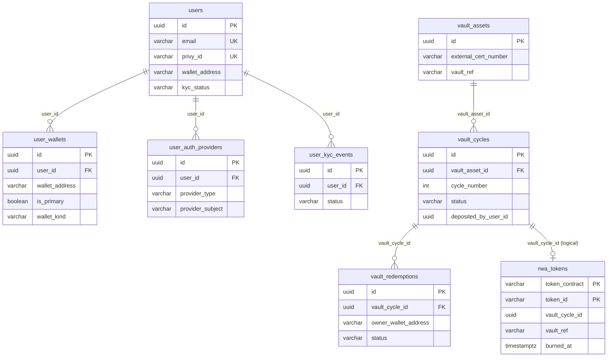
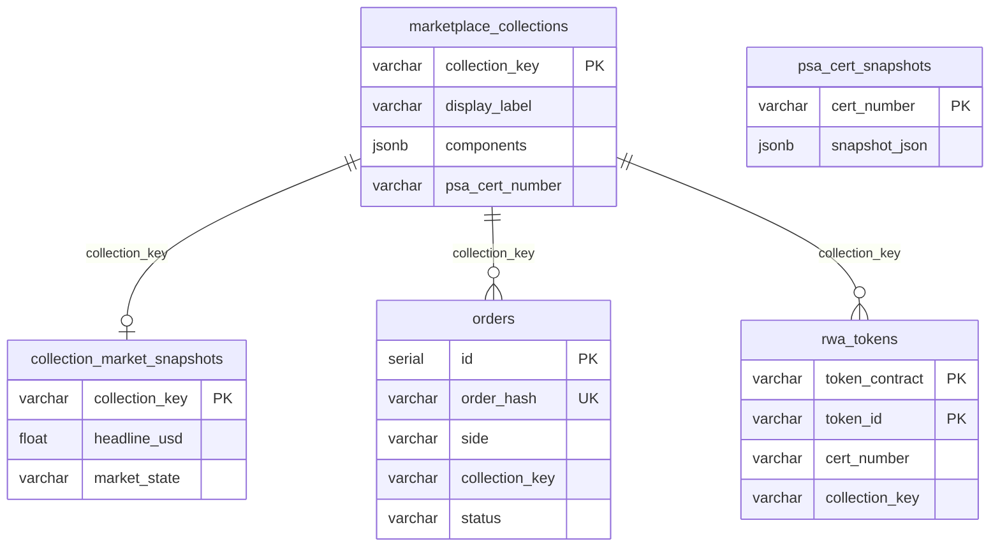

# Database

**Engine:** PostgreSQL 16  
**ORM:** TypeORM (NestJS) — **22 entities**  
**DDL:** `backend/sql/schema/` — applied via [bootstrap script](../../backend/sql/README.md)  
**Source of truth:** `backend/src/**/entities/*.ts`

---

## Principles

| Rule | Detail |
|------|--------|
| **Domain tables** | Auth/users, vault lifecycle, marketplace core, portfolio, Cardhedger price infra, admin |
| **No FK constraints (marketplace core)** | Core bucket/order relationships are **logical** (enforced in app code) |
| **FK on user-scoped tables** | `user_wallets`, `user_watchlist`, `verification_tokens`, `user_kyc_events` reference `users(id)` with CASCADE |
| **FK on vault tables** | `vault_cycles` → `vault_assets`, `vault_redemptions` → `vault_cycles` with RESTRICT |
| **Bucket vs pricing split** | `marketplace_collections` = metadata · `collection_market_snapshots` = Cardhedger pricing |
| **PSA cache split** | `psa_cert_snapshots` = API cache by cert · `marketplace_collections.psa_cert_number` = bucket facet |
| **Hot read path** | Collection charts/list rows read PostgreSQL only — Cardhedger upstream runs in snapshot workers |

---

## Tables by domain

### Auth & users

| Table | Purpose | Entity |
|-------|---------|--------|
| `users` | Platform account (email, profile, Privy DID, KYC snapshot) | `user/entities/user.entity.ts` |
| `user_auth_providers` | Linked login methods (email, Google, Apple, wallet, passkey) — synced from Privy | `user/entities/user-auth-provider.entity.ts` |
| `user_wallets` | Multiple linked wallets per user with embedded/external metadata | `user/entities/user-wallet.entity.ts` |
| `user_kyc_events` | Append-only KYC status audit trail | `user/entities/user-kyc-event.entity.ts` |
| `verification_tokens` | Hashed single-use tokens (legacy admin flows only) | `auth/entities/verification-token.entity.ts` |

### Vault lifecycle (new — migrations 080–084)

| Table | Purpose | Entity |
|-------|---------|--------|
| `vault_assets` | Permanent physical card identity (PSA cert → vaultRef = keccak256) | `vault/entities/vault-asset.entity.ts` |
| `vault_cycles` | One deposit-to-redemption window per asset; at most one open cycle at a time | `vault/entities/vault-cycle.entity.ts` |
| `vault_redemptions` | Redemption state machine: pending → ownership_verified → burned → completed | `vault/entities/vault-redemption.entity.ts` |

### Marketplace core

| Table | Purpose | Entity |
|-------|---------|--------|
| `psa_cert_snapshots` | PSA Public API response cache (by cert number) | `marketplace/entities/psa-cert-snapshot.entity.ts` |
| `marketplace_collections` | Graded-metadata bucket catalog (created on first ask) | `marketplace/entities/marketplace-collection.entity.ts` |
| `rwa_tokens` | On-chain mint registry (contract + tokenId → cert, vault cycle, IPFS) | `marketplace/entities/rwa-token.entity.ts` |
| `collection_market_snapshots` | Materialized Cardhedger market state per bucket | `marketplace/entities/collection-market-snapshot.entity.ts` |
| `orders` | Seaport signed asks/bids + fulfilled trade tape | `marketplace/entities/order.entity.ts` |

### Portfolio & engagement

| Table | Purpose | Entity |
|-------|---------|--------|
| `portfolio_daily_snapshots` | Daily 09:00 KST wallet mark-to-market | `marketplace/entities/portfolio-daily-snapshot.entity.ts` |
| `portfolio_hidden_holdings` | Per-wallet UI hide list (off-chain, chain-scoped) | `marketplace/entities/portfolio-hidden-holding.entity.ts` |
| `user_watchlist` | Saved marketplace collections per authenticated user | `marketplace/entities/user-watchlist.entity.ts` |

### Admin & Cardhedger infra

| Table | Purpose | Entity |
|-------|---------|--------|
| `marketplace_admins` | Marketplace admin console credentials | `marketplace/entities/marketplace-admin.entity.ts` |
| `card_top100_daily_snapshots` | Daily Top 100 rank snapshots (**no SQL file** — TypeORM sync only) | `cardhedger/entities/card-top100-snapshot.entity.ts` |
| `cardhedger_price_subscriptions` | Price push registrations | `cardhedger/entities/cardhedger-price-subscription.entity.ts` |
| `cardhedger_price_delta_checkpoints` | Singleton checkpoint for delta polling | `cardhedger/entities/cardhedger-price-delta-checkpoint.entity.ts` |
| `cardhedger_daily_price_export_runs` | Nightly CSV export audit | `cardhedger/entities/cardhedger-daily-price-export-run.entity.ts` |
| `cardhedger_price_delta_import_runs` | Per-run delta import audit | `cardhedger/entities/cardhedger-price-delta-import-run.entity.ts` |

> **Note:** `card_top100_daily_snapshots` has no SQL migration file. Created via TypeORM sync in dev; add DDL for production bootstrap.

---

## Entity relationships

### User → wallets / vault



### Marketplace core (logical links — no FK)



---

## Vault cycle status machine

```
pending_deposit
  → deposit_verified    (PSA cert lookup passed — automated)
  → minted              (after on-chain mint to custody wallet)
  → redemption_requested
  → redeemed            (after adminBurn)

(terminal) cancelled    (on-chain mint failed; compensating action)
```

---

## `rwa_tokens` — key columns

| Column | Notes |
|--------|-------|
| `(token_contract, token_id)` | Composite PK |
| `cert_number` | PSA cert |
| `vault_cycle_id` | Links to vault lifecycle |
| `vault_ref` | `keccak256(certNumber.toUpperCase())` — permanent, survives burn |
| `burned_at` | Set on adminBurn |
| **Unique constraint** | `(token_contract, cert_number) WHERE burned_at IS NULL` — allows re-mint of same cert after burn |

---

## Schema files (applied by `bootstrap-empty-prod-db.sql`)

| # | File | Table(s) / change |
|---|------|-------------------|
| 010 | `010_users.sql` | `users` |
| 015 | `015_psa_cert_snapshots.sql` | `psa_cert_snapshots` |
| 020 | `020_marketplace_collections.sql` | `marketplace_collections` |
| 025 | `025_rwa_tokens.sql` | `rwa_tokens` |
| 026 | `026_rwa_tokens_display_image.sql` | `rwa_tokens.display_image_url` |
| 030 | `030_collection_market_snapshots.sql` | `collection_market_snapshots` |
| 040 | `040_orders.sql` | `orders` |
| 050 | `050_refactor_legacy_columns.sql` | Legacy column cleanup (safe on fresh bootstrap) |
| 060 | `060_portfolio_daily_snapshots.sql` | `portfolio_daily_snapshots` |
| 061 | `061_portfolio_hidden_holdings.sql` | `portfolio_hidden_holdings` |
| 062 | `062_user_watchlist.sql` | `user_watchlist` |
| 063 | `063_users_password_hash.sql` | `users.password_hash` |
| 064 | `064_verification_tokens.sql` | `verification_tokens` |
| 065 | `065_user_wallets.sql` | `user_wallets` |
| 066 | `066_user_wallets_allow_shared.sql` | Allow shared wallet addresses |
| 067 | `067_password_reset_tokens.sql` | `verification_token_type` + password_reset |
| 068 | `068_marketplace_admins.sql` | `marketplace_admins` |
| 069 | `069_users_privy_kyc.sql` | `users.privy_id`, `kyc_status`, `kyc_verified_at` |
| 070 | `070_cardhedger_price_infra.sql` | price subscriptions, checkpoints, export runs |
| 071 | `071_cardhedger_price_delta_import_runs.sql` | Delta import audit table |
| 072 | `072_cardhedger_delta_catalog_fallback.sql` | Extra columns on import runs |
| 073 | `073_perf_indexes.sql` | Performance indexes |
| 074 | `074_user_auth_providers.sql` | `user_auth_providers` + legacy backfill |
| 075 | `075_user_wallets_metadata.sql` | wallet_kind, chain_type, Privy metadata |
| 076 | `076_user_kyc_platform.sql` | KYC metadata + `user_kyc_events` |
| 078 | `078_rwa_tokens_cert_unique.sql` | Cert unique (superseded by 084) |
| 079 | `079_portfolio_hidden_holdings_chain_scope.sql` | Chain-scoped hidden holdings |
| 080 | `080_vault_assets.sql` | `vault_assets` |
| 081 | `081_vault_cycles.sql` | `vault_cycles` |
| 082 | `082_vault_redemptions.sql` | `vault_redemptions` |
| 083 | `083_rwa_tokens_vault_lifecycle.sql` | `vault_cycle_id`, `vault_ref`, `burned_at` on `rwa_tokens` |
| 084 | `084_rwa_tokens_cert_unique_active_only.sql` | Partial unique — allows re-mint after burn |
| 900 | `900_triggers.sql` | `updated_at` auto-triggers |

**Maintenance (not in bootstrap):**

| File | Purpose |
|------|---------|
| `maintenance/077_reset_amoy_marketplace_data.sql` | Clears marketplace/vault tables for dev network reset |

**Seeds (dev only):**

| File | Purpose |
|------|---------|
| `seed-dev-platform-chart-fills.sql` | Synthetic fulfilled orders for chart data |
| `seed-marketplace-admin.sql` | Default admin credentials |

---

## Environment

| Variable | Purpose |
|----------|---------|
| `RWA_TOKEN_REGISTRY_SYNC_ON_BOOT` | Scan all minted tokenIds → `rwa_tokens` |
| `MARKETPLACE_BUCKET_KEY_MIGRATE_ON_BOOT` | Recompute active ask `collection_key` (v2) |
| `PSA_PUBLIC_SNAPSHOT_DB_TTL_SEC` | `psa_cert_snapshots` TTL |
| `MARKET_SNAPSHOT_*` | Snapshot worker tuning |
| `PORTFOLIO_SNAPSHOT_*` | Portfolio cron tuning |
| `REDIS_URL` | Identity cache L2 |

---

## Bootstrap approach per environment

| Environment | Approach |
|-------------|----------|
| **Local dev** | `NODE_ENV !== production` → TypeORM `synchronize: true` on backend boot |
| **Production / empty DB** | Run `backend/sql/scripts/bootstrap-db.sh` once |
| **Existing DB (upgrade)** | Apply missing numbered migrations manually |

Details: [backend/sql/README.md](../../backend/sql/README.md) · [guides/deployment.md](../guides/deployment.md)
