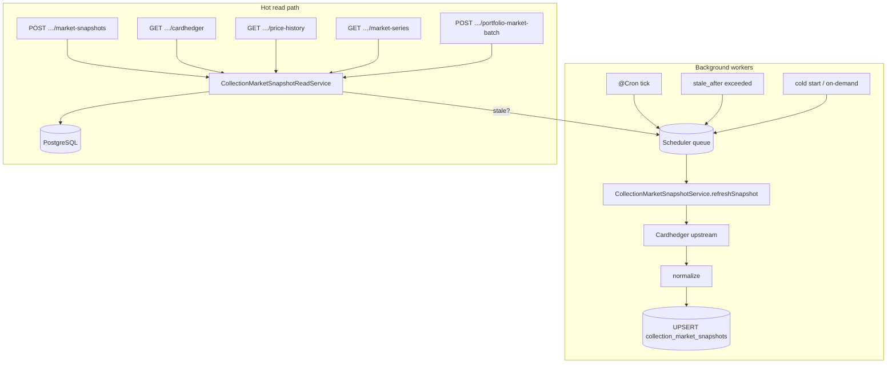

# Materialized Market Snapshot Architecture

## Overview

Cardhedger market data is **materialized** in `collection_market_snapshots` and refreshed by background workers. User-facing marketplace routes read PostgreSQL first and do not call Cardhedger upstream on the hot path.

Full table definitions: [database.md](./database.md).

## Separation of concerns

| Store | Purpose |
|-------|---------|
| `marketplace_collections` | Bucket metadata, cover, PSA/cert enrichments, listing display fields |
| `collection_market_snapshots` | Cardhedger pricing, preview JSON, external USD series, grade strip |
| `orders` | Platform listing pool (active asks) + fulfilled tape for charts |

**Removed:** pull-on-read bundle cache tables and legacy `MARKET_SNAPSHOT_READ_ENABLED` flag (no-op).

## Stale-while-revalidate

1. API returns last-known-good snapshot immediately.
2. If `stale_after <= now()`, response includes `snapshotStale: true`.
3. Scheduler enqueues async refresh — the HTTP request does not block on Cardhedger.

**Portfolio holdings** (`POST …/portfolio-market-batch`) never overlay live Cardhedger and never scan the listing pool. Missing rows enqueue `cold_start` and return an empty series until the worker upserts.

Holdings that have **no `marketplace_collections` row** cannot get a snapshot. The portfolio UI then uses token-level `POST /marketplace/cardhedger/mint-previews` (spot) and `GET /marketplace/rwa/:tokenId/trades` (comps sparkline). Daily wallet totals (`portfolio_daily_snapshots`) already apply the same mint-preview fallback.

## Cold start

When no snapshot row exists (new collection / first listing):

- `MARKET_SNAPSHOT_ON_DEMAND=true` (default): one upstream refresh, persist, return.
- Otherwise: empty preview until cron or a later on-demand refresh succeeds.

## Environment variables

See [backend/sql/README.md](../../backend/sql/README.md#snapshot-worker-env). Common tunables:

| Variable | Default | Purpose |
|----------|---------|---------|
| `MARKET_SNAPSHOT_ON_DEMAND` | on | Cold-start upstream refresh |
| `MARKET_SNAPSHOT_STALE_AFTER_SEC` | 900 | Freshness window |
| `MARKET_SNAPSHOT_CRON_ENABLED` | on | Background `@Cron` refresh |
| `MARKET_SNAPSHOT_REFRESH_CONCURRENCY` | 4 | Parallel worker cap |
| `PSA_PUBLIC_API_REFRESH_ON_SNAPSHOT` | ignored | Mint-only PSA policy — snapshot refresh never calls PSA |
| `PORTFOLIO_SNAPSHOT_*` | see sql README | Daily 09:00 KST wallet totals (`portfolio_daily_snapshots`) |

## Future: BullMQ + Redis

- Replace in-memory queue in `CollectionMarketSnapshotSchedulerService` with BullMQ `Queue.add`.
- Bind shared cache to Redis for cross-instance Cardhedger dedupe.
- Run workers as a separate Nest process or container.

## Rollout (production)

1. Bootstrap DB: `backend/sql/scripts/bootstrap-db.sh` (includes `collection_market_snapshots`).
2. Set `TYPEORM_SYNC=false` after first apply.
3. Monitor logs: `market_snapshot_refreshed`, `market_snapshot_refresh_scheduled`.

See [guides/deployment.md](../guides/deployment.md) for EC2 DB reset workflow.
