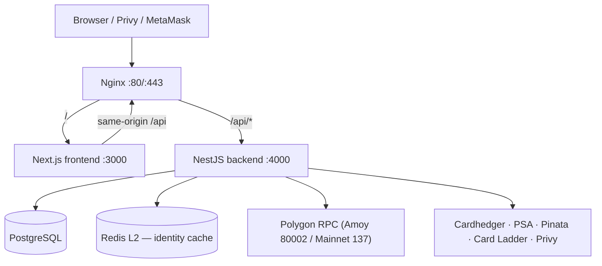

# System Overview

## Architecture at a Glance



## Request Flow

1. **Browser** calls same-origin `/api/*` through Nginx (no hard-coded API host in production).
2. **Site access gate** (optional): when `SITE_ACCESS_ENABLED=true`, unauthenticated API calls return `401 SITE_ACCESS_REQUIRED` except public paths (health, auth, site-access verify, Cardhedger webhooks). See [site-access.md](../api/site-access.md).
3. **NestJS** validates via `ValidationPipe`, applies JWT auth where required, and routes to the appropriate module.
4. **PostgreSQL** (TypeORM) persists **22+ application tables** — see [database.md](./database.md).
5. **Polygon RPC** (Amoy testnet or mainnet) provides read-only contract data. On-chain mint/burn is executed by the platform backend wallet; Seaport trading uses wallet-signed transactions in the browser.
6. **Cardhedger API** is called from snapshot workers, identity/cert resolution, `/api/cardhedger/v1/*` proxy, Top 100 / Top Movers services, and portfolio capture — not on every marketplace chart/list GET.
7. **Redis** (optional L2) backs the collection **identity cache** (`components.cardhedgerCardId`). Without `REDIS_URL`, L1 in-process cache only.
8. **PSA Public API** (six upstream methods — see [api/psa.md](../api/psa.md)) verifies certs, slab images, spec population, and optional order/submission progress. A **multi-token pool** (`PSA_PUBLIC_API_TOKENS`) rotates across free API tokens.
9. **Pinata** stores IPFS metadata and images.
10. **Privy** handles all user-facing authentication (email, Google, Apple, embedded wallet, external MetaMask). See [auth.md](../api/auth.md).

## Service Topology (Docker Compose)

| Container | Image | Port |
|-----------|-------|------|
| `tokenable-frontend` | ECR `tokenable-frontend` | 3000 (internal) |
| `tokenable-backend` | ECR `tokenable-backend` | 4000 (internal) |
| `tokenable-postgres` | `postgres:16-alpine` | 5432 (internal) |
| `tokenable-redis` | `redis:7-alpine` | 6379 (internal; host dev: 127.0.0.1:6380) |
| `tokenable-nginx` | `nginx:alpine` | 80, 443 (public) |

Local development omits Nginx; the frontend dev server proxies `/api` to the backend (default port **4100** — see [local-setup.md](../guides/local-setup.md)).

## Backend Modules (high level)

| Module | Role |
|--------|------|
| `AuthModule` | **Privy JWT session only** — `POST /auth/privy/session`, `GET /session`, `POST /logout`, `POST /delete-account` |
| `PrivyModule` | Privy feature catalog + Privy API proxy (users, funding, verify) |
| `UserModule` | `users`, `user_wallets`, `user_auth_providers`, `user_kyc_events` |
| `RwaModule` | IPFS upload (Pinata), platform-signed on-chain mint, redeem-request; PSA 10 gate |
| `VaultModule` | Physical card vault lifecycle DB orchestration (`VaultService`) — `vault_assets`, `vault_cycles`, `vault_redemptions` |
| `BlockchainModule` | Multi-chain RPC reads + IPFS gateway resolver; `RwaChainWriterService` (minter + custody signing) |
| `PsaModule` | Slab OCR, analyze-by-cert, PSA Public API 6-method proxy |
| `CardhedgerModule` | Upstream HTTP client + `/api/cardhedger/v1/*` proxy, Top 100, Top Movers |
| `CardhedgerPriceInfraModule` | Price webhooks, nightly delta import, subscription admin |
| `CardhedgerAdminModule` | Ops health + Prometheus scrape |
| `CardladderModule` | Landing market indexes scrape + cache |
| `MarketplaceModule` | Orders, collections, snapshots, portfolio, watchlist, admin |
| `SiteAccessModule` | Staging password gate |
| `HealthModule` | Liveness probe |

Detail: [backend.md](./backend.md).

## NFT & Vault Lifecycle

```
PSA cert lookup / slab OCR
  → IPFS metadata upload (POST /rwa/upload)
  → Platform backend mints NFT to custody wallet (POST /rwa/mint)
  → Admin delivers NFT to user primary wallet (POST /admin/rwa-tokens/:id/deliver)
  → User lists for sale on Seaport (ask order)
  → Buyer fulfills order on-chain (fulfillOrder USDC)
  → User initiates redemption (POST /rwa/redeem-request)
  → Admin burns NFT + releases physical card (POST /admin/rwa-tokens/:id/burn)
```

Detail: [vault-lifecycle.md](./vault-lifecycle.md).

## Trading & Orders

| Layer | Storage | Settlement | Entry Point |
|------|---------|-----------|-------------|
| **Seaport** | `orders`, `marketplace_collections` | Wallet-signed on-chain `fulfillOrder` / `matchAdvancedOrders` | `marketplace/orders/*` API + `frontend/lib/seaport/*` |
| **Market pricing (read)** | `collection_market_snapshots` | N/A — materialized + stale-while-revalidate | `marketplace/collections/*` + `POST …/market-snapshots` |
| **Portfolio history** | `portfolio_daily_snapshots` | N/A — daily 09:00 KST cron (on-chain holders) | `GET …/portfolio/daily/:wallet` |
| **Portfolio UI prefs** | `portfolio_hidden_holdings` | N/A — off-chain hide preference | `GET/POST/DELETE …/portfolio/hidden*` |
| **Watchlist** | `user_watchlist` | N/A — saved collections per user | `GET/POST/DELETE …/watchlist` |

Relational matching (`bids`/`asks` tables, settlement workers) has been **removed**. See [database.md](./database.md) and [materialized-market-snapshots.md](./materialized-market-snapshots.md).

## Key Environment Variables

### Authentication

| Variable | Service | Purpose |
|----------|---------|---------|
| `PRIVY_APP_ID` | backend | Privy App ID (same as frontend) |
| `PRIVY_APP_SECRET` | backend | Privy server secret — never expose to client |
| `PRIVY_JWT_VERIFICATION_KEY` | backend | Optional PEM key; avoids JWKS fetch on each verify |
| `JWT_SECRET` | backend | Tokenable session JWT signing (cookie) |
| `NEXT_PUBLIC_PRIVY_APP_ID` | frontend | Enables Privy login; no-op if unset |

### Blockchain / Multi-chain

| Variable | Service | Purpose |
|----------|---------|---------|
| `CHAIN_{id}_RPC_URL` | backend | Per-chain RPC URL (`137`, `80002`) |
| `CHAIN_{id}_RWA_ADDRESS` | backend | Per-chain TokenableRWA proxy address |
| `CHAIN_{id}_USDC_ADDRESS` | backend | Per-chain USDC address |
| `DEFAULT_CHAIN_ID` | backend | Default chain when header absent (default `80002`) |
| `RWA_OWNER_PRIVATE_KEY` | backend | Platform wallet — MINTER_ROLE + BURNER_ROLE |
| `RWA_CUSTODY_WALLET_ADDRESS` | backend | Custody wallet address (defaults to owner address) |
| `RWA_CUSTODY_PRIVATE_KEY` | backend | Optional separate custody signing key |
| `NEXT_PUBLIC_CHAIN_{id}_RPC_URL` | frontend | Client-side RPC per chain |
| `NEXT_PUBLIC_CHAIN_{id}_RWA` | frontend | Client-side RWA address per chain |
| `NEXT_PUBLIC_CHAIN_{id}_USDC` | frontend | Client-side USDC address per chain |
| `NEXT_PUBLIC_DEFAULT_CHAIN_ID` | frontend | Default chain for wagmi/Privy config |

### Performance instrumentation

| Variable | Service | Purpose |
|----------|---------|---------|
| `PERF_LOG` | backend | `true` / `1` — enable structured JSON stdout logging |
| `PERF_THRESHOLD_MS` | backend | Log threshold for HTTP/PSA/IPFS/RPC (default `200`) |
| `PERF_THRESHOLD_DB_MS` | backend | TypeORM `maxQueryExecutionTime` (default `500`) |

Frontend perf toggle uses `localStorage` keys (`PERF_LOG`, `PERF_THRESHOLD_MS`).

### Other backend

| Variable | Service | Purpose |
|----------|---------|---------|
| `CARDHEDGER_API_KEY` | backend | Cardhedger upstream |
| `PSA_PUBLIC_API_TOKENS` | backend | PSA cert lookup — comma-separated multi-token pool |
| `MARKET_SNAPSHOT_*` | backend | Collection market snapshot worker tuning |
| `REDIS_URL` | backend | Identity cache L2 (optional) |
| `PORTFOLIO_SNAPSHOT_*` | backend | Portfolio daily cron + bootstrap |
| `PINATA_JWT` + `PINATA_GATEWAY` | backend | IPFS upload & read |
| `SITE_ACCESS_ENABLED` + `SITE_ACCESS_SECRET` | backend | Optional staging gate |

Full variable reference: [guides/local-setup.md](../guides/local-setup.md).
