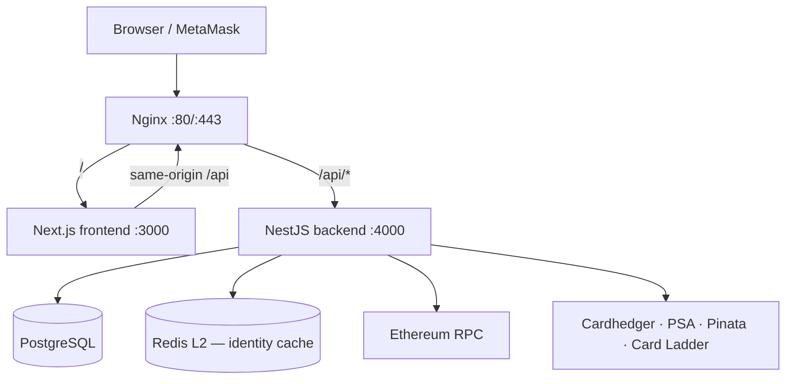

# System Overview

## Architecture at a Glance

## Request Flow

1. **Browser** calls same-origin `/api/*` through Nginx (no hard-coded API host in production).
2. **NestJS** validates the request via `ValidationPipe`, applies JWT auth where required, and routes to the appropriate module.
3. **PostgreSQL** (TypeORM) persists **eight** application tables — see [database.md](./database.md): `users`, `psa_cert_snapshots`, `marketplace_collections`, `rwa_tokens`, `collection_market_snapshots`, `orders`, `portfolio_daily_snapshots`, `portfolio_hidden_holdings`.
4. **Ethereum RPC** (Alchemy Sepolia) provides read-only contract data. On-chain settlement uses **Seaport 1.5** via wallet-signed transactions in the browser.
5. **Cardhedger API** is called from **background snapshot workers**, identity/cert resolution, and cold-start refresh — not on every marketplace chart/list request. Ops: `GET /api/admin/cardhedger/*` (admin wallet gate). Landing market indexes: `GET /api/cardladder/indexes` (Card Ladder scrape + cache).
6. **Redis** (optional L2) backs the collection **identity cache** (`components.cardhedgerCardId`). Without `REDIS_URL`, L1 in-process cache only.
7. **PSA Public API** verifies cert numbers and provides slab metadata.
8. **Pinata** stores IPFS metadata and images.

## Service Topology (Docker Compose)

| Container | Image | Port |
|-----------|-------|------|
| `tokenable-frontend` | ECR `tokenable-frontend` | 3000 (internal) |
| `tokenable-backend` | ECR `tokenable-backend` | 4000 (internal) |
| `tokenable-postgres` | `postgres:16-alpine` | 5432 (internal) |
| `tokenable-redis` | `redis:7-alpine` | 6379 (internal; host dev: 127.0.0.1:6380) |
| `tokenable-nginx` | `nginx:alpine` | 80, 443 (public) |

Local development omits Nginx; the frontend dev server proxies `/api` to `localhost:4000`.

## Trading & Orders

| Layer | Storage | Settlement | Entry Point |
|------|---------|-----------|-------------|
| **Seaport** | `orders`, `marketplace_collections` | Wallet-signed on-chain `fulfillOrder` / `matchAdvancedOrders` | `marketplace/orders/*` API + `frontend/lib/seaport/*` |
| **Market pricing (read)** | `collection_market_snapshots` | N/A — materialized + stale-while-revalidate | `marketplace/collections/*` + `POST …/market-snapshots` |
| **Portfolio history** | `portfolio_daily_snapshots` | N/A — daily 09:00 KST cron (on-chain holders) | `GET …/portfolio/daily/:wallet` |
| **Portfolio UI prefs** | `portfolio_hidden_holdings` | N/A — off-chain hide preference | `GET/POST/DELETE …/portfolio/hidden*` |

Relational matching (`bids`/`asks` tables, settlement workers) has been **removed**. See [database.md](./database.md) and [materialized-market-snapshots.md](./materialized-market-snapshots.md).

## Key Environment Variables

| Variable | Service | Purpose |
|----------|---------|---------|
| `RWA_CONTRACT_ADDRESS` | backend | TokenableRWA on Sepolia |
| `USDC_CONTRACT_ADDRESS` | backend | MockUSDC on Sepolia |
| `SEPOLIA_RPC_URL` | backend | Alchemy RPC |
| `CARDHEDGER_API_KEY` | backend | Cardhedger upstream (snapshot workers) |
| `MARKET_SNAPSHOT_*` | backend | Collection market snapshot worker tuning |
| `REDIS_URL` | backend | Identity cache L2 (optional; L1-only if unset) |
| `MARKETPLACE_ADMIN_WALLETS` | backend | Comma-separated admin wallets for cover/delete + Cardhedger ops |
| `PORTFOLIO_SNAPSHOT_*` | backend | Portfolio daily cron + bootstrap (`PORTFOLIO_SNAPSHOT_CRON_ENABLED`, …) |
| `PSA_PUBLIC_API_TOKEN` | backend | PSA cert lookup |
| `TYPEORM_SYNC` | backend | Prod: `true` only for empty DB bootstrap, then `false` |
| `PINATA_JWT` + `PINATA_GATEWAY` | backend | IPFS upload & read |
| `JWT_SECRET` | backend | JWT signing |
| `GOOGLE_CLIENT_ID/SECRET` | backend | Google OAuth |
| `CARDLADDER_INDEXES_SCRAPER_PROXY` | backend | Residential proxy for Card Ladder scraper (required on datacenter IPs) |
| `CARDLADDER_INDEXES_PREWARM_DISABLED` | backend | Set `1` to skip boot scrape (default: enabled → scrapes on startup then every 6h) |
| `NEXT_PUBLIC_RWA_CONTRACT_ADDRESS` | frontend | Baked into bundle at Docker build |
| `NEXT_PUBLIC_ALCHEMY_RPC_URL` | frontend | Browser-side RPC |

Full variable reference: [guides/local-setup.md](../guides/local-setup.md).
