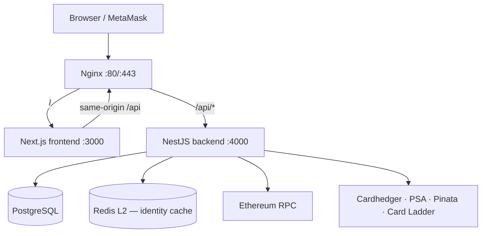

# System Overview

## Architecture at a Glance

## Request Flow

1. **Browser** calls same-origin `/api/*` through Nginx (no hard-coded API host in production).
2. **Site access gate** (optional): when `SITE_ACCESS_ENABLED=true`, unauthenticated API calls return `401 SITE_ACCESS_REQUIRED` except public paths (health, auth, site-access verify, Cardhedger webhooks). See [site-access.md](../api/site-access.md).
3. **NestJS** validates via `ValidationPipe`, applies JWT auth where required, and routes to the appropriate module.
4. **PostgreSQL** (TypeORM) persists **seventeen** application tables — see [database.md](./database.md).
5. **Ethereum RPC** (Alchemy Sepolia) provides read-only contract data. On-chain settlement uses **Seaport 1.5** via wallet-signed transactions in the browser.
6. **Cardhedger API** is called from snapshot workers, identity/cert resolution, `/api/cardhedger/v1/*` proxy, Top 100 / Top Movers services, and portfolio capture — not on every marketplace chart/list GET.
7. **Redis** (optional L2) backs the collection **identity cache** (`components.cardhedgerCardId`). Without `REDIS_URL`, L1 in-process cache only.
8. **PSA Public API** verifies cert numbers and provides slab metadata / OCR enrichment.
9. **Pinata** stores IPFS metadata and images.

## Service Topology (Docker Compose)

| Container | Image | Port |
|-----------|-------|------|
| `tokenable-frontend` | ECR `tokenable-frontend` | 3000 (internal) |
| `tokenable-backend` | ECR `tokenable-backend` | 4000 (internal) |
| `tokenable-postgres` | `postgres:16-alpine` | 5432 (internal) |
| `tokenable-redis` | `redis:7-alpine` | 6379 (internal; host dev: 127.0.0.1:6380) |
| `tokenable-nginx` | `nginx:alpine` | 80, 443 (public) |

Local development omits Nginx; the frontend dev server proxies `/api` to the backend (default port **4100** — see [local-setup.md](../guides/local-setup.md)).

## Backend Modules (high level)

| Module | Role |
|--------|------|
| `AuthModule` | Google OAuth, email/password, JWT cookies, wallet link (signature challenge) |
| `UserModule` | `users`, `user_wallets` |
| `RwaModule` | IPFS upload (Pinata) — PSA 10 gate |
| `BlockchainModule` | Sepolia read-only RWA + IPFS gateway resolver |
| `PsaModule` | Slab OCR, analyze-by-cert, order/submission progress proxy |
| `CardhedgerModule` | Upstream client + `/api/cardhedger/v1/*` proxy, Top 100, Top Movers |
| `CardhedgerPriceInfraModule` | Price webhooks, nightly delta import, subscription admin |
| `CardhedgerAdminModule` | Ops health + Prometheus scrape |
| `CardladderModule` | Landing market indexes scrape + cache |
| `MarketplaceModule` | Orders, collections, snapshots, portfolio, watchlist, admin |
| `SiteAccessModule` | Staging password gate |
| `HealthModule` | Liveness probe |

Detail: [backend.md](./backend.md).

## Trading & Orders

| Layer | Storage | Settlement | Entry Point |
|------|---------|-----------|-------------|
| **Seaport** | `orders`, `marketplace_collections` | Wallet-signed on-chain `fulfillOrder` / `matchAdvancedOrders` | `marketplace/orders/*` API + `frontend/lib/seaport/*` |
| **Market pricing (read)** | `collection_market_snapshots` | N/A — materialized + stale-while-revalidate | `marketplace/collections/*` + `POST …/market-snapshots` |
| **Portfolio history** | `portfolio_daily_snapshots` | N/A — daily 09:00 KST cron (on-chain holders) | `GET …/portfolio/daily/:wallet` |
| **Portfolio UI prefs** | `portfolio_hidden_holdings` | N/A — off-chain hide preference | `GET/POST/DELETE …/portfolio/hidden*` |
| **Watchlist** | `user_watchlist` | N/A — saved collections per user | `GET/POST/DELETE …/watchlist` |

Relational matching (`bids`/`asks` tables, settlement workers) has been **removed**. See [database.md](./database.md) and [materialized-market-snapshots.md](./materialized-market-snapshots.md).

## Key Environment Variables

| Variable | Service | Purpose |
|----------|---------|---------|
| `RWA_CONTRACT_ADDRESS` | backend | TokenableRWA on Sepolia |
| `USDC_CONTRACT_ADDRESS` | backend | MockUSDC on Sepolia |
| `SEPOLIA_RPC_URL` | backend | Alchemy RPC |
| `CARDHEDGER_API_KEY` | backend | Cardhedger upstream (snapshot workers + proxy) |
| `MARKET_SNAPSHOT_*` | backend | Collection market snapshot worker tuning |
| `REDIS_URL` | backend | Identity cache L2 (optional; L1-only if unset) |
| `MARKETPLACE_ADMIN_WALLETS` | backend | Comma-separated admin wallets for cover/delete + Cardhedger ops |
| `PORTFOLIO_SNAPSHOT_*` | backend | Portfolio daily cron + bootstrap |
| `PSA_PUBLIC_API_TOKEN` | backend | PSA cert lookup |
| `TYPEORM_SYNC` | backend | Prod: `true` only for empty DB bootstrap, then `false` |
| `PINATA_JWT` + `PINATA_GATEWAY` | backend | IPFS upload & read |
| `JWT_SECRET` | backend | JWT signing |
| `GOOGLE_CLIENT_ID/SECRET` | backend | Google OAuth |
| `SITE_ACCESS_ENABLED` + `SITE_ACCESS_SECRET` | backend | Optional staging gate |
| `CARDLADDER_INDEXES_SCRAPER_PROXY` | backend | Residential proxy for Card Ladder scraper (datacenter IPs) |
| `NEXT_PUBLIC_RWA_CONTRACT_ADDRESS` | frontend | Baked into bundle at Docker build |
| `NEXT_PUBLIC_ALCHEMY_RPC_URL` | frontend | Browser-side RPC |

Full variable reference: [guides/local-setup.md](../guides/local-setup.md).
