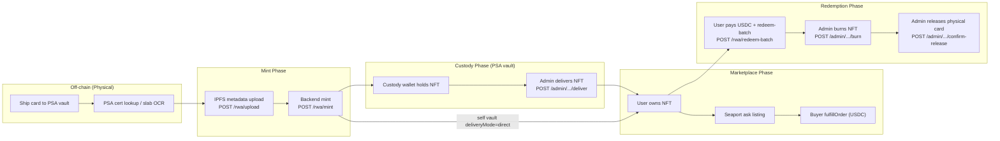

# Vault Lifecycle

The vault system is the core business process of Tokenable: it manages the lifecycle of a **physical PSA-graded card** from initial deposit to NFT minting, marketplace trading, and final redemption/burn.

---

## Overview



---

## Data Model

### VaultAsset

Permanent record of a physical card. Created once per PSA cert. Never deleted.

```
vault_assets (uuid id PK)
  external_cert_number: "83179580"   — PSA cert (UPPERCASE normalized)
  vault_ref: "0xkeccak256..."        — keccak256(cert.toUpperCase()) = on-chain vaultRef
  asset_type: "psa_graded"
  display_name: optional
```

### VaultCycle

Cycles are chain-scoped in both DB and API:

- Partial unique index `uq_vault_cycles_one_open_per_asset_chain` on `(vault_asset_id, chain_id)` where status is open
- `VaultService.assertAvailableForNewCycle(cert, chainId)` / `reserveCycleForDeposit({ chainId })` filter by `chain_id`
- Chain-sensitive writes (`POST /api/rwa/upload`, `/rwa/mint`, `/rwa/redeem-request`, bulk-mint, P2P listing create) use `ChainConfigService.requireChainId()` — missing `x-tokenable-chain-id` returns 400 instead of silently using `DEFAULT_CHAIN_ID` (which would mis-attribute a Sepolia conflict to a Polygon mint attempt)

```
vault_cycles (uuid id PK)
  vault_asset_id: FK → vault_assets
  chain_id: EIP-155 chain the cycle's NFT is minted on (11155111, 137, ...)
  cycle_number: 1, 2, 3, ...  (sequential per asset, across chains)
  status: pending_deposit | deposit_verified | minted | redemption_requested | redeemed | cancelled
  deposited_by_user_id: uuid (the user who initiated this vault cycle)
  deposited_at: timestamptz
  redeemed_at: timestamptz
```

### VaultRedemption

Tracks the multi-step redemption process for a specific cycle.

```
vault_redemptions (uuid id PK)
  vault_cycle_id: FK → vault_cycles
  owner_wallet_address: "0x..."   — wallet that owned NFT when redemption was requested
  status: pending | ownership_verified | burned | completed
  burn_tx_hash: "0x..."
  ownership_verified_at: timestamptz
  burned_at: timestamptz
  completed_at: timestamptz      — physical card released
```

### RwaToken (extended for vault)

```
rwa_tokens
  vault_cycle_id: uuid (FK to vault_cycles)
  vault_ref: "0xkeccak256..."    — matches on-chain vaultRef
  burned_at: timestamptz         — set when adminBurn completes
  burn_tx_hash: "0x..."
```

---

### VaultSubmission (sell-flow package, pre-mint)

Tracks the collector **shipping package** once they enter `/sell/shipping` (Add-cards stays in localStorage). Durable across devices for `awaiting_shipment`+.

```
vault_submissions
  public_id: SUB-YYYYMMDD-#####   # e.g. SUB-20260805-00001 (per-day sequence)
  user_id
  status: awaiting_shipment | in_transit | psa_reviewing | completed | cancelled
          (legacy: draft — no longer created by POST /draft)
  carrier / tracking_number / ship_date / shipped_at
  packing_slip_downloaded_at

vault_submission_items
  cert_number, display_name, grade, image_url
  status: confirmed | in_transit | reviewing | approved | rejected | minting | completed | failed
          (legacy item draft unused on ship upsert — cards must be confirmed)
  vault_cycle_id  — set when POST /rwa/mint reserves a cycle for this cert
```

Scenario key for Vault-Detail UI (A~H) is derived from package + item statuses (`VaultSubmissionService.resolveScenario`).

API (JWT): `GET/POST /api/vault/submissions…` — see `docs/api/vault-submissions.md`.  
Admin ops: `/api/marketplace/admin/vault-submissions` + UI `/marketplace/admin/vault/submissions` (packages) · `/marketplace/admin/vault/psa-mail` (mail inbox) · `/marketplace/admin/vault/mint-queue` (mint & deliver).

**Ship → PSA:** seller tracking → `in_transit`. Arrival is admin **Mark arrived**, or Gmail **Items Received** mail to `tokenable.dev@gmail.com` — poll auto-confirms matched packages (`vault_psa_arrival_reviews.confirmed_via = auto`) or ops **Confirm** on **PSA mail** (`confirmed_via = admin`). Incomplete parses get `ingest_note` and stay **Pending** (never silent-drop). Bodies with both arrival and vaulted phrases are treated as ambiguous and enqueued for ops (not auto-confirmed).

**PSA → Live:** Gmail **Items Vaulted** (“now secured in your PSA Vault”, same subject as arrival) → `PsaVaultedMailService` auto mint & deliver (`vault_psa_vaulted_reviews`, `minted_via = auto`). Ops can also use **Mint queue** manual **Mint & deliver**. Incomplete/unmatched mail stays **Pending** on Mint queue for retry; partial mint retries preserve prior successful certs in `mint_results`. Item → `completed` (Live in portfolio).

**Sell-flow draft resume:** Add-cards progress is **localStorage only** (no `status=draft` package rows). Entering `/sell/shipping` **upserts confirmed cards** as `awaiting_shipment` (first durable write; Hub shows Add tracking). Confirm tracking → `in_transit`.

---

## VaultCycle Status Machine

```
pending_deposit  →  deposit_verified  →  minted  →  redemption_requested  →  redeemed
                                                                 ↑
                                                         (admin burn completes)

Any state  →  cancelled   (on-chain mint failure; compensating action)
```

### Automated vs manual steps

| Step | Who | When |
|------|-----|------|
| `deposit_verified` | Automated | PSA cert lookup passes; `reserveCycleForDeposit()` |
| `minted` | Backend on-chain | After `mint()` tx confirmed; `recordMintResult()` |
| `redemption_requested` | User API | `POST /rwa/redeem-request` |
| `redeemed` | Admin on-chain | After `adminBurn()` tx confirmed |
| `completed` | Admin ops | After physical card shipped (`confirmVaultRelease`) |
| `cancelled` | Backend (compensating) | On-chain mint failed; cycle released for retry |

### Portfolio Redeem UI (design system-5 — pay-first)

User-facing flow (product copy: **Redeem**, route `/portfolio/redeem`):

1. Portfolio My Assets → **Redeem** → select up to 50 eligible cards (not listed, no open redemption)
2. Draft in `sessionStorage` → `/portfolio/redeem` ship-to form; cost from `GET /api/rwa/redeem/estimate?tokenIds=` (retrieval + early if vaulted &lt;90d via `deposited_at` + shipping once)
3. **Review and pay** → Review & pay screen
4. **Pay and redeem** → KYC Level 2 → USDC `transfer` to `PLATFORM_FEE_RECIPIENT` → `POST /api/rwa/redeem-batch` (stores `payment_received_usdc_micros`) → buyer **user-signs** ERC-721 `safeTransferFrom` into `RWA_CUSTODY_WALLET_ADDRESS` for every batch NFT → `POST /api/rwa/redeem-batch/:batchId/custody` → only when **all** are `in_custody` → **Preparing** (`?view=preparing`)
5. Mid-transfer abandonment (wallet cancel / close tab): Portfolio shows **Redeeming — finish transfer** → **Finish transfer** → `/portfolio/redeem?view=resume` (Finish NFT transfers; no second USDC). Also works from `/portfolio/redeem?view=preparing` if cards are still `ownership_verified`. Hydrate from open redemptions + optional `sessionStorage`; custody address from `GET /rwa/redeem/custody-wallet`
6. Holdings show **Redeeming — preparing** for `in_custody` without tracking (and **finish transfer** while `ownership_verified`). Cards already transferred to custody are still listed on Portfolio as redeeming rows (from `GET /rwa/redemptions/mine`), with Set price blocked · **View status** → Preparing
7. Admin sets **tracking per vault shipment** (`psa_vault` / `partner:<id>`) on the payment batch → that shipment shows **On the way**; when any shipment is tracked the user surface advances to **In transit** with one box per vault (Redeem.html). Carrier is editable on Admin Redeems (including after tracking is set). Refunds lock after any tracking is set.
8. When **all** vault shipments have tracking, the user can tap **I've received my cards** → `POST /rwa/redeem-batch/:batchId/confirm-received` → status `completed` (**Done** / “In your possession”). **FedEx Track cron** (`FEDEX_TRACK_ENABLED`) also stamps `carrier_delivered_at` on Delivered, reminds via `RD_RECEIVED_REMINDER`, then after `REDEEM_AUTO_RECEIPT_GRACE_DAYS` auto-confirms (`receipt_confirmed_via=auto`) so users who never return still close the redeem for settlement. Burn / confirm-release may still follow for ops. Portfolio **Redeem** tab keeps completed orders under **Completed** history (`GET /rwa/redemptions/mine` still returns them).

**Refunds (admin):** allowed until a `tracking_number` is set (blocked after burn/completed). USDC refund is **once per payment batch** (stored micros; never recompute) — not once per redemption row. Return custody NFTs via custody signer (per card). UI: `/marketplace/admin/redeems` (batch header shows paid amount + refund actions).

Physical PSA outbound remains ops (no PSA vault withdraw API). Apply `backend/sql/maintenance/add_vault_redemptions_fee_payment.sql`, `add_vault_redemptions_custody_refund.sql`, and `add_vault_redeem_payment_claims.sql` (UNIQUE `payment_tx_hash` claim table + atomic batch create).

Maintenance SQL for ship-to on existing DBs: `backend/sql/maintenance/add_vault_redemptions_ship_to.sql`.  
Maintenance SQL for FedEx delivery / auto-receipt: `backend/sql/maintenance/add_vault_redemptions_carrier_delivered.sql`.

---

## VaultRef

The `vaultRef` is a **permanent on-chain identity** for the physical card:

```typescript
vaultRef = keccak256(certNumber.trim().toUpperCase())
```

- Derived from PSA cert number only — never from tokenURI or tokenId
- Stored in contract: `_vaultRefs[tokenId]` (permanent, survives burn)
- Used for anti-double-claim: `VaultRefAlreadyActive` revert if active token exists
- `activeTokenIdOf(vaultRef)` returns 0 after burn → allows new cycle

---

## Custody wallet

**Default / PSA vault** mints go to the **platform custody wallet**:

```
mint(custodyWallet, tokenURI, vaultRef)   ← backend executes (deliveryMode=custody)
```

**Self vault** (`deliveryMode=direct` on `POST /rwa/mint`) mints straight to the user's linked wallet:

```
mint(userLinkedWallet, tokenURI, vaultRef)   ← no admin deliver step
```

If the same PSA cert is already on a vault submission that finished shipping (`in_transit` / at PSA), `deliveryMode=direct` is rejected. The PSA custody mint path for that package remains available.

The `custodyWallet` is configured via:

```env
RWA_CUSTODY_WALLET_ADDRESS=0x...   # explicit address (recommended)
RWA_CUSTODY_PRIVATE_KEY=...        # signing key for delivery transfers
# When unset: defaults to RWA_OWNER_PRIVATE_KEY / wallet
```

**Admin delivery** (custody path only) transfers the NFT from custody to the depositor's primary linked wallet:

```
safeTransferFrom(custodyWallet → user.primaryWallet, tokenId)
```

The `intendedRecipient` (user's linked wallet at mint time) is recorded but is not enforced on-chain for custody mints. Admin can deliver to any wallet linked to the depositor.

---

## Re-vault cycle

After an NFT is burned, the same PSA cert can be re-vaulted:

1. On-chain: `adminBurn()` clears `activeTokenIdOf(vaultRef)` → slot is free
2. DB: `burned_at` set on `rwa_tokens`; vault cycle reaches `redeemed`
3. New cycle: `reserveCycleForDeposit()` creates `vault_cycle_number = 2`
4. New mint: `mint(custodyWallet, newTokenURI, sameVaultRef)` → new `tokenId`
5. DB partial unique: `(token_contract, cert_number) WHERE burned_at IS NULL` — allows duplicate cert on burned tokens

---

## Admin operations

All admin vault ops require the marketplace admin session.

| Endpoint | Action |
|----------|--------|
| `GET /api/marketplace/admin/rwa-tokens/cards` | All registry tokens (listed + unlisted + burned) |
| `GET /api/marketplace/admin/rwa-tokens/custody-nfts` | NFTs in custody wallet pending delivery |
| `POST /api/marketplace/admin/rwa-tokens/:id/deliver` | Transfer custody → user primary wallet |
| `POST /api/marketplace/admin/rwa-tokens/:id/burn` | On-chain adminBurn + completeRedemptionBurn |
| `POST /api/marketplace/admin/rwa-tokens/redemptions/:redemptionId/confirm-release` | Mark physical card shipped |
| `GET /api/marketplace/admin/rwa-tokens/vault-history/:certNumber` | Full audit history for a cert |

---

## Smart contract role mapping

| Action | Contract function | Signer |
|--------|-------------------|--------|
| Mint to custody | `mint(to, tokenURI, vaultRef)` | `RWA_OWNER_PRIVATE_KEY` (MINTER_ROLE) |
| Deliver to user | `safeTransferFrom(custody, user, tokenId)` | `RWA_CUSTODY_PRIVATE_KEY` |
| Admin burn | `adminBurn(tokenId, expectedOwner)` | `RWA_OWNER_PRIVATE_KEY` (BURNER_ROLE) |

> Both MINTER_ROLE and BURNER_ROLE are granted to the minter address at `initialize()` time. They can be split to separate wallets via `grantRole()` without a contract upgrade.

---

## Backend service files

| File | Responsibility |
|------|----------------|
| `backend/src/vault/vault.service.ts` | DB state machine (reserveCycle, recordMintResult, requestRedemption, completeRedemptionBurn, confirmVaultRelease, getHistoryForCert) |
| `backend/src/rwa/rwa-mint.service.ts` | reserveCycle → mintTo(custody|user) → recordMintResult (+ cost basis on direct) |
| `backend/src/rwa/rwa-redeem.service.ts` | User redemption request flow |
| `backend/src/blockchain/rwa-chain-writer.service.ts` | mintTo, safeTransferFromCustody, adminBurn |
| `backend/src/marketplace/collections/rwa-token-admin.service.ts` | listCustodyHeldNfts, deliverCustodyNftToUser, burnTokenOnChain, confirmRedemptionRelease |
