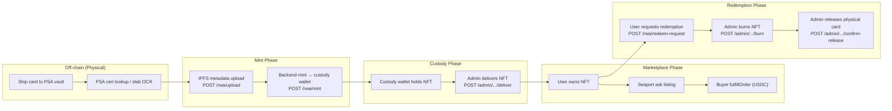

# Vault Lifecycle

The vault system is the core business process of Tokenable: it manages the lifecycle of a **physical PSA-graded card** from initial deposit to NFT minting, marketplace trading, and final redemption/burn.

---

## Overview



---

## Data Model

### VaultAsset

Permanent record of a physical card. Created once per PSA cert. Never deleted.

```
vault_assets (uuid id PK)
  external_cert_number: "83179580"   — PSA cert (UPPERCASE normalized)
  vault_ref: "0xkeccak256..."        — keccak256(cert.toUpperCase()) = on-chain vaultRef
  asset_type: "psa_graded"
  display_name: optional
```

### VaultCycle

One deposit-to-redemption window. A card can have many cycles over its lifetime, but **at most one open (non-terminal) cycle at a time** — mirrors the on-chain `VaultRefAlreadyActive` constraint.

```
vault_cycles (uuid id PK)
  vault_asset_id: FK → vault_assets
  cycle_number: 1, 2, 3, ...
  status: pending_deposit | deposit_verified | minted | redemption_requested | redeemed | cancelled
  deposited_by_user_id: uuid (the user who initiated this vault cycle)
  deposited_at: timestamptz
  redeemed_at: timestamptz
```

### VaultRedemption

Tracks the multi-step redemption process for a specific cycle.

```
vault_redemptions (uuid id PK)
  vault_cycle_id: FK → vault_cycles
  owner_wallet_address: "0x..."   — wallet that owned NFT when redemption was requested
  status: pending | ownership_verified | burned | completed
  burn_tx_hash: "0x..."
  ownership_verified_at: timestamptz
  burned_at: timestamptz
  completed_at: timestamptz      — physical card released
```

### RwaToken (extended for vault)

```
rwa_tokens
  vault_cycle_id: uuid (FK to vault_cycles)
  vault_ref: "0xkeccak256..."    — matches on-chain vaultRef
  burned_at: timestamptz         — set when adminBurn completes
  burn_tx_hash: "0x..."
```

---

## VaultCycle Status Machine

```
pending_deposit  →  deposit_verified  →  minted  →  redemption_requested  →  redeemed
                                                                 ↑
                                                         (admin burn completes)

Any state  →  cancelled   (on-chain mint failure; compensating action)
```

### Automated vs manual steps

| Step | Who | When |
|------|-----|------|
| `deposit_verified` | Automated | PSA cert lookup passes; `reserveCycleForDeposit()` |
| `minted` | Backend on-chain | After `mint()` tx confirmed; `recordMintResult()` |
| `redemption_requested` | User API | `POST /rwa/redeem-request` |
| `redeemed` | Admin on-chain | After `adminBurn()` tx confirmed |
| `completed` | Admin ops | After physical card shipped (`confirmVaultRelease`) |
| `cancelled` | Backend (compensating) | On-chain mint failed; cycle released for retry |

---

## VaultRef

The `vaultRef` is a **permanent on-chain identity** for the physical card:

```typescript
vaultRef = keccak256(certNumber.trim().toUpperCase())
```

- Derived from PSA cert number only — never from tokenURI or tokenId
- Stored in contract: `_vaultRefs[tokenId]` (permanent, survives burn)
- Used for anti-double-claim: `VaultRefAlreadyActive` revert if active token exists
- `activeTokenIdOf(vaultRef)` returns 0 after burn → allows new cycle

---

## Custody wallet

Vault mints go to the **platform custody wallet**, not directly to the user:

```
mint(custodyWallet, tokenURI, vaultRef)   ← backend executes
```

The `custodyWallet` is configured via:

```env
RWA_CUSTODY_WALLET_ADDRESS=0x...   # explicit address (recommended)
RWA_CUSTODY_PRIVATE_KEY=...        # signing key for delivery transfers
# When unset: defaults to RWA_OWNER_PRIVATE_KEY / wallet
```

**Admin delivery** transfers the NFT from custody to the depositor's primary linked wallet:

```
safeTransferFrom(custodyWallet → user.primaryWallet, tokenId)
```

The `intendedRecipient` (user's primary linked wallet at mint time) is recorded but is not enforced on-chain. Admin can deliver to any wallet linked to the depositor.

---

## Re-vault cycle

After an NFT is burned, the same PSA cert can be re-vaulted:

1. On-chain: `adminBurn()` clears `activeTokenIdOf(vaultRef)` → slot is free
2. DB: `burned_at` set on `rwa_tokens`; vault cycle reaches `redeemed`
3. New cycle: `reserveCycleForDeposit()` creates `vault_cycle_number = 2`
4. New mint: `mint(custodyWallet, newTokenURI, sameVaultRef)` → new `tokenId`
5. DB partial unique: `(token_contract, cert_number) WHERE burned_at IS NULL` — allows duplicate cert on burned tokens

---

## Admin operations

All admin vault ops require the marketplace admin session.

| Endpoint | Action |
|----------|--------|
| `GET /api/marketplace/admin/rwa-tokens/cards` | All registry tokens (listed + unlisted + burned) |
| `GET /api/marketplace/admin/rwa-tokens/custody-nfts` | NFTs in custody wallet pending delivery |
| `POST /api/marketplace/admin/rwa-tokens/:id/deliver` | Transfer custody → user primary wallet |
| `POST /api/marketplace/admin/rwa-tokens/:id/burn` | On-chain adminBurn + completeRedemptionBurn |
| `POST /api/marketplace/admin/rwa-tokens/redemptions/:redemptionId/confirm-release` | Mark physical card shipped |
| `GET /api/marketplace/admin/rwa-tokens/vault-history/:certNumber` | Full audit history for a cert |

---

## Smart contract role mapping

| Action | Contract function | Signer |
|--------|-------------------|--------|
| Mint to custody | `mint(to, tokenURI, vaultRef)` | `RWA_OWNER_PRIVATE_KEY` (MINTER_ROLE) |
| Deliver to user | `safeTransferFrom(custody, user, tokenId)` | `RWA_CUSTODY_PRIVATE_KEY` |
| Admin burn | `adminBurn(tokenId, expectedOwner)` | `RWA_OWNER_PRIVATE_KEY` (BURNER_ROLE) |

> Both MINTER_ROLE and BURNER_ROLE are granted to the minter address at `initialize()` time. They can be split to separate wallets via `grantRole()` without a contract upgrade.

---

## Backend service files

| File | Responsibility |
|------|----------------|
| `backend/src/vault/vault.service.ts` | DB state machine (reserveCycle, recordMintResult, requestRedemption, completeRedemptionBurn, confirmVaultRelease, getHistoryForCert) |
| `backend/src/rwa/rwa-mint.service.ts` | Orchestrates upload → reserveCycle → mintTo(custody) → recordMintResult |
| `backend/src/rwa/rwa-redeem.service.ts` | User redemption request flow |
| `backend/src/blockchain/rwa-chain-writer.service.ts` | mintTo, safeTransferFromCustody, adminBurn |
| `backend/src/marketplace/collections/rwa-token-admin.service.ts` | listCustodyHeldNfts, deliverCustodyNftToUser, burnTokenOnChain, confirmRedemptionRelease |
