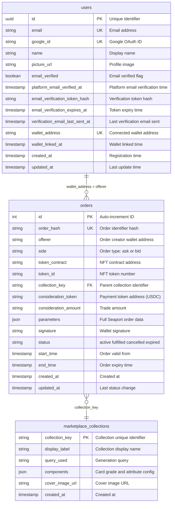

# Tokenable Marketplace — Full Pipeline

> Seaport v1.5 · Off-chain order book (backend) · On-chain `fulfillOrder` / `matchAdvancedOrders`

---

## Part 1 — Overall Flow

```mermaid
%%{init: {'flowchart': {'rankSpacing': 60, 'nodeSpacing': 40, 'padding': 24}}}%%
flowchart TD
    classDef mint  fill:#0c1e33,stroke:#60a5fa,color:#bfdbfe,padding:10px 18px
    classDef list  fill:#0a2215,stroke:#4ade80,color:#dcfce7,padding:10px 18px
    classDef buy   fill:#1f1a00,stroke:#fbbf24,color:#fef3c7,padding:10px 18px
    classDef bid   fill:#280a18,stroke:#f472b6,color:#fce7f3,padding:10px 18px
    classDef match fill:#1a0a2e,stroke:#c084fc,color:#f3e8ff,padding:10px 18px
    classDef gate  fill:#111827,stroke:#6b7280,color:#e5e7eb,padding:10px 18px
    classDef done  fill:#052e12,stroke:#4ade80,color:#dcfce7,padding:10px 18px

    START(["Start"])

    subgraph G1 ["① Mint"]
        M1["Upload PSA Card"]
        M2["PSA Grade Analysis (OCR)"]
        M3["Store Metadata on IPFS"]
        M4["🔗 Mint ERC-721 Token"]
        M1 --> M2 --> M3 --> M4
    end

    subgraph G2 ["② Ask Listing"]
        L1["Set Asking Price"]
        L2["🔗 Approve NFT to Seaport"]
        L3["✍️ Sign Sell Order"]
        L4["💾 Listing Registered"]
        L1 --> L2 --> L3 --> L4
    end

    FORK(["Choose Next Action"])

    subgraph G3 ["③ Instant Buy"]
        F1["Compare Prices"]
        F2["🔗 Approve USDC"]
        F3["🔗 Fulfill Order On-chain"]
        F4["💾 Trade Complete"]
        F1 --> F2 --> F3 --> F4
    end

    subgraph G4 ["④ Collection Bid"]
        B1["Enter Desired Price"]
        B2["Build Merkle Tree"]
        B3["🔗 Approve USDC"]
        B4["✍️ Sign Bid Order"]
        B5["💾 Bid Registered"]
        B1 --> B2 --> B3 --> B4 --> B5
    end

    subgraph G5 ["⑤ Instant Match"]
        I1["Check Price Adjustment"]
        I2["✍️ Re-sign After Repricing"]
        I3["Generate Merkle Proof"]
        I4["🔗 Match Orders On-chain"]
        I5["💾 Bilateral Settlement"]
        I1 -->|"Repricing needed"| I2 --> I3
        I1 -->|"Prices match"| I3
        I3 --> I4 --> I5
    end

    CANCEL(["💾 Cancel Order"])
    DONE(["Trade Complete"])

    START --> M1
    M4    --> L1
    L4    --> FORK

    FORK -->|"Instant Buy"| F1
    FORK -->|"Collection Bid"| B1
    FORK -->|"Cancel"| CANCEL

    F4 --> DONE
    B5 --> I1
    I5 --> DONE

    class M1,M2,M3,M4 mint
    class L1,L2,L3,L4 list
    class F1,F2,F3,F4 buy
    class B1,B2,B3,B4,B5 bid
    class I1,I2,I3,I4,I5 match
    class FORK,CANCEL gate

    style G1 fill:#060f1c,stroke:#60a5fa,stroke-width:3px,color:#93c5fd
    style G2 fill:#030f08,stroke:#4ade80,stroke-width:3px,color:#86efac
    style G3 fill:#0f0d00,stroke:#fbbf24,stroke-width:3px,color:#fde68a
    style G4 fill:#120510,stroke:#f472b6,stroke-width:3px,color:#f9a8d4
    style G5 fill:#090514,stroke:#c084fc,stroke-width:3px,color:#d8b4fe

    linkStyle 13 stroke:#c084fc,stroke-width:2px,color:#d8b4fe
    linkStyle 15 stroke:#c084fc,stroke-width:2px,color:#d8b4fe
    linkStyle 21 stroke:#fbbf24,stroke-width:2px,color:#fde68a
    linkStyle 22 stroke:#f472b6,stroke-width:2px,color:#f9a8d4
    linkStyle 23 stroke:#6b7280,stroke-width:2px,color:#d1d5db
```

---

## Part 2 — Technical Sequence Diagram

```mermaid
sequenceDiagram
    actor U   as 👤 User
    participant A   as 💻 App
    participant S   as 🖥️ Server
    participant DB  as 🗄️ Database
    participant C   as ⛓️ Blockchain

    rect rgba(147, 197, 253, 0.15)
        Note over U,C: ① Mint
        U  ->> A  : Upload card image + info
        A  ->> S  : POST /psa/analyze
        S -->> A  : Grade data returned
        A  ->> S  : POST /rwa/upload → IPFS
        S -->> A  : tokenURI (IPFS CID)
        A  ->> C  : ERC721.mint(address, tokenURI)
        C -->> U  : 🎉 tokenId issued
        Note over DB: Minting results are not stored in DB.<br/>tokenId and tokenURI reference on-chain data.
    end

    rect rgba(134, 239, 172, 0.15)
        Note over U,C: ② Ask Listing
        U  ->> A  : Enter asking price
        A  ->> C  : ERC721.isApprovedForAll(Seaport)
        alt Not approved
            A  ->> C  : ERC721.setApprovalForAll(Seaport, true)
        end
        A  ->> C  : Seaport.getCounter(seller)
        A -->> U  : 🖊️ MetaMask signature request — EIP-712 sell order
        U  ->> A  : Approve signature
        A  ->> S  : POST /marketplace/orders [side: ask]
        S  ->> DB : INSERT orders<br/>{order_hash, offerer, side:ask,<br/>token_contract, token_id,<br/>consideration_token, consideration_amount,<br/>parameters(jsonb), signature,<br/>status:active, start_time, end_time,<br/>collection_key}
        S  ->> DB : UPSERT marketplace_collections<br/>{collection_key, display_label,<br/>components(jsonb), cover_image_url}
        S -->> A  : ASK ACTIVE
    end

    rect rgba(252, 165, 165, 0.15)
        Note over U,C: ③ Collection Bid
        U  ->> A  : Enter desired buy price
        Note over A: SeaportMerkleTree(activeAsks)<br/>→ identifierOrCriteria: merkleRoot
        A  ->> C  : USDC.approve(Seaport, maxUint256)
        A  ->> C  : Seaport.getCounter(buyer)
        A -->> U  : 🖊️ MetaMask signature request — EIP-712 buy order
        U  ->> A  : Approve signature
        A  ->> S  : POST /marketplace/orders [side: bid]
        S  ->> DB : INSERT orders<br/>{order_hash, offerer, side:bid,<br/>token_id:"0" (criteria sentinel),<br/>consideration_amount (bid price),<br/>parameters (includes merkleRoot jsonb),<br/>signature, status:active,<br/>collection_key}
        S -->> A  : BID ACTIVE
    end

    rect rgba(250, 204, 21, 0.12)
        Note over U,C: ④ Instant Buy (bid price ≥ lowest ask)
        Note over A: pickLowestActiveAsk() → runInstantPurchase(ask)
        A  ->> C  : USDC.approve(Seaport, askPrice)
        A  ->> C  : Seaport.fulfillOrder(orderParams, extraData)
        C -->> U  : 💸 NFT → buyer / USDC → seller
        A  ->> S  : PATCH /orders/:hash/fulfill
        S  ->> DB : UPDATE orders<br/>SET status=fulfilled<br/>WHERE order_hash=:hash
        S  ->> DB : UPDATE orders<br/>SET status=cancelled<br/>WHERE token_contract=:contract<br/>AND token_id=:id<br/>AND status=active AND id≠fulfilled_id
        S -->> A  : FULFILLED
    end

    rect rgba(192, 132, 252, 0.15)
        Note over U,C: ⑤ Instant Match (seller accepts buyer's bid)
        U  ->> A  : Order Book → click Match
        opt Listing price > bid price (needsReprice = true)
            A -->> U  : 🖊️ MetaMask signature request — re-listing EIP-712
            U  ->> A  : Approve signature
            A  ->> S  : POST /orders/replace-listing
            S  ->> DB : UPDATE orders SET status=cancelled<br/>WHERE order_hash=:oldHash
            S  ->> DB : INSERT orders<br/>{new ask, status:active, repriced consideration_amount}
            S -->> A  : Old CANCELLED / New ASK ACTIVE
        end
        A  ->> S  : GET /collections/:key/merkle-set
        S -->> A  : tokenIds[]
        Note over A: getCriteriaProof(tokenId)<br/>buildCriteriaMatchExecution()<br/>simulateContract pre-validation
        A  ->> C  : Seaport.matchAdvancedOrders(orders, proof, fulfillments)
        C -->> U  : 💸 NFT → buyer / USDC → seller
        A  ->> S  : POST /orders/fulfill-matched-pair
        S  ->> DB : UPDATE orders<br/>SET status=fulfilled<br/>WHERE order_hash IN [askHash, bidHash]
        S  ->> DB : UPDATE orders<br/>SET status=cancelled<br/>WHERE token_contract=:contract<br/>AND token_id=:id<br/>AND status=active (cancel remaining)
        S -->> A  : ask + bid FULFILLED
    end

    rect rgba(251, 146, 60, 0.12)
        Note over U,C: ⑥ Cancel Order
        U  ->> A  : Click cancel button
        A  ->> S  : PATCH /orders/:hash/cancel?callerAddress=...
        S  ->> DB : UPDATE orders<br/>SET status=cancelled<br/>WHERE order_hash=:hash AND offerer=:caller
        S -->> A  : CANCELLED
    end
```

---

## Part 3 — DB Schema & State Transitions

> All marketplace order and trade data is stored in two main tables.
> `orders` — order data and status management. `marketplace_collections` — collection group info.

### 3-1. Table Schema

### 3-2. When and What Data Is Stored

```mermaid
flowchart LR
    classDef ins  fill:#0a2215,stroke:#4ade80,color:#dcfce7,padding:8px 16px
    classDef upd  fill:#1f1a00,stroke:#fbbf24,color:#fef3c7,padding:8px 16px
    classDef del  fill:#280a18,stroke:#f472b6,color:#fce7f3,padding:8px 16px
    classDef head fill:#111827,stroke:#6b7280,color:#e5e7eb,padding:8px 16px

    subgraph OP1 ["Ask Listing"]
        OP1H["When the user sets a price<br/>and completes signing"]:::head
        OP1A["📝 New order record saved<br/>· order_hash<br/>· seller wallet (offerer)<br/>· type: ask<br/>· NFT info (contract + token_id)<br/>· asking price (consideration_amount)<br/>· Seaport order data (parameters)<br/>· signature<br/>· status: active"]:::ins
        OP1B["📁 Collection auto-created/updated<br/>· collection_key + display name<br/>· card grade composition<br/>· cover image"]:::ins
        OP1H --> OP1A
        OP1H --> OP1B
    end

    subgraph OP2 ["Collection Bid"]
        OP2H["When the buyer enters a price<br/>and completes signing"]:::head
        OP2A["📝 New bid record saved<br/>· order_hash<br/>· buyer wallet (offerer)<br/>· type: bid<br/>· bid price (consideration_amount)<br/>· order data incl. Merkle Root<br/>· signature<br/>· status: active"]:::ins
        OP2H --> OP2A
    end

    subgraph OP3 ["Instant Buy Settlement"]
        OP3H["When the on-chain trade<br/>completes successfully"]:::head
        OP3A["✅ Target order<br/>status → fulfilled"]:::upd
        OP3B["🚫 Remaining orders for<br/>the same NFT → all cancelled"]:::del
        OP3H --> OP3A
        OP3H --> OP3B
    end

    subgraph OP4 ["Instant Match Settlement"]
        OP4H["When bilateral matching<br/>completes successfully"]:::head
        OP4A["✅ Both ask + bid orders<br/>→ fulfilled"]:::upd
        OP4B["🚫 Remaining orders for<br/>the same NFT → all cancelled"]:::del
        OP4H --> OP4A
        OP4H --> OP4B
    end

    subgraph OP5 ["Cancel Order"]
        OP5H["When a user cancels<br/>their own order"]:::head
        OP5A["🚫 Target order<br/>status → cancelled<br/>(wallet ownership verified)"]:::del
        OP5H --> OP5A
    end

    subgraph OP6 ["Repricing"]
        OP6H["When seller lowers price<br/>before accepting a bid"]:::head
        OP6A["🚫 Existing sell order<br/>status → cancelled"]:::del
        OP6B["📝 New sell order created<br/>· adjusted price<br/>· new signature<br/>· status: active"]:::ins
        OP6H --> OP6A
        OP6H --> OP6B
    end
```

> **Color legend** — 🟢 Green: New record (INSERT) · 🟡 Yellow: Status update (fulfilled) · 🔴 Pink: Cancellation (cancelled)

### 3-3. Order State Transitions

```mermaid
flowchart LR
    classDef st_new     fill:#1e3a5f,stroke:#60a5fa,color:#bfdbfe,stroke-width:2px,padding:12px 20px
    classDef st_active  fill:#052e12,stroke:#4ade80,color:#dcfce7,stroke-width:3px,padding:12px 20px
    classDef st_done    fill:#1f1a00,stroke:#fbbf24,color:#fef3c7,stroke-width:2px,padding:12px 20px
    classDef st_cancel  fill:#280a18,stroke:#f472b6,color:#fce7f3,stroke-width:2px,padding:12px 20px
    classDef st_expire  fill:#111827,stroke:#6b7280,color:#e5e7eb,stroke-width:2px,padding:12px 20px

    NEW(["📝 Order Created<br/>Ask Listing · Collection Bid"]):::st_new

    ACTIVE(["🟢 Active<br/>Visible in Order Book"]):::st_active

    FULFILLED(["✅ Fulfilled<br/>Trade Complete"]):::st_done

    CANCELLED(["🚫 Cancelled<br/>Order Withdrawn"]):::st_cancel

    EXPIRED(["⏰ Expired<br/>Validity Period Passed"]):::st_expire

    NEW -->|"Ask listing or<br/>bid registration"| ACTIVE

    ACTIVE -->|"Instant buy settlement<br/>Instant match settlement"| FULFILLED
    ACTIVE -->|"User cancellation<br/>Old order discarded on repricing<br/>Remaining orders cleaned after trade"| CANCELLED
    ACTIVE -->|"Automatic transition<br/>when end_time passes"| EXPIRED

    CANCELLED -.->|"Reactivate"| ACTIVE
    FULFILLED -.->|"Reactivate"| ACTIVE

    style NEW fill:#0d1b2a,stroke:#60a5fa,stroke-width:2px
    style ACTIVE fill:#052e16,stroke:#4ade80,stroke-width:3px
    style FULFILLED fill:#1a1500,stroke:#fbbf24,stroke-width:2px
    style CANCELLED fill:#200510,stroke:#f472b6,stroke-width:2px
    style EXPIRED fill:#0f1115,stroke:#6b7280,stroke-width:2px
```

---

## Legend

| Icon | Meaning |
|------|---------|
| 🔗 | On-chain contract call |
| ✍️ | EIP-712 wallet signature |
| 💾 | Backend DB write / status update |

| Component | Tech Stack |
|-----------|------------|
| NFT | `Tokenable_RWA` ERC-721 |
| Payment | Mock USDC ERC-20 (6 decimals) |
| Protocol | Seaport v1.5 |
| Network | Ethereum Sepolia |
