# Tokenable 마켓플레이스 — 전체 파이프라인

> Seaport v1.5 · 오프체인 오더북(백엔드) · 온체인 `fulfillOrder` / `matchAdvancedOrders` 기준

> **부록 (2026-04):** 동일 백엔드에 **규칙 기반 입찰·매칭·정산 워커**가 추가되었습니다 (`bids` / `asks` / `match_intents` / `trade_executions` 등). 현재 제품 UI의 기본 경로는 여전히 Seaport `orders` 입니다. 상세는 **[marketplace-trading.md](../marketplace-trading.md)** 및 **[marketplace-trading-relational-layer.drawio](./marketplace-trading-relational-layer.drawio)**.
>
> **HTTP 경로 표기:** 아래 시퀀스의 `POST /api/...` 는 Nest 글로벌 프리픽스 **`api`** 를 포함한 전체 경로입니다. 전체 표는 **[API-REFERENCE.md](../API-REFERENCE.md)**.

---

## Part 1 — 전체 흐름도

```mermaid
%%{init: {'flowchart': {'rankSpacing': 60, 'nodeSpacing': 40, 'padding': 24}}}%%
flowchart TD
    classDef mint  fill:#0c1e33,stroke:#60a5fa,color:#bfdbfe,padding:10px 18px
    classDef list  fill:#0a2215,stroke:#4ade80,color:#dcfce7,padding:10px 18px
    classDef buy   fill:#1f1a00,stroke:#fbbf24,color:#fef3c7,padding:10px 18px
    classDef bid   fill:#280a18,stroke:#f472b6,color:#fce7f3,padding:10px 18px
    classDef match fill:#1a0a2e,stroke:#c084fc,color:#f3e8ff,padding:10px 18px
    classDef gate  fill:#111827,stroke:#6b7280,color:#e5e7eb,padding:10px 18px
    classDef done  fill:#052e12,stroke:#4ade80,color:#dcfce7,padding:10px 18px

    START(["시작"])

    %% ① 발행 ──────────────────────────────────────────────────────
    subgraph G1 ["① 발행  ·  Mint"]
        M1["PSA 카드 업로드"]
        M2["PSA 등급 분석(OCR)"]
        M3["IPFS 메타데이터 저장"]
        M4["🔗 ERC-721 토큰 발행"]
        M1 --> M2 --> M3 --> M4
    end

    %% ② 판매 등록 ──────────────────────────────────────────────────
    subgraph G2 ["② 판매 등록  ·  Ask Listing"]
        L1["판매가 설정"]
        L2["🔗 Seaport NFT 위임"]
        L3["✍️ 매도 주문 서명"]
        L4["💾 판매 등록 완료"]
        L1 --> L2 --> L3 --> L4
    end

    %% 분기점 ───────────────────────────────────────────────────────
    FORK(["다음 행동 선택"])

    %% ③ 즉시 구매 ──────────────────────────────────────────────────
    subgraph G3 ["③ 즉시 구매  ·  Instant Buy"]
        F1["가격 비교"]
        F2["🔗 USDC 승인"]
        F3["🔗 온체인 주문 체결"]
        F4["💾 체결 완료"]
        F1 --> F2 --> F3 --> F4
    end

    %% ④ 구매 입찰 ──────────────────────────────────────────────────
    subgraph G4 ["④ 구매 입찰  ·  Collection Bid"]
        B1["희망 매수가 입력"]
        B2["Merkle Tree 구성"]
        B3["🔗 USDC 승인"]
        B4["✍️ 입찰 주문 서명"]
        B5["💾 입찰 등록 완료"]
        B1 --> B2 --> B3 --> B4 --> B5
    end

    %% ⑤ 입찰 수락 ──────────────────────────────────────────────────
    subgraph G5 ["⑤ 입찰 수락  ·  Instant Match"]
        I1["가격 재조정 여부 확인"]
        I2["✍️ 가격 재조정 후 재서명"]
        I3["Merkle Proof 생성"]
        I4["🔗 온체인 오더 매칭"]
        I5["💾 양방향 체결 완료"]
        I1 -->|"가격 재조정 시"| I2 --> I3
        I1 -->|"가격 일치 시"| I3
        I3 --> I4 --> I5
    end

    CANCEL(["💾 주문 철회"])
    DONE(["거래 완료"])

    %% 섹션 간 연결 ─────────────────────────────────────────────────
    START --> M1
    M4    --> L1
    L4    --> FORK

    FORK -->|"즉시 구매"| F1
    FORK -->|"구매 입찰"| B1
    FORK -->|"주문 취소"| CANCEL

    F4 --> DONE
    B5 --> I1
    I5 --> DONE

    class M1,M2,M3,M4 mint
    class L1,L2,L3,L4 list
    class F1,F2,F3,F4 buy
    class B1,B2,B3,B4,B5 bid
    class I1,I2,I3,I4,I5 match
    class FORK,CANCEL gate

    style G1 fill:#060f1c,stroke:#60a5fa,stroke-width:3px,color:#93c5fd
    style G2 fill:#030f08,stroke:#4ade80,stroke-width:3px,color:#86efac
    style G3 fill:#0f0d00,stroke:#fbbf24,stroke-width:3px,color:#fde68a
    style G4 fill:#120510,stroke:#f472b6,stroke-width:3px,color:#f9a8d4
    style G5 fill:#090514,stroke:#c084fc,stroke-width:3px,color:#d8b4fe

    %% 레이블 화살표 색상 — 목적지 섹션 테마 색 적용
    %% 링크 인덱스: 0-12 서브그래프 내부, 13·15 G5 분기, 18-20 섹션 간, 21-23 FORK 분기
    linkStyle 13 stroke:#c084fc,stroke-width:2px,color:#d8b4fe
    linkStyle 15 stroke:#c084fc,stroke-width:2px,color:#d8b4fe
    linkStyle 21 stroke:#fbbf24,stroke-width:2px,color:#fde68a
    linkStyle 22 stroke:#f472b6,stroke-width:2px,color:#f9a8d4
    linkStyle 23 stroke:#6b7280,stroke-width:2px,color:#d1d5db
```

---

## Part 2 — 기술 시퀀스 다이어그램

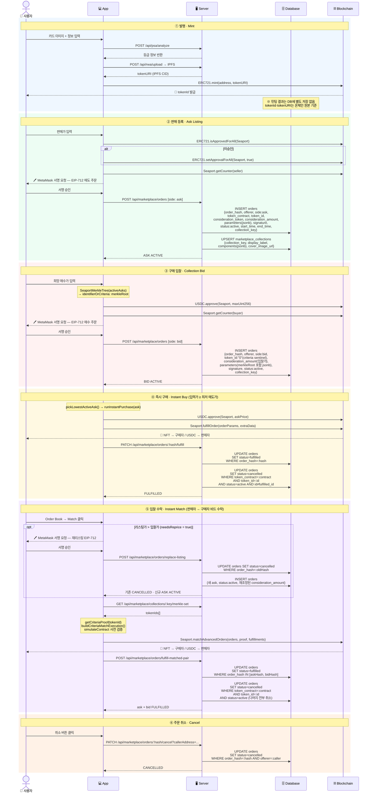

---

## Part 3 — DB 저장 구조 및 상태 전이

> 마켓플레이스에서 발생하는 모든 주문·거래 데이터는 두 개의 테이블에 저장됩니다.
> `orders` — 매도/매수 주문 원본과 상태 관리, `marketplace_collections` — 컬렉션 그룹 정보.

### 3-1. 테이블 구조

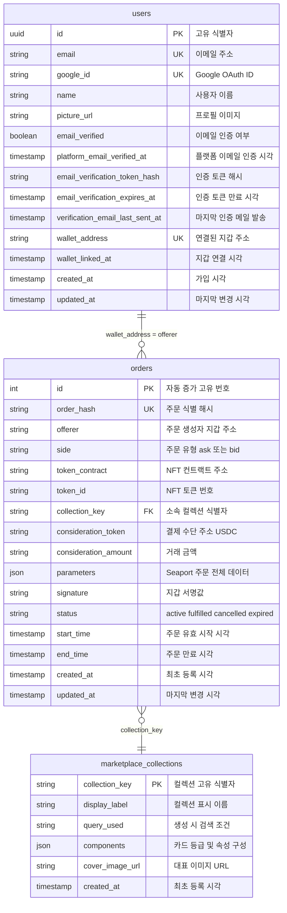

### 3-2. 언제, 어떤 데이터가 저장되는가

```mermaid
flowchart LR
    classDef ins  fill:#0a2215,stroke:#4ade80,color:#dcfce7,padding:8px 16px
    classDef upd  fill:#1f1a00,stroke:#fbbf24,color:#fef3c7,padding:8px 16px
    classDef del  fill:#280a18,stroke:#f472b6,color:#fce7f3,padding:8px 16px
    classDef head fill:#111827,stroke:#6b7280,color:#e5e7eb,padding:8px 16px
    classDef note fill:#1e1b4b,stroke:#818cf8,color:#c7d2fe,padding:8px 16px

    subgraph OP1 ["판매 등록"]
        OP1H["사용자가 판매가를 설정하고<br/>서명을 완료하면"]:::head
        OP1A["📝 주문 데이터 신규 저장<br/>· 주문 해시 (order_hash)<br/>· 판매자 지갑 (offerer)<br/>· 유형: ask<br/>· NFT 정보 (contract + token_id)<br/>· 판매가 (consideration_amount)<br/>· Seaport 주문 원본 (parameters)<br/>· 서명값 (signature)<br/>· 상태: active"]:::ins
        OP1B["📁 컬렉션 자동 생성/갱신<br/>· 컬렉션 키 + 이름<br/>· 카드 등급 구성 정보<br/>· 대표 이미지"]:::ins
        OP1H --> OP1A
        OP1H --> OP1B
    end

    subgraph OP2 ["입찰 등록"]
        OP2H["구매자가 희망가를 입력하고<br/>서명을 완료하면"]:::head
        OP2A["📝 입찰 데이터 신규 저장<br/>· 주문 해시 (order_hash)<br/>· 구매자 지갑 (offerer)<br/>· 유형: bid<br/>· 입찰가 (consideration_amount)<br/>· Merkle Root 포함 주문 원본<br/>· 서명값 (signature)<br/>· 상태: active"]:::ins
        OP2H --> OP2A
    end

    subgraph OP3 ["즉시 구매 체결"]
        OP3H["온체인 거래가<br/>성공적으로 완료되면"]:::head
        OP3A["✅ 해당 주문<br/>상태 → fulfilled"]:::upd
        OP3B["🚫 같은 NFT의<br/>나머지 주문 → 전부 cancelled"]:::del
        OP3H --> OP3A
        OP3H --> OP3B
    end

    subgraph OP4 ["입찰 수락 체결"]
        OP4H["양방향 매칭이<br/>성공적으로 완료되면"]:::head
        OP4A["✅ 매도 + 매수 주문<br/>양쪽 모두 → fulfilled"]:::upd
        OP4B["🚫 같은 NFT의<br/>나머지 주문 → 전부 cancelled"]:::del
        OP4H --> OP4A
        OP4H --> OP4B
    end

    subgraph OP5 ["주문 철회"]
        OP5H["사용자가 본인의<br/>주문을 취소하면"]:::head
        OP5A["🚫 해당 주문<br/>상태 → cancelled<br/>(본인 지갑 확인 후)"]:::del
        OP5H --> OP5A
    end

    subgraph OP6 ["가격 재조정"]
        OP6H["입찰 수락 전<br/>판매가를 낮추면"]:::head
        OP6A["🚫 기존 판매 주문<br/>상태 → cancelled"]:::del
        OP6B["📝 새 판매 주문 생성<br/>· 조정된 판매가<br/>· 새 서명값<br/>· 상태: active"]:::ins
        OP6H --> OP6A
        OP6H --> OP6B
    end
```

> **색상 범례** — 🟢 초록: 신규 저장 (INSERT) · 🟡 노랑: 상태 갱신 (fulfilled) · 🔴 핑크: 취소 처리 (cancelled)

### 3-3. 주문 상태 변화

```mermaid
flowchart LR
    classDef st_new     fill:#1e3a5f,stroke:#60a5fa,color:#bfdbfe,stroke-width:2px,padding:12px 20px
    classDef st_active  fill:#052e12,stroke:#4ade80,color:#dcfce7,stroke-width:3px,padding:12px 20px
    classDef st_done    fill:#1f1a00,stroke:#fbbf24,color:#fef3c7,stroke-width:2px,padding:12px 20px
    classDef st_cancel  fill:#280a18,stroke:#f472b6,color:#fce7f3,stroke-width:2px,padding:12px 20px
    classDef st_expire  fill:#111827,stroke:#6b7280,color:#e5e7eb,stroke-width:2px,padding:12px 20px

    NEW(["📝 주문 생성<br/>판매 등록 · 입찰 등록"]):::st_new

    ACTIVE(["🟢 Active<br/>오더북에 노출 중"]):::st_active

    FULFILLED(["✅ Fulfilled<br/>거래 체결 완료"]):::st_done

    CANCELLED(["🚫 Cancelled<br/>주문 취소됨"]):::st_cancel

    EXPIRED(["⏰ Expired<br/>유효 기간 만료"]):::st_expire

    NEW -->|"판매 등록 또는<br/>입찰 등록 시"| ACTIVE

    ACTIVE -->|"즉시 구매 체결<br/>입찰 수락 체결"| FULFILLED
    ACTIVE -->|"사용자 직접 취소<br/>가격 재조정 시 기존 주문 폐기<br/>동일 NFT 거래 후 잔여 주문 정리"| CANCELLED
    ACTIVE -->|"만료 시각 경과 시<br/>자동 전환"| EXPIRED

    CANCELLED -.->|"재활성화"| ACTIVE
    FULFILLED -.->|"재활성화"| ACTIVE

    style NEW fill:#0d1b2a,stroke:#60a5fa,stroke-width:2px
    style ACTIVE fill:#052e16,stroke:#4ade80,stroke-width:3px
    style FULFILLED fill:#1a1500,stroke:#fbbf24,stroke-width:2px
    style CANCELLED fill:#200510,stroke:#f472b6,stroke-width:2px
    style EXPIRED fill:#0f1115,stroke:#6b7280,stroke-width:2px
```

---

## Part 4 — 프론트엔드 아키텍처

> Next.js App Router · React 19 · Wagmi · Zustand · TanStack Query 기반

### 4-1. 라우팅 및 페이지 구조

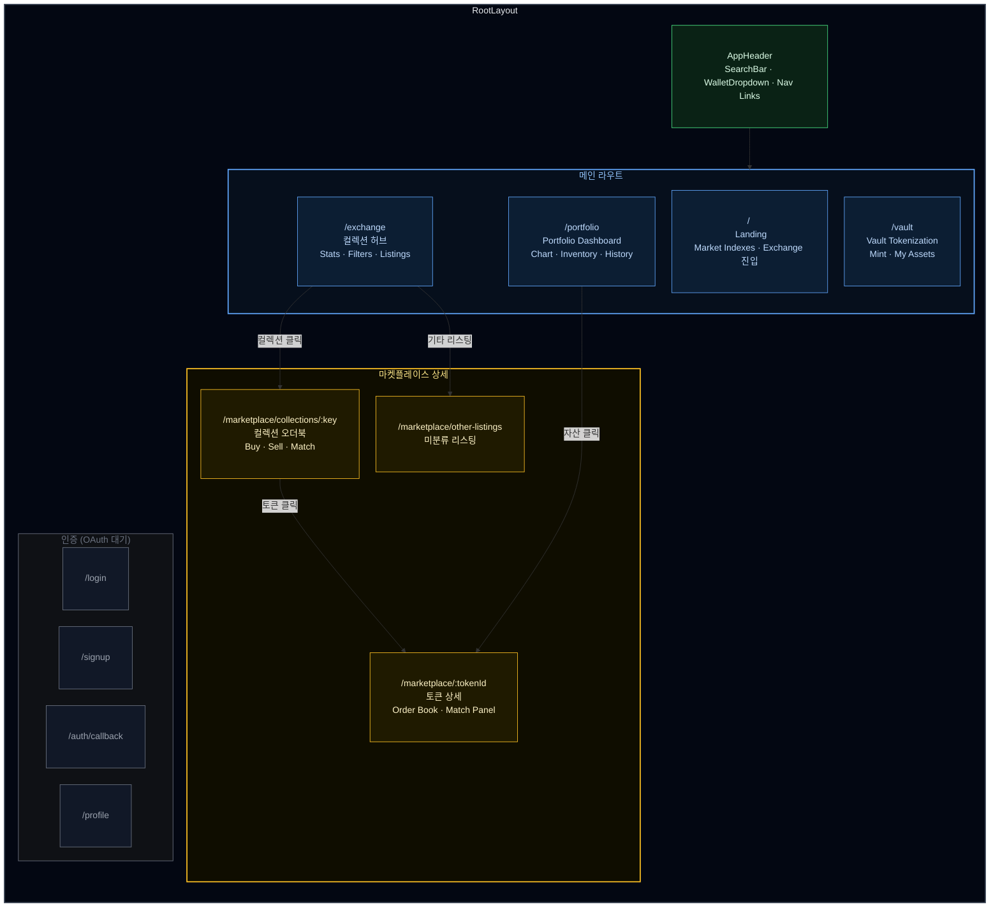

### 4-2. 컴포넌트 · 라이브러리 구조

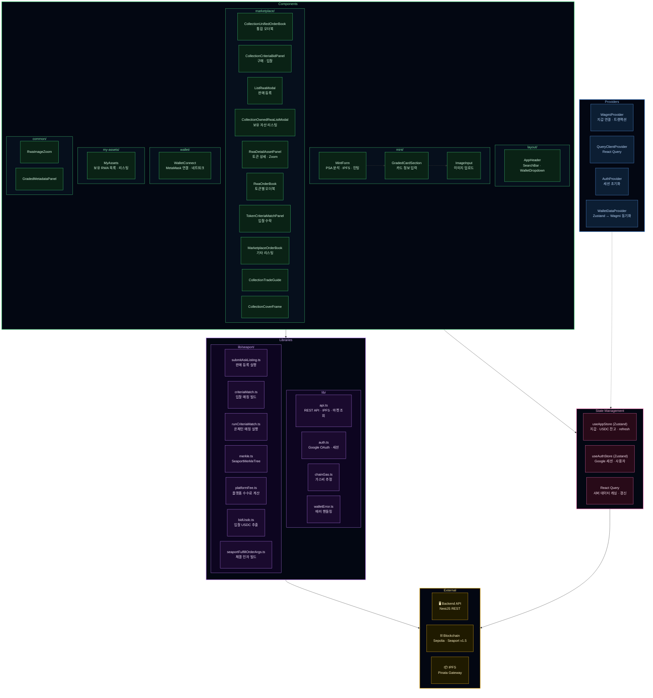

### 4-3. 데이터 흐름

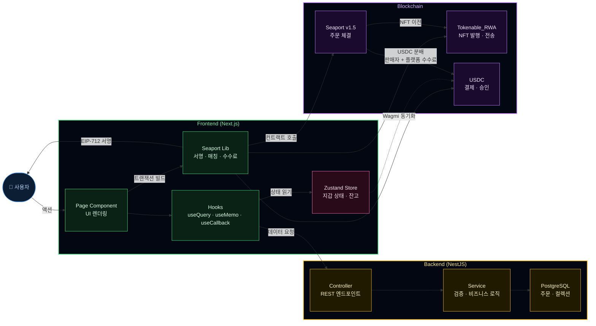

### 4-4. 파일 트리 요약

```
frontend/
├── app/
│   ├── layout.tsx              # RootLayout — Providers · AppHeader
│   ├── globals.css             # Tailwind v4 · 테마 · 스크롤바
│   ├── providers.tsx           # Wagmi · Query · Auth · WalletData
│   ├── page.tsx                # / Landing
│   ├── exchange/page.tsx       # /exchange 컬렉션 허브
│   ├── vault/page.tsx          # /vault 민팅 · 보유자산
│   ├── portfolio/page.tsx      # /portfolio 대시보드
│   └── marketplace/
│       ├── [tokenId]/page.tsx  # 토큰 상세
│       ├── collections/[collectionKey]/page.tsx  # 컬렉션 오더북
│       └── other-listings/page.tsx               # 미분류 리스팅
│
├── components/
│   ├── layout/AppHeader.tsx    # 헤더 — 검색 · 지갑 · 내비게이션
│   ├── mint/                   # MintForm · GradedCardSection · ImageInput
│   ├── marketplace/            # 오더북 · 입찰 · 리스팅 · 매칭 패널
│   ├── my-assets/MyAssets.tsx  # 보유 RWA 목록
│   ├── wallet/WalletConnect.tsx
│   └── common/                 # RwaImageZoom · GradedMetadataPanel
│
├── lib/
│   ├── api.ts                  # REST API · IPFS 헬퍼
│   ├── auth.ts                 # Google OAuth · 세션
│   ├── chainGas.ts             # 가스비 추정
│   ├── walletError.ts          # 지갑 에러 매핑
│   └── seaport/
│       ├── submitAskListing.ts # 판매 등록
│       ├── criteriaMatch.ts    # 입찰 매칭 빌드
│       ├── runCriteriaMatch.ts # 온체인 매칭
│       ├── platformFee.ts      # 플랫폼 수수료
│       ├── merkle.ts           # Merkle Tree
│       └── ...                 # bidUsdc · eip712Uint · constants
│
├── store/
│   ├── index.ts                # useAppStore (지갑 · USDC · refresh)
│   └── authStore.ts            # useAuthStore (Google 세션)
│
├── constants/
│   └── contracts.ts            # 컨트랙트 주소 · ABI · 수수료 설정
│
├── config/
│   └── wagmi.ts                # Wagmi — Sepolia · MetaMask · Alchemy
│
├── providers/
│   ├── AuthProvider.tsx        # Google 세션 초기화
│   └── WalletDataProvider.tsx  # Wagmi ↔ Zustand 동기화
│
└── types/
    └── gradedCard.ts           # 그레이딩 카드 타입 정의
```

---

## Part 5 — 백엔드 아키텍처

> NestJS · TypeORM · PostgreSQL · 글로벌 prefix `api` · Swagger `/api/docs`

### 5-1. HTTP 진입점·컨트롤러 라우트

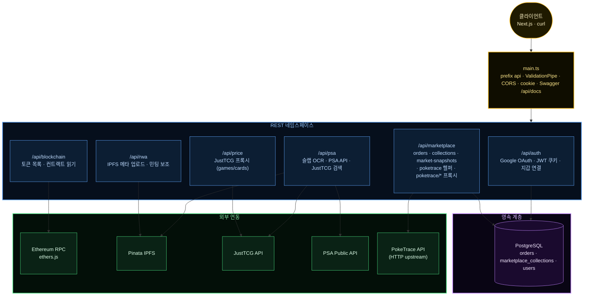

### 5-2. Nest 모듈·서비스 구조

```mermaid
%%{init: {'flowchart': {'rankSpacing': 36, 'nodeSpacing': 22, 'padding': 14}}}%%
flowchart TB
    classDef mod   fill:#1f1a00,stroke:#fbbf24,color:#fef3c7,padding:6px 12px
    classDef ctrl  fill:#0c1e33,stroke:#60a5fa,color:#bfdbfe,padding:6px 12px
    classDef svc   fill:#0a2215,stroke:#4ade80,color:#dcfce7,padding:6px 12px
    classDef util  fill:#1a0a2e,stroke:#c084fc,color:#f3e8ff,padding:6px 12px
    classDef ent   fill:#280a18,stroke:#f472b6,color:#fce7f3,padding:6px 12px

    subgraph APP ["AppModule"]
        direction TB
        CFG["ConfigModule global"]:::mod
        ORM["TypeORM<br/>Order · Collection · User · Bid · Ask · TradeExecution …"]:::ent
    end

    subgraph M_AUTH ["auth/ — AuthModule"]
        direction TB
        ACTRL["AuthController"]:::ctrl
        ASVC["AuthService"]:::svc
        GSTR["GoogleStrategy · JwtStrategy"]:::svc
        subgraph AUTH_DEP ["의존"]
            UMOD["UserModule → UserService"]:::svc
            MMOD["MailModule → MailService"]:::svc
        end
        ACTRL --> ASVC
        ASVC --> GSTR
        ASVC --> AUTH_DEP
    end

    subgraph M_MKT ["marketplace/ — MarketplaceModule"]
        direction TB
        MCTRL["MarketplaceController<br/>PoketraceProxyController<br/>BidsController · TradeController"]:::ctrl
        MSVC["MarketplaceService"]:::svc
        CSV["CollectionService"]:::svc
        CMKT["CollectionMarketService"]:::svc
        PTRSVC["PoketraceModule → PoketraceService"]:::svc
        MCTRL --> MSVC
        MCTRL --> CSV
        MCTRL --> CMKT
        MCTRL --> PTRSVC
        MBLOCK["BlockchainModule import"]:::util
        MSVC --> MBLOCK
    end

    subgraph M_NFT ["nft/ — NftModule"]
        NCTRL["NftController /rwa"]:::ctrl
        NSVC["NftService"]:::svc
        NCTRL --> NSVC
        UTL["UtilModule → PinataService"]:::util
        NSVC --> UTL
    end

    subgraph M_BC ["blockchain/ — BlockchainModule"]
        BCTRL["BlockchainController"]:::ctrl
        BSV["BlockchainService"]:::svc
        ETHF["ethers Provider · USDC · TokenableRWA factories"]:::util
        BCTRL --> BSV
        BSV --> ETHF
    end

    subgraph M_PRICE ["price/ — PriceModule"]
        PCTRL["PriceController"]:::ctrl
        PSV["PriceService<br/>JustTCG · TCG_API_KEY 필수"]:::svc
        PCTRL --> PSV
    end

    subgraph M_PSA ["psa/ — PsaModule"]
        PSACTRL["PsaController"]:::ctrl
        PSASVC["PsaService<br/>OCR · 이미지 · 병합"]:::svc
        PSAAPI["PsaPublicApiService"]:::svc
        PSACTRL --> PSASVC
        PSASVC --> PSAAPI
        PIMP["PriceModule import"]:::util
        PSASVC --> PIMP
    end

    subgraph M_UTIL ["util/ — UtilModule"]
        PIN["PinataService"]:::svc
    end

    APP --> M_AUTH
    APP --> M_MKT
    APP --> M_NFT
    APP --> M_BC
    APP --> M_PRICE
    APP --> M_PSA
    APP --> M_UTIL

    style APP fill:#030712,stroke:#fbbf24,stroke-width:2px,color:#fde68a
    style M_AUTH fill:#030712,stroke:#60a5fa,stroke-width:1px,color:#93c5fd
    style M_MKT fill:#030712,stroke:#4ade80,stroke-width:1px,color:#86efac
    style M_NFT fill:#030712,stroke:#4ade80,stroke-width:1px,color:#86efac
    style M_BC fill:#030712,stroke:#c084fc,stroke-width:1px,color:#d8b4fe
    style M_PRICE fill:#030712,stroke:#4ade80,stroke-width:1px,color:#86efac
    style M_PSA fill:#030712,stroke:#60a5fa,stroke-width:1px,color:#93c5fd
    style M_UTIL fill:#030712,stroke:#c084fc,stroke-width:1px,color:#d8b4fe
```

### 5-3. 요청 처리·외부 연동 흐름

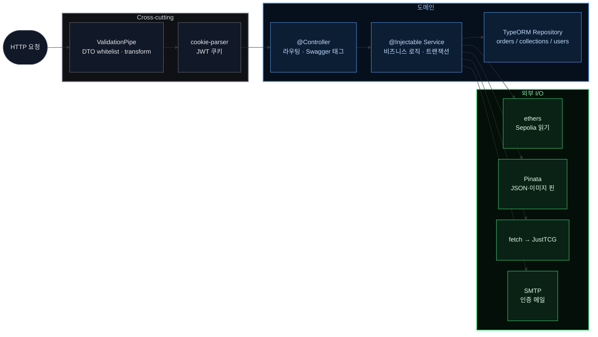

### 5-4. 파일 트리 요약

```
backend/
├── src/
│   ├── main.ts                 # 부트스트랩 — prefix api · CORS · Swagger
│   ├── app.module.ts           # Config · TypeORM · Feature 모듈 조립
│   │
│   ├── auth/
│   │   ├── auth.controller.ts  # /auth — Google · JWT · 세션 · 지갑 연결
│   │   ├── auth.service.ts
│   │   ├── guards/             # JwtAuthGuard
│   │   └── strategies/         # google · jwt
│   │
│   ├── user/
│   │   ├── user.service.ts
│   │   └── entities/user.entity.ts
│   │
│   ├── mail/
│   │   └── mail.service.ts     # SMTP (Auth에서 사용)
│   │
│   ├── marketplace/
│   │   ├── marketplace.controller.ts   # orders · collections · snapshots…
│   │   ├── poketrace-proxy.controller.ts  # GET /marketplace/poketrace/*
│   │   ├── trading/bids.controller.ts # GET /marketplace/bids
│   │   ├── trading/trade.controller.ts # POST /marketplace/trade/match …
│   │   ├── marketplace.service.ts
│   │   ├── collection.service.ts
│   │   ├── collection-market.service.ts
│   │   ├── entities/           # order · marketplace-collection · bids/asks/…
│   │   └── trading/*.service.ts
│   │
│   ├── poketrace/
│   │   ├── poketrace.service.ts
│   │   ├── poketrace-api.registry.ts · poketrace-period.util.ts · poketrace-upstream.urls.ts
│   │
│   ├── nft/
│   │   ├── nft.controller.ts   # /rwa — IPFS 업로드
│   │   ├── nft.service.ts
│   │   └── dto/
│   │
│   ├── blockchain/
│   │   ├── blockchain.controller.ts
│   │   ├── blockchain.service.ts
│   │   ├── abis/
│   │   └── providers/          # ethers · USDC · RWA 팩토리
│   │
│   ├── price/
│   │   ├── price.controller.ts # /price — JustTCG 프록시
│   │   └── price.service.ts    # TCG_API_KEY 필수 (mock 파일 없음)
│   │
│   ├── psa/
│   │   ├── psa.controller.ts   # /psa/analyze
│   │   ├── psa.service.ts      # OCR · 병합 · JustTCG 검색
│   │   ├── psa-public-api.service.ts
│   │   └── psa-*.util.ts
│   │
│   └── util/
│       └── pinata/pinata.service.ts
│
├── sql/
│   └── bootstrap-empty-prod-db.sql
│
└── Dockerfile
```

---

## 범례

| 아이콘 | 의미 |
|--------|------|
| 🔗 | 온체인 컨트랙트 호출 |
| ✍️ | EIP-712 지갑 서명 |
| 💾 | 백엔드 DB 저장 / 상태 갱신 |
| 💡 | 조건 분기 |
| 🌿 | Merkle 처리 |
| 🔍 | 사전 시뮬레이션 (검증) |

| 구분 | 기술 스택 |
|------|-----------|
| NFT | `Tokenable_RWA` ERC-721 |
| 결제 | Mock USDC ERC-20 (6 decimals) |
| 프로토콜 | Seaport v1.5 |
| 네트워크 | Ethereum Sepolia |
