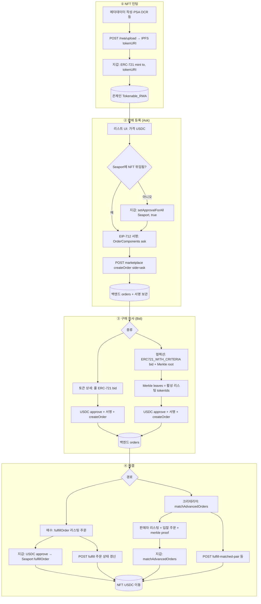
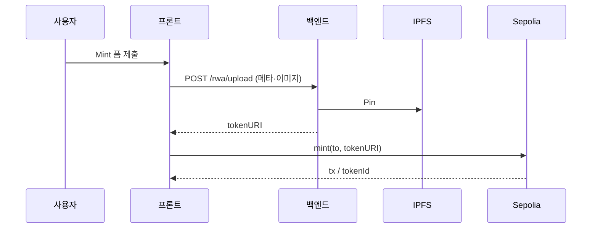
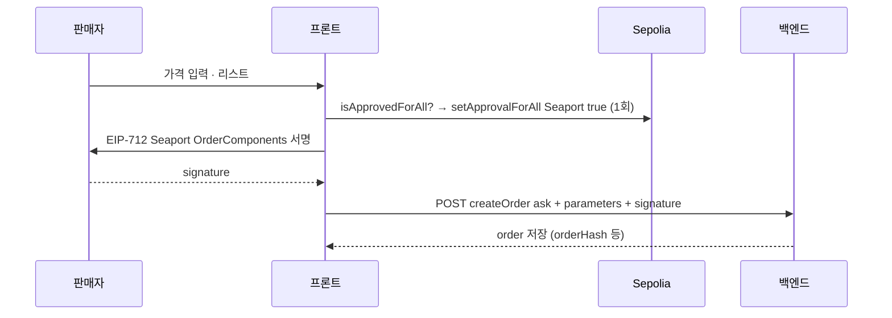
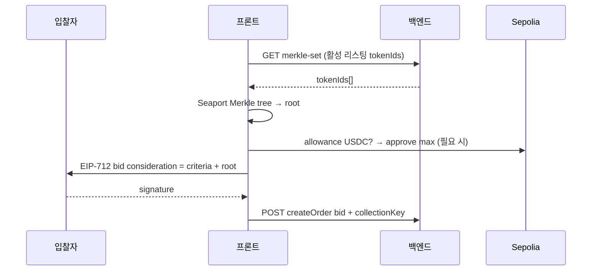
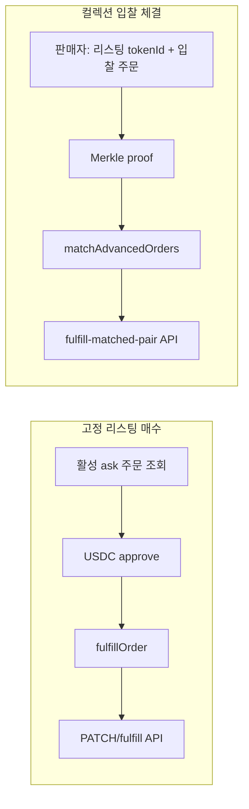

# Tokenable 마켓플레이스 라이프사이클 (민트 · 리스팅 · 입찰 · 체결)

> GitHub / 대부분의 Markdown 뷰어에서 Mermaid 렌더링.  
> Seaport v1.5 + 오프체인 오더북(백엔드) + 온체인 `fulfillOrder` / `matchAdvancedOrders` 기준.

---

## 전체 흐름 (한 눈에)

---

## 민팅 (상세)

---

## 판매 등록 Ask (상세)

---

## 컬렉션 입찰 Bid (크리테리아 + Merkle)

---

## 체결: 일반 매수 vs 크리테리아 매칭

---

## 범례 / 구현 메모

| 단계 | 온체인 | 오프체인 (백엔드) |
|------|--------|-------------------|
| 민팅 | `mint` | IPFS 업로드 |
| Ask | `setApprovalForAll`, 서명 | 주문 저장·노출 |
| Bid | USDC `approve`, 서명 | 주문 저장·Merkle 집합 |
| 체결 | `fulfillOrder` 또는 `matchAdvancedOrders` | 상태·히스토리 |

Seaport 도메인: `name=Seaport`, `version=1.5`, `verifyingContract=Seaport 1.5 주소`.
