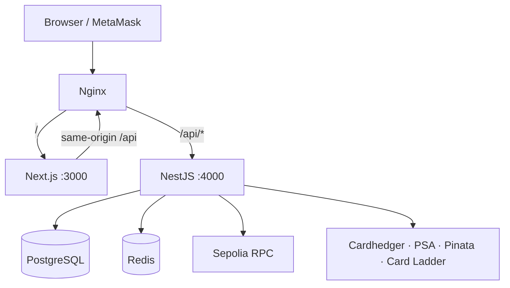
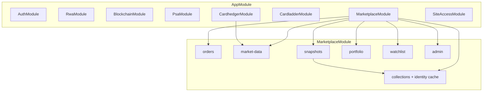
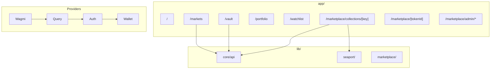
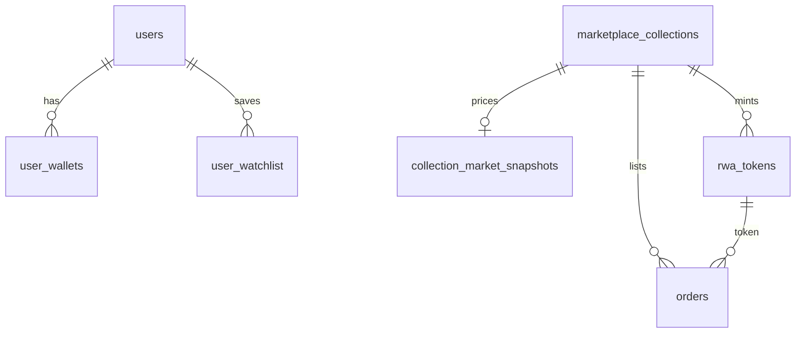
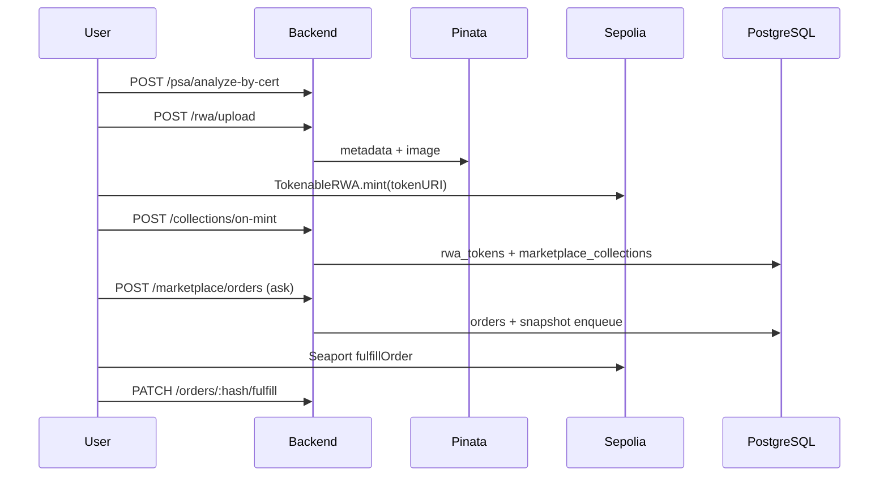

# Tech Stack

Graded-card RWA marketplace on **Ethereum Sepolia**. Mint (PSA 10) → IPFS → **Seaport 1.5** off-chain orders → USDC settlement. External prices from **Cardhedger** (materialized in Postgres). Landing indexes from **Card Ladder** scrape.

> Vault inbound custody is **designed, not implemented**. `/vault` today = mint wizard only.

**Full docs:** [github.com/tokenable-dev/tokenable-dev/tree/develop/docs](https://github.com/tokenable-dev/tokenable-dev/tree/develop/docs)

---

## Stack

| Layer | Technologies |
|-------|----------------|
| **Frontend** | Next.js 16, React 19, wagmi, viem, TanStack Query, Zustand, Tailwind |
| **Backend** | NestJS 11, TypeORM, PostgreSQL 16, Redis 7 (optional), Ethers.js 6 |
| **Chain** | Sepolia — TokenableRWA (ERC-721), MockUSDC, Seaport 1.5 |
| **Storage** | Pinata (IPFS metadata) |
| **External** | Cardhedger API, PSA Public API, Card Ladder (Playwright) |
| **Infra** | Docker Compose, Nginx, AWS ECR + EC2, GitHub Actions |

---

## Repository

[github.com/tokenable-dev/tokenable-dev](https://github.com/tokenable-dev/tokenable-dev)

```
tokenable-dev/
├── frontend/     # Next.js :3000
├── backend/      # NestJS :4000 (local dev :4100)
├── contracts/    # Hardhat
├── docs/         # Canonical documentation
└── nginx/        # Reverse proxy
```

---

## System architecture



**Request path:** Browser → Nginx → NestJS → DB/RPC/external APIs. Trades settle **on-chain** via wallet-signed Seaport txs.

**Optional:** `SITE_ACCESS_ENABLED` staging gate — see [API Docs](https://github.com/tokenable-dev/tokenable-dev/blob/develop/docs/notion-export/API-Docs.md) · [site-access.md](https://github.com/tokenable-dev/tokenable-dev/blob/develop/docs/api/site-access.md)

Extended diagram: [architecture/overview.md](https://github.com/tokenable-dev/tokenable-dev/blob/develop/docs/architecture/overview.md)

---

## Backend structure



| Module | Role |
|--------|------|
| `auth` | Google OAuth, email/password, JWT, wallet link |
| `rwa` | Pinata IPFS upload (PSA 10 gate) |
| `blockchain` | RWA metadata read, IPFS → HTTPS |
| `psa` | Slab OCR, cert lookup, order progress proxy |
| `cardhedger` | `/api/cardhedger/v1/*` proxy, Top 100, Top Movers |
| `marketplace` | Seaport orders, collections, snapshots, portfolio, watchlist |
| `cardladder` | Landing market indexes |
| `site-access` | Staging password gate |

**17 TypeORM entities** → [architecture/backend.md](https://github.com/tokenable-dev/tokenable-dev/blob/develop/docs/architecture/backend.md)

---

## Frontend structure



| Area | `components/` + `hooks/` + `lib/` |
|------|----------------------------------|
| Markets | `markets/`, `markets-ui/` |
| Collection trading | `collection-detail/`, `unified-order-book/`, `collection-trading/` |
| RWA detail | `rwa-detail/`, `list-rwa/` |
| Portfolio / Vault | `portfolio/`, `vault/` |
| Admin | `marketplace/admin/` |

**Routes:** [frontend/routes.md](https://github.com/tokenable-dev/tokenable-dev/blob/develop/docs/frontend/routes.md) · **Layout:** [architecture/frontend.md](https://github.com/tokenable-dev/tokenable-dev/blob/develop/docs/architecture/frontend.md)

---

## Database (17 tables)



| Domain | Tables |
|--------|--------|
| **Auth** | `users`, `user_wallets`, `verification_tokens` |
| **Marketplace** | `marketplace_collections`, `rwa_tokens`, `orders`, `collection_market_snapshots`, `psa_cert_snapshots` |
| **Engagement** | `portfolio_daily_snapshots`, `portfolio_hidden_holdings`, `user_watchlist` |
| **Admin / Cardhedger** | `marketplace_admins`, `card_top100_daily_snapshots`, `cardhedger_price_*` (4 tables) |

**Rules:** Marketplace core = logical keys (no FK). Pricing in `collection_market_snapshots`. Seaport only.

**Detail:** [architecture/database.md](https://github.com/tokenable-dev/tokenable-dev/blob/develop/docs/architecture/database.md) · DDL: [backend/sql/README.md](https://github.com/tokenable-dev/tokenable-dev/blob/develop/backend/sql/README.md)

---

## Core flows

### Mint → list → trade



Full pipeline diagram: [diagrams/marketplace-lifecycle.en.md](https://github.com/tokenable-dev/tokenable-dev/blob/develop/docs/diagrams/marketplace-lifecycle.en.md)

### Pricing read path (hot)

```
GET/POST collection APIs → collection_market_snapshots (PostgreSQL only)
                         → if stale: background Cardhedger refresh (SWR)
```

→ [architecture/materialized-market-snapshots.md](https://github.com/tokenable-dev/tokenable-dev/blob/develop/docs/architecture/materialized-market-snapshots.md)

### Portfolio cron

Daily **09:00 KST** → scan RWA holders → Cardhedger pricing → `portfolio_daily_snapshots`

---

## Trading model

| Layer | Storage | Settlement |
|-------|---------|------------|
| Orders | `orders` (Seaport params + signature) | Wallet on-chain |
| Prices | `collection_market_snapshots` | N/A (materialized) |
| Criteria bids | `orders` side=bid | Merkle-eligible tokens |

**Collection key:** `SHA256(normalized graded metadata)` — v2 includes card # + PSA Variety parallel.

---

## Key policies

| Policy | Value |
|--------|-------|
| Mint upload gate | PSA grade **10** only |
| Collection row created | First ask or `on-mint` webhook |
| Custody of funds | Non-custodial until Seaport fulfill |
| Pricing on page load | DB-first, not live Cardhedger |

---

## Environment (essential)

| Variable | Service |
|----------|---------|
| `POSTGRES_*`, `REDIS_URL` | Backend DB + identity cache L2 |
| `JWT_SECRET`, `GOOGLE_*`, `FRONTEND_URL` | Auth |
| `RWA_CONTRACT_ADDRESS`, `USDC_CONTRACT_ADDRESS`, `SEPOLIA_RPC_URL` | Chain |
| `PINATA_JWT`, `PINATA_GATEWAY` | IPFS |
| `CARDHEDGER_API_KEY` | Pricing / proxy |
| `PSA_PUBLIC_API_TOKEN` | Cert lookup |
| `NEXT_PUBLIC_RWA_CONTRACT_ADDRESS`, `NEXT_PUBLIC_ALCHEMY_RPC_URL` | Frontend (build-time) |
| `SITE_ACCESS_ENABLED` | Staging gate |

**Full list:** [guides/local-setup.md](https://github.com/tokenable-dev/tokenable-dev/blob/develop/docs/guides/local-setup.md)

---

## Run & deploy

```bash
# Local
docker compose up -d postgres redis
cd backend && pnpm start:dev    # :4100
cd frontend && pnpm dev         # :3000

# Prod DB bootstrap
backend/sql/scripts/bootstrap-db.sh
```

| Branch | Deploy |
|--------|--------|
| `develop` | Dev EC2 via GitHub Actions |
| `main` | Prod EC2 (when configured) |

→ [guides/deployment.md](https://github.com/tokenable-dev/tokenable-dev/blob/develop/docs/guides/deployment.md) · [guides/networking.md](https://github.com/tokenable-dev/tokenable-dev/blob/develop/docs/guides/networking.md)

---

## Vault (planned)

| Decision | Choice |
|----------|--------|
| Model | `vault_submissions` → `vault_submission_items` |
| Public ID | `TBV-{YYYY}-{SEQ}` |
| Evidence | Private object storage (not IPFS) |
| Mint | Platform-orchestrated after custody (not client mint) |
| Redemption | Burn + outbound shipment |

Not in codebase yet.

---

## Further reading

| Document | Link |
|----------|------|
| **Docs home** | [docs/](https://github.com/tokenable-dev/tokenable-dev/tree/develop/docs) |
| System overview | [architecture/overview.md](https://github.com/tokenable-dev/tokenable-dev/blob/develop/docs/architecture/overview.md) |
| Backend modules | [architecture/backend.md](https://github.com/tokenable-dev/tokenable-dev/blob/develop/docs/architecture/backend.md) |
| Frontend layout | [architecture/frontend.md](https://github.com/tokenable-dev/tokenable-dev/blob/develop/docs/architecture/frontend.md) |
| Database ER + DDL | [architecture/database.md](https://github.com/tokenable-dev/tokenable-dev/blob/develop/docs/architecture/database.md) |
| Marketplace pipeline | [diagrams/marketplace-lifecycle.en.md](https://github.com/tokenable-dev/tokenable-dev/blob/develop/docs/diagrams/marketplace-lifecycle.en.md) |
| API reference (Notion) | [notion-export/API-Docs.md](https://github.com/tokenable-dev/tokenable-dev/blob/develop/docs/notion-export/API-Docs.md) |
| API reference (full) | [api/README.md](https://github.com/tokenable-dev/tokenable-dev/blob/develop/docs/api/README.md) |
| Troubleshooting | [guides/troubleshooting.md](https://github.com/tokenable-dev/tokenable-dev/blob/develop/docs/guides/troubleshooting.md) |

**Swagger (live):** `GET /api/docs`
